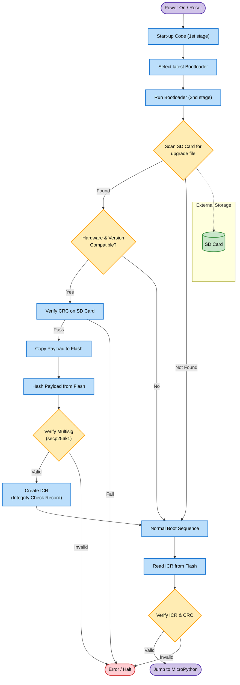
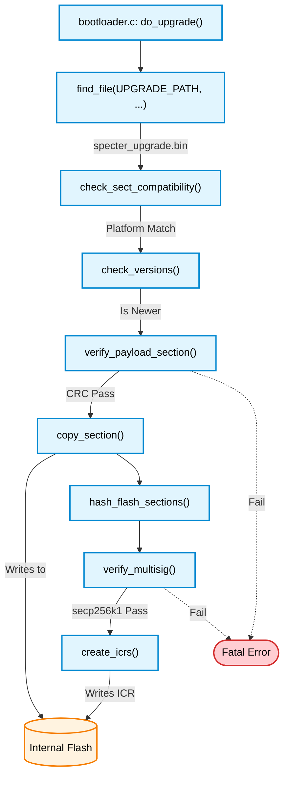
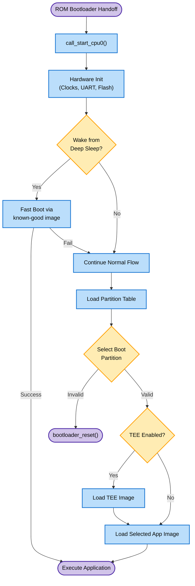
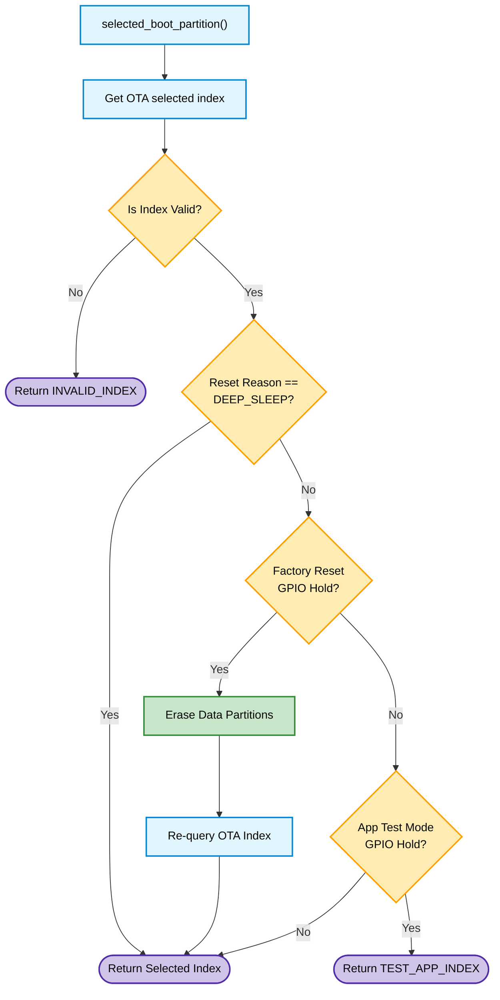
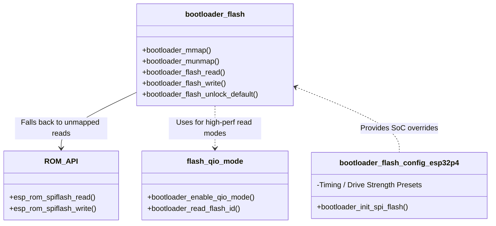
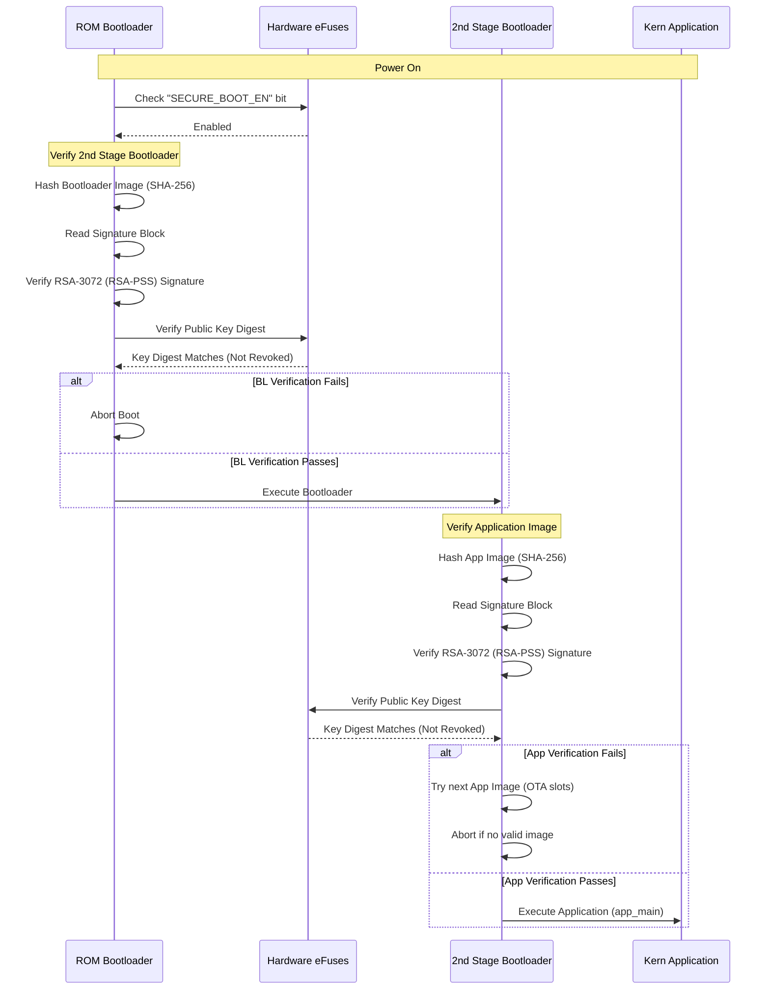
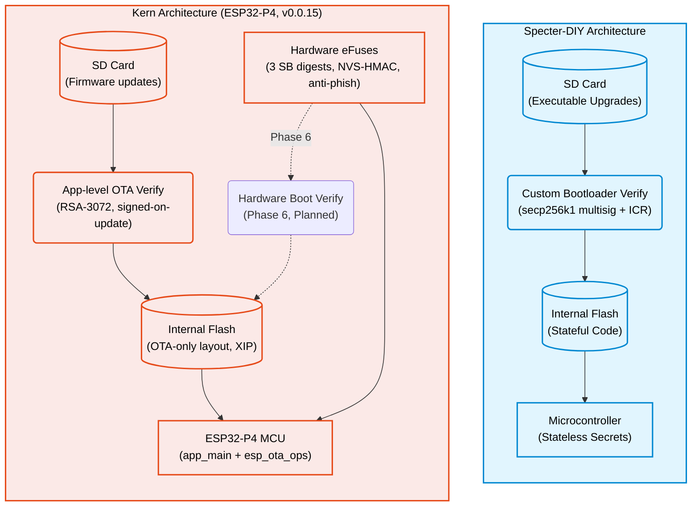
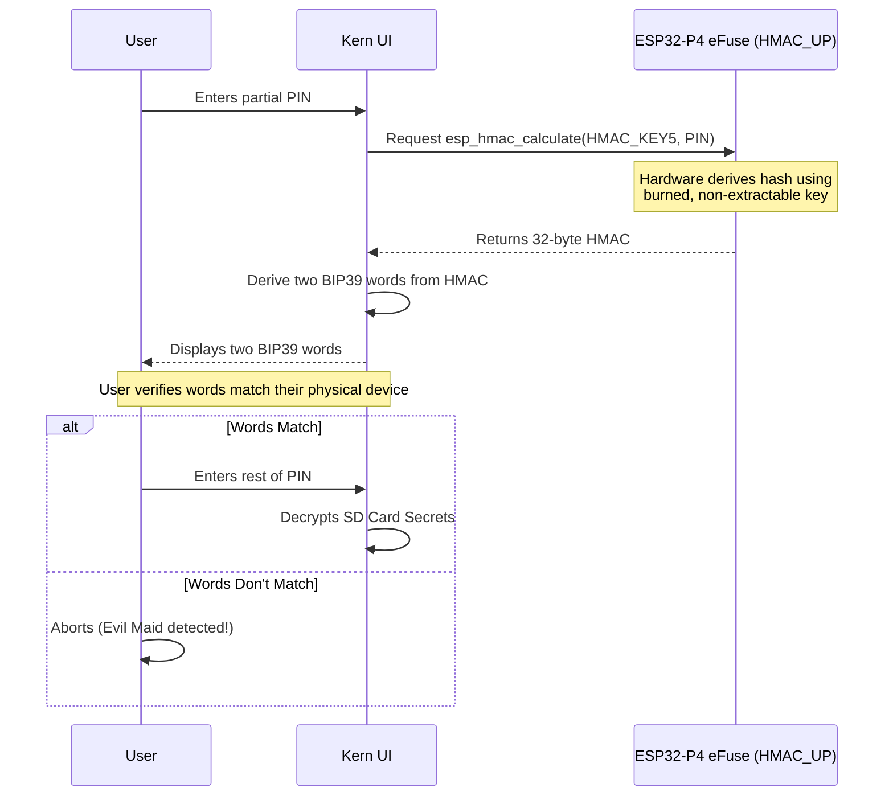
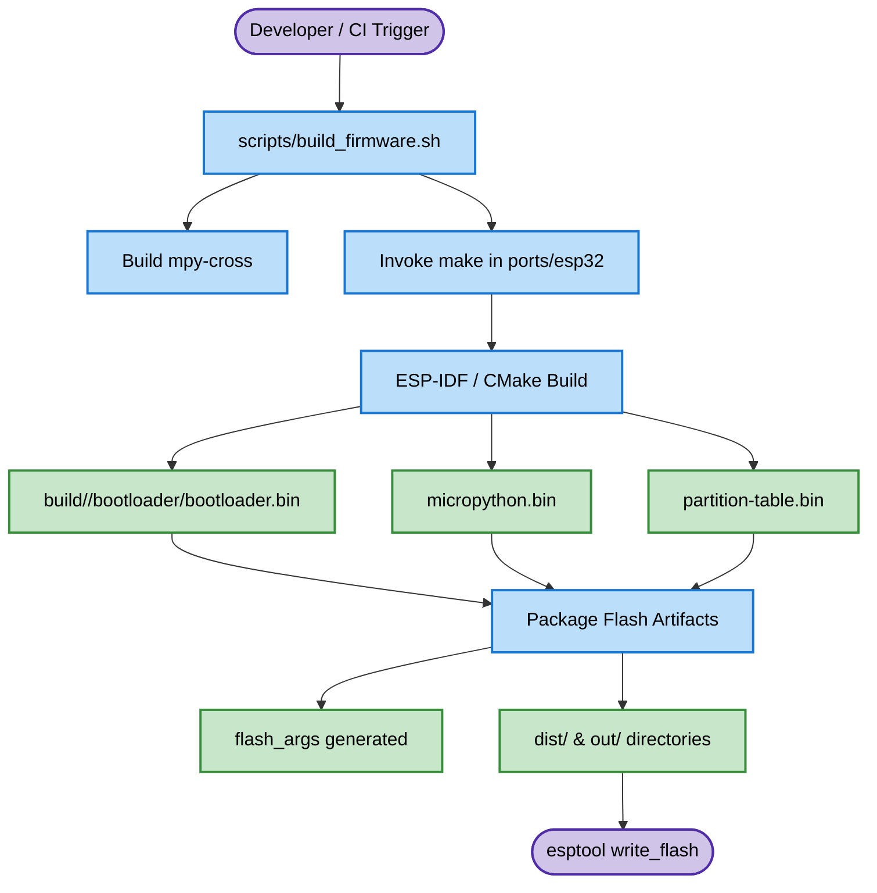

## MicroPython Port R&D for Secure Boot and Removable Storage
There is still substantial R&D work ahead for the SeedSigner MicroPython port for someone who wants to go deep on microcontrollers. The current discussion specifically points to foundational platform work rather than only application-level features. Example directions include the beginnings of a secure bootloader and running the code from an SD card instead of built-in flash. The project is best framed as exploratory embedded systems work that can leave behind the first building blocks for future porting work.

**Expected Outcomes**

- Investigate and document priority R&D directions in the MicroPython port
- Prototype the beginnings of a secure bootloader
- Explore running code from an SD card instead of the built-in flash
- Leave behind proof-of-concept code, experiments, or implementation notes for future microcontroller work

# Literature Review

## Summary
This document reviews and compares the bootloader designs and security implementations of **Specter-DIY** and **Kern**. While Specter-DIY uses a stateful approach for code but operates statelessly regarding secrets via an SD card boot process, Kern opts for a fully stateful model with direct execution from internal flash, heavily relying on ESP32-P4 eFuses for security. As of v0.0.15 (July 2026), Kern has implemented Phases 0–4 of its security roadmap: anti-phishing via eFuse HMAC, NVS encryption, and air-gapped SD card firmware updates with **RSA-3072** signature verification. The secure boot scheme pivoted from ECDSA-P256 to **RSA-3072 (RSA-PSS)** because ECDSA Secure Boot v2 is non-functional on ESP32-P4 silicon (chip errata). Boot-time eFuse enforcement (Phase 6) and flash encryption (Phase 5, blocked on IDF ≥ 6.1) remain ahead — an unsigned app still boots, and signature verification is currently enforced only on the OTA update path.

## Table of Contents
- [Summary](#executive-summary)
- [Specter-DIY](#specter-diy)
- [ESP IDF](#esp-idf)
- [Kern](#kern-githubcomodudexkern)
- [Comparison Between Kern and Specter-DIY](#comparison-between-kern-and-specter-diy)
- [Bootloader Related Things in SeedSigner MicroPython Builder](#bootloader-related-things-in-seedsigner-micropython-builder)

# Specter-DIY
## [cryptoadvance/specter-diy](https://github.com/cryptoadvance/specter-diy/) -> [cryptoadvance/specter-bootloader/blob/master](https://github.com/cryptoadvance/specter-bootloader/blob/master/)
**Specter-DIY Bootloader Upgrade & Execution Flow:**


I read the Specter-DIY bootloader code. The main file is `main.c` that runs the bootloader.

During the bootloader, the following steps are followed if the version is upgraded:

1. Looks for `specter_upgrade*.bin`  files in SD card.
2. Does some checks like if those files are hardware compatible and if their versions are newer.
3. Verifies the CRC on SD card before copying to flash. After copying, the firmware is hashed from flash.
4. It verifies signatures (multisig using secp256k1 library).
5.  Creates ICR(Integrity Check Record) (On further boots, this ICR is checked).
When the device is booted up normally, if no upgrade is required, control is handed back to `main.c` where it reads the ICR from internal flash memory and calculates the CRC of the firmware. If both match successfully, the device boots up and control is given to MicroPython. 

**Interesting:** In Specter-DIY one can build a custom bootloader with their own key [cryptoadvance/specter-bootloader/blob/master/doc/selfsigned.md](https://github.com/cryptoadvance/specter-bootloader/blob/master/doc/selfsigned.md)

### Code Excerpt:
**Detect Upgrade Files**

- **Location:** bootloader.c — the bootloader looks for an upgrade file and calls `do_upgrade()`  when found:
```c
bl_status_t status = bl_status_normal_exit;
const char* file_name = find_file(UPGRADE_PATH, UPGRADE_FILES);
if (file_name) {
  if (bl_run_kats()) {
    if (do_upgrade(file_name, p_args, flags)) {
      status = bl_status_upgrade_complete;
    }
  } else {
    status = bl_status_err_internal;
  }
}
```
- **Location:** bootloader.c — `find_file()`  scans mounted media for matching filenames (e.g. `specter_upgrade*.bin` ):
```c
static const char* find_file(const char* path, const char* pattern) {
  blsys_media_umount();
  uint32_t n_dev = blsys_media_devices();
  for (uint32_t dev_idx = 0U; dev_idx < n_dev; ++dev_idx) {
    if (blsys_media_check(dev_idx)) {
      if (blsys_media_mount(dev_idx)) {
        const char* fname = blsys_ffind_first(&bl_ctx.ffind_ctx, path, pattern);
        if (fname) {
          if (strlen(fname) + 1U > sizeof(bl_ctx.file_name)) {
            fatal_error("File name is too long");
          }
          strcpy(bl_ctx.file_name, fname);
          if (blsys_ffind_next(&bl_ctx.ffind_ctx)) {
            fatal_error("More than one upgrade file found");
          }
        }
        blsys_ffind_close(&bl_ctx.ffind_ctx);
        if (fname) {
          return bl_ctx.file_name;
        }
        blsys_media_umount();
      } else {
        fatal_error("Unable to mount '%s'", blsys_media_name(dev_idx));
      }
    }
  }
  return NULL;
}
```
**Hardware Compatibility & Version Checks**

- **Location:** bootloader.c — `check_sect_compatibility()`  verifies `bl_attr_platform`  and `bl_attr_base_addr`  (hardware/platform compatibility):
```c
static bool check_sect_compatibility(const bl_section_t* p_hdr,
                                     bl_addr_t sect_base, uint32_t sect_size) {
  if (p_hdr) {
    // Get necessary attributes from the header
    char platform[BL_ATTR_STR_MAX] = "";
    bl_uint_t base_addr = 0U;
    if (blsect_get_attr_str(p_hdr, bl_attr_platform, platform,
                            sizeof(platform)) &&
        blsect_get_attr_uint(p_hdr, bl_attr_base_addr, &base_addr)) {
      // Check parameters and attributes
      return bl_streq(platform, blsys_platform_id()) &&
             base_addr == sect_base &&
             bl_icr_check_sect_size(sect_size, p_hdr->pl_size);
    }
  }
  return false;
}
```
- **Location:** bootloader.c — `check_versions()`  compares upgrade file versions vs saved/current versions (filters RCs unless allowed):
```c
static version_check_res_t check_versions(const file_metadata_t* p_md,
                                          version_info_t curr, uint32_t flags) {
  if (p_md) {
    // Check version of the Bootloader
    version_check_res_t check_bl =
        p_md->boot_section.loaded
            ? check_version(p_md->boot_section.header.pl_ver,
                            curr.bootloader_ver, flags)
            : version_same;

    // Get saved version from version check record. It stores the latest
    // version even if the Main firmware is erased.
    uint32_t saved_ver =
        bl_vcr_get_version(bl_ctx.flash_map.firmware_base,
                           bl_ctx.flash_map.firmware_size, bl_vcr_any);
    // Chose the latest version number of all sources: ICR & 2x VCR.
    uint32_t latest_ver = bl_max_u32(curr.main_fw_ver, saved_ver);
    // Check version of the Main Firmware from file against the latest version
    // ever programmed in the device.
    version_check_res_t check_main =
        p_md->main_section.loaded
            ? check_version(p_md->main_section.header.pl_ver, latest_ver, flags)
            : version_same;

    // Return check result with the higher rank (severity in case of error)
    return (int)check_main >= (int)check_bl ? check_main : check_bl;
  }
  return version_invalid;
}
```
**CRC verification (on SD) then copy + hash from flash**

- **Location:** bootloader.c — `verify_payload_section()`  validates payload CRC in the upgrade file before copying:
```c
static bool verify_payload_section(bl_file_t file, const sect_metadata_t* p_md,
                                   bl_cbarg_t progr_arg) {
  if (p_md && p_md->loaded) {
    if (0 == blsys_fseek(file, p_md->pl_file_offset, SEEK_SET) &&
        blsect_validate_payload_from_file(&p_md->header, file, progr_arg)) {
      return true;
    }
  }
  return false;
}
```
- **Location:** bl_section.c — `blsect_validate_payload_from_file()`  computes CRC over the file payload:
```c
bool blsect_validate_payload_from_file(const bl_section_t* p_hdr,
                                       bl_file_t file, bl_cbarg_t progr_arg) {
  if (p_hdr && p_hdr->pl_size && p_hdr->pl_size <= BL_PAYLOAD_SIZE_MAX &&
      file) {
    size_t rm_bytes = p_hdr->pl_size;
    uint32_t crc = 0U;

    bl_report_progress(progr_arg, p_hdr->pl_size, 0U);
    while (rm_bytes) {
      if (blsys_feof(file)) {
        return false;
      }
      size_t read_len = (rm_bytes < IO_BUF_SIZE) ? rm_bytes : IO_BUF_SIZE;
      size_t got_len = blsys_fread(ctx.io_buf, 1U, read_len, file);
      if (got_len != read_len) {
        return false;
      }
      crc = crc32_fast(ctx.io_buf, read_len, crc);
      rm_bytes -= read_len;
      bl_report_progress(progr_arg, p_hdr->pl_size, p_hdr->pl_size - rm_bytes);
    }
    return crc == p_hdr->pl_crc;
  }
  return false;
}
```
- **Location:** bootloader.c — `copy_section()`  streams the payload from the file to flash:
```c
static bool copy_section(bl_addr_t flash_addr, bl_file_t file,
                         const sect_metadata_t* p_md, bl_cbarg_t progr_arg) {
  if (p_md && p_md->loaded) {
    if (blsys_fseek(file, p_md->pl_file_offset, SEEK_SET) != 0) {
      return false;
    }
    size_t rm_bytes = p_md->header.pl_size;
    bl_addr_t curr_addr = flash_addr;

    bl_report_progress(progr_arg, p_md->header.pl_size, 0U);
    while (rm_bytes) {
      if (blsys_feof(file)) {
        return false;
      }
      size_t copy_len = (rm_bytes < IO_BUF_SIZE) ? rm_bytes : IO_BUF_SIZE;
      size_t got_len = blsys_fread(bl_ctx.io_buf, 1U, copy_len, file);
      if (got_len != copy_len) {
        return false;
      }
      if (!blsys_flash_write(curr_addr, bl_ctx.io_buf, copy_len)) {
        return false;
      }
      curr_addr += copy_len;
      rm_bytes -= copy_len;
      bl_report_progress(progr_arg, p_md->header.pl_size,
                         p_md->header.pl_size - rm_bytes);
    }
    return true;
  }
  return false;
}
```
- **Location:** bootloader.c + bl_section.c — after copying, `hash_flash_sections()`  calls `blsect_hash_over_flash()`  which reads flash and computes SHA-256 over the header+payload:
```c
// bootloader.c (hash_flash_sections excerpt)
if (!blsect_hash_over_flash(&p_md->main_section.header,
                            bl_ctx.flash_map.firmware_base, p_item++,
                            stage_calc_hash | substage_main)) {
  return false;
}

// bl_section.c (blsect_hash_over_flash excerpt)
bool blsect_hash_over_flash(const bl_section_t* p_hdr, bl_addr_t pl_addr,
                            bl_hash_t* p_result, bl_cbarg_t progr_arg) {
  ...
  sha256_Init(&context);
  sha256_Update(&context, (const uint8_t*)p_hdr, sizeof(bl_section_t));
  ...
  while (rm_bytes) {
    if (!blsys_flash_read(curr_addr, ctx.io_buf, read_len)) {
      return false;
    }
    sha256_Update(&context, ctx.io_buf, read_len);
    ...
  }
  sha256_Final(&context, p_result->digest);
  ...
}
```
**Signature (secp256k1 multisig) verification**

- **Location:** bootloader.c — `verify_multisig()`  builds the Bech32 message and calls `blsig_verify_multisig()` :
```c
// make signature message
if (blsect_make_signature_message(msg, &msg_size, hash_buf, hash_items)) {
  // Perform signature verification
  *p_result = blsig_verify_multisig(
      algorithm, p_md->sig_payload, p_md->sig_section.header.pl_size,
      p_md->boot_section.loaded ? pubkeys_boot : pubkeys_main, msg,
      msg_size, stage_verify_sig);
  ...
}
```
- **Location:** bl_signature.c + bl_signature.c — `blsig_verify_multisig()`  sets up a secp256k1 context and `verify_signature()`  uses `secp256k1_ec_pubkey_parse` , `secp256k1_ecdsa_signature_parse_compact`  and `secp256k1_ecdsa_verify()` :
```c
int32_t blsig_verify_multisig(const char* algorithm, const uint8_t* sig_pl,
                              size_t sig_pl_size, const bl_pubkey_t** pubkey_set,
                              const uint8_t* message, size_t message_len,
                              bl_cbarg_t progr_arg) {
  if (bl_streq(algorithm, ALG_SECP256K1_SHA256)) {
    secp256k1_context* verify_ctx = create_verify_ctx();
    if (verify_ctx) {
      int32_t result = blsig_verify_multisig_internal(
          verify_ctx, sig_pl, sig_pl_size, pubkey_set, message, message_len,
          progr_arg);
      destroy_verify_ctx(verify_ctx);
      return result;
    }
    return blsig_err_out_of_memory;
  }
  return blsig_err_algo_not_supported;
}
```
and

```c
BL_STATIC_NO_TEST bool verify_signature(secp256k1_context* verify_ctx,
                                        const signature_t* p_sig,
                                        const uint8_t* message,
                                        size_t message_len,
                                        const bl_pubkey_t* p_pubkey) {
  ...
  bool valid = (1 == secp256k1_ec_pubkey_parse(verify_ctx, &pubkey_obj,
                                               p_pubkey->bytes,
                                               sizeof(p_pubkey->bytes)));
  secp256k1_ecdsa_signature sig_obj;
  valid = valid && (1 == secp256k1_ecdsa_signature_parse_compact(
                             verify_ctx, &sig_obj, p_sig->bytes));
  valid = valid && (1 == secp256k1_ecdsa_verify(verify_ctx, &sig_obj, digest,
                                                &pubkey_obj));
  return valid;
}
```
**Create ICR (on upgrade) and verify ICR (on boot)**

- **Location:** bootloader.c — `create_icrs()`  writes ICR(s) in flash after successful upgrade by calling `bl_icr_create()` :
```c
static bool create_icrs(const file_metadata_t* p_md, bl_addr_t bl_addr,
                        const flash_map_t* p_map) {
  if (p_md) {
    if (p_md->boot_section.loaded) {
      if (!bl_icr_create(get_inactive_bl_addr(bl_addr), p_map->bootloader_size,
                         p_md->boot_section.header.pl_size,
                         p_md->boot_section.header.pl_ver)) {
        return false;
      }
    }
    if (p_md->main_section.loaded) {
      if (!bl_icr_create(p_map->firmware_base, p_map->firmware_size,
                         p_md->main_section.header.pl_size,
                         p_md->main_section.header.pl_ver)) {
        return false;
      }
    }
    return true;
  }
  return false;
}
```
- **Location:** bl_integrity_check.c — `bl_icr_create()`  builds the ICR and writes it to flash; `bl_icr_verify()`  reads and validates ICR and compares CRC over flash payload:
```c
BL_STATIC_NO_TEST bool icr_struct_create_main(bl_integrity_check_rec_t* p_icr,
                                              bl_addr_t main_addr,
                                              uint32_t main_size,
                                              uint32_t pl_size,
                                              uint32_t pl_ver) {
  if (p_icr && main_size && pl_size) {
    uint32_t crc = 0U;
    if (blsys_flash_crc32(&crc, main_addr, pl_size)) {
      memset(p_icr, 0, sizeof(bl_integrity_check_rec_t));
      p_icr->magic = BL_ICR_MAGIC;
      p_icr->struct_rev = BL_ICR_STRUCT_REV;
      p_icr->pl_ver = pl_ver;
      p_icr->main_sect.pl_size = pl_size;
      p_icr->main_sect.pl_crc = crc;
      p_icr->struct_crc = crc32_fast(p_icr, ICR_CRC_CHECKED_SIZE, 0U);
      return true;
    }
  }
  return false;
}

bool bl_icr_create(bl_addr_t sect_addr, uint32_t sect_size, uint32_t pl_size,
                   uint32_t pl_ver) {
  if (bl_icr_check_sect_size(sect_size, pl_size)) {
    bl_integrity_check_rec_t icr;
    bl_addr_t icr_addr = sect_addr + sect_size - BL_ICR_OFFSET_FROM_END;
    if (icr_struct_create_main(&icr, sect_addr, sect_size, pl_size, pl_ver)) {
      return blsys_flash_write(icr_addr, &icr, sizeof(icr));
    }
  }
  return false;
}

bool bl_icr_verify(bl_addr_t sect_addr, uint32_t sect_size,
                   uint32_t* p_pl_ver) {
  if (sect_size) {
    if (p_pl_ver) {
      *p_pl_ver = BL_VERSION_NA;
    }
    bl_integrity_check_rec_t icr;
    if (icr_get(&icr, sect_addr, sect_size) &&
        icr_verify_main(&icr, sect_addr)) {
      if (p_pl_ver) {
        *p_pl_ver = icr.pl_ver;
      }
      return true;
    }
  }
  return false;
}
```
**Normal boot / Handoff to MicroPython**

- **Location:** main.c — after `bootloader_run()`  the main checks `bl_icr_verify()`  and then calls `blsys_start_firmware()`  to jump to MicroPython:
```c
// Run the Bootloader
bl_status_t status = bootloader_run(&args, bootloader_flags);
if (bootloader_has_error(status)) {
  fatal_error(bootloader_status_text(status));
}

// Check integrity of the Main Firmware
if (!bl_icr_verify(LV_VALUE(_main_firmware_start),
                   LV_VALUE(_main_firmware_size), NULL)) {
  fatal_error("No valid firmware found");
}

// Start the application, normally this call should not return
(void)blsys_start_firmware(LV_VALUE(_main_firmware_start),
                           upy_reset_mode_normal);
```
**Specter-DIY Bootloader Code Verification Call Graph:**


### Copy pasting how the booting process is described in the readme.MD:
The Bootloader resides in the internal flash memory of the microcontroller and consists of two parts:

- 1-st stage non-upgradable bootloader called the [Start-up code](https://github.com/cryptoadvance/specter-bootloader/blob/master/#Start-up-code)
- 2-nd stage bootloader called simply the [Bootloader](https://github.com/cryptoadvance/specter-bootloader/blob/master/#Bootloader)
### Start-up code
First, at power-on, the **Start-up code** takes control over the microcontroller. Its role is quite simple: to verify the integrity of up to 2 copies of the Bootloader and select the one with the latest version to be executed next.

### Bootloader
The Bootloader implements all the steps of the firmware upgrade process:

- Scans removable media for upgrade files
- Ensures that the upgrade file is valid, not corrupted, and built for the right platform
- Checks that this file contains a later version of the firmware than current
- Copies payload from an upgrade file to internal flash memory
- Verifies the signatures and makes the firmware runnable if they are valid


Some points to be kept in mind regarding Specter-DIY:

1. Specter-DIY is **stateful for code** (firmware in Flash). Secrets are not part of bootloader-managed flash state; in the broader project, they may be stored on the main MCU unless the wallet is used in an explicit no-secret mode.
2. **Flash storage:** The internal flash stores the **firmware code** and integrity/version metadata; private keys and seed phrases are not part of the bootloader's flash-resident firmware state.
3. **Hardware Locking (RDP):** The chip can be built with **Read Protection** enabled, but the level is a build-time/configuration choice rather than a fixed always-on property of the device.
4. **Signature Enforcement:** The bootloader will only run firmware that is **cryptographically signed**, preventing an attacker from replacing your wallet code with a malicious "key-stealing" version.
Though the current SeedSigner doesn't store the code, it requires an SD card for booting up and it is completely stateless.

The use of flash memory instead of an SD card leads to the following problems:

1. **The "Evil Maid" Chip Swap:** Internal flash is vulnerable to chip-swap attacks where an attacker replaces the MCU with a pre-compromised version. If the OS lives on a removable SD card, the chip remains "dumb" silicon that relies on external code provided by the user at boot.
2. **Lack of "Blank Slate" Guarantee:** Internal flash is permanently attached to the device. Unlike an SD card, one cannot easily verify its contents or ensure it is a "blank slate" before every session.
3. **Forensic Ghosting:** Flash wear-leveling can preserve "deleted" data in hidden sectors. One can achieve true data destruction by physically destroying an SD card, a feat not possible with internal memory without destroying the wallet itself.

# ESP IDF


ESP IDF supports C/C++ code.

There exists an ESP MicroPython port that provides a binding layer, allowing Python code to be executed.

While the ESP32 itself runs C/C++ code, the tools (like ESP-IDF's `idf.py`) used on the computer to build, configure, and flash that code are largely orchestrated by Python.

## Bootloader-related code
### 1. [`bootloader/`](https://github.com/espressif/esp-idf/blob/v6.0.1/components/bootloader) — The Bootloader Project 
The above is the second stage bootloader code. The first-stage bootloader is in the chip's ROM (mask ROM) and is not part of this repository. It is shipped in silicon, not as source.

**Overview**

- **File:** `bootloader_start.c`  : Second-stage bootloader entry for ESP-IDF; coordinates hardware init, partition selection, and loading the image to boot.
- **Primary role:** Run minimal C startup after ROM loader, initialize hardware, pick the boot partition (with optional factory-reset/test conditions), load TEE (if enabled), and load/hand off to the application image.
**Entry point**

**ESP-IDF Bootloader Startup Flow:**


- `call_start_cpu0()`  : Marked `__attribute__((noreturn))`  — this is the bootloader's main entry called after ROM bootloader loads this stage. It never returns to caller; if anything fails it calls `bootloader_reset()` .
Execution sequence inside `call_start_cpu0()`:

- **Before-init hook:** If `bootloader_before_init`  is set, call it. (Hook for project-specific early actions.)
- **Hardware init:** `bootloader_init()`  — initializes clocks, UART, flash/drivers; on error calls `bootloader_reset()` .
- **After-init hook:** If `bootloader_after_init`  is set, call it.
- **Deep-sleep fast path (optional):** Under `CONFIG_BOOTLOADER_SKIP_VALIDATE_IN_DEEP_SLEEP` , if waking from deep sleep the code calls `bootloader_utility_load_boot_image_from_deep_sleep()`  which attempts a shortcut boot using previously-known-good image; if it fails, normal flow continues.
- **Partition selection:** Create `bootloader_state_t bs = {0};`  then call `select_partition_number(&bs)`  which first loads the partition table and then chooses the boot partition. If it returns `INVALID_INDEX`  the bootloader resets.
- **TEE load (optional):** If `CONFIG_SECURE_ENABLE_TEE`  is set, call `bootloader_utility_load_tee_image(&bs)` . [Trusted Execution Environment (TEE) is an isolated, secure runtime that executes sensitive code and stores secrets separately from the main (non-secure) OS.]
- **Load chosen app image:** `bootloader_utility_load_boot_image(&bs, boot_index)`  — this loads and jumps to the selected application image.
**Partition selection helpers**

- `select_partition_number(bootloader_state_t *bs)` 
    - Calls `bootloader_utility_load_partition_table(bs)` ; if that fails it logs an error and returns `INVALID_INDEX` .
    - Otherwise forwards to `selected_boot_partition(bs)` .

**ESP-IDF Boot Partition Selection Logic:**


- `selected_boot_partition(const bootloader_state_t *bs)` 
    - Starts by asking `bootloader_utility_get_selected_boot_partition(bs)`  which applies OTA/boot metadata to pick an index. If that returns `INVALID_INDEX` , it's unrecoverable and returns that.
    - If reset reason is not deep sleep (`esp_rom_get_reset_reason(0) != RESET_REASON_CORE_DEEP_SLEEP` ), it checks GPIO-driven override conditions:
        - **Factory reset** (`CONFIG_BOOTLOADER_FACTORY_RESET` ):
            - Reads a configured pin long-hold via `bootloader_common_check_long_hold_gpio_level(...)` .
            - If detected, logs message, determines if OTA data should be erased (`CONFIG_BOOTLOADER_OTA_DATA_ERASE` ), and erases partitions specified by `CONFIG_BOOTLOADER_DATA_FACTORY_RESET`  via `bootloader_common_erase_part_type_data(...)` . Optionally sets RTC retained memory state (`CONFIG_BOOTLOADER_RESERVE_RTC_MEM` ) for factory reset.
            - After erasing, re-queries `bootloader_utility_get_selected_boot_partition(bs)`  and returns that index.

        - **App test mode** (`CONFIG_BOOTLOADER_APP_TEST` ):
            - If the configured app-test GPIO long-hold is observed, checks `bs->test.offset`  — if nonzero selects `TEST_APP_INDEX`  (a special index); otherwise logs error and returns `INVALID_INDEX` .

        - **Customer hooks:** Commented area where vendor code could inspect GPIOs and return a specific partition number.

    - If none of the special conditions trigger, returns the `boot_index`  originally chosen.

**Hooks and extensibility**

- Global function pointers used as hooks: `bootloader_before_init` , `bootloader_after_init` , `bootloader_*`  utilities. These let platform or board code inject behavior without changing this file.
**Conditional compilation**

- Many behaviors are gated by Kconfig macros:
    - `CONFIG_BOOTLOADER_SKIP_VALIDATE_IN_DEEP_SLEEP`  — fast-path restore after deep-sleep.
    - `CONFIG_SECURE_ENABLE_TEE`  — load TEE image before app.
    - `CONFIG_BOOTLOADER_FACTORY_RESET`  & related macros — enable factory reset functionality and configure pins/behavior.
    - `CONFIG_BOOTLOADER_APP_TEST`  — enable booting a test image via GPIO.
    - `CONFIG_LIBC_NEWLIB`  — generate `_reent`  accessor for newlib.

**Error handling and reset behavior**

- On critical failures (hardware init failure, invalid partition selection, unrecoverable failures), code calls `bootloader_reset()`  to restart the boot sequence.
- Partition-table load failure logs `ESP_LOGE(TAG, "load partition table error!");`  and returns failure.
**Logging**

- Uses ESP_LOG macros with `TAG`  defined earlier via `ESP_LOG_ATTR_TAG(TAG, "boot");`  for the boot module.
**C runtime support**

- Under `CONFIG_LIBC_NEWLIB` , function `__getreent()`  returns `_GLOBAL_REENT`  to support newlib reentrancy in bootloader context (necessary if linking certain libc functions).
**Concurrency / CPU state notes**

- A comment at the top states: *"We arrive here after the ROM bootloader finished loading this second stage bootloader from flash. The hardware is mostly uninitialized, flash cache is down and the app CPU is in reset. We do have a stack, so we can do the initialization in C."* This explains why the bootloader performs minimal, necessary initialization before accessing flash and peripherals.
### 2. [`bootloader_support/`](https://github.com/espressif/esp-idf/blob/v6.0.1/components/bootloader_support) — Shared Bootloader APIs 
- **Purpose:** Code used by both the bootloader and the main app
- Includes critical functionality like partition management, secure boot, flash encryption, and image validation
- Defined in [README.rst](https://github.com/espressif/esp-idf/blob/v6.0.1/components/bootloader_support/README.rst)  as "APIs used by bootloader but needed by main app"
**Public headers (** `include/` **)**: (intended for other components/tools)

This `include` folder is the public API surface for bootloader support. Most files are small, focused headers that either define the binary formats the bootloader understands or expose early-boot helpers used by the bootloader and, in some cases, the application.

- [bootloader_clock.h](https://github.com/espressif/esp-idf/blob/v6.0.1/components/bootloader_support/include/bootloader_clock.h) sets up the chip clocks for early boot and exposes a helper to report the chip’s rated maximum frequency.
- [bootloader_common.h](https://github.com/espressif/esp-idf/blob/v6.0.1/components/bootloader_support/include/bootloader_common.h) is the main “common bootloader” API header. It covers chip revision checks, OTA data parsing and selection, GPIO hold detection, partition erasure helpers, chip/package checks, VDDSDIO setup, SHA-256 for partitions, and optional RTC-retained boot state.
- [bootloader_mem.h](https://github.com/espressif/esp-idf/blob/v6.0.1/components/bootloader_support/include/bootloader_mem.h) exposes the bootloader’s memory initialization entry point.
- [bootloader_memory_utils.h](https://github.com/espressif/esp-idf/blob/v6.0.1/components/bootloader_support/include/bootloader_memory_utils.h) provides inline helpers for identifying IRAM/DRAM/RTC/PSRAM address ranges and converting between overlapping memory aliases.
- [bootloader_random.h](https://github.com/espressif/esp-idf/blob/v6.0.1/components/bootloader_support/include/bootloader_random.h) manages boot-time entropy, including enabling and disabling the entropy source and filling buffers with random bytes.
- [bootloader_util.h](https://github.com/espressif/esp-idf/blob/v6.0.1/components/bootloader_support/include/bootloader_util.h) is a tiny utility header with a region-overlap helper used by bootloader code.
- [bootloader_utility_tee.h](https://github.com/espressif/esp-idf/blob/v6.0.1/components/bootloader_support/include/bootloader_utility_tee.h) contains helpers for TEE OTA boot selection, update-partition selection, and rollback cancellation.
- [esp_app_format.h](https://github.com/espressif/esp-idf/blob/v6.0.1/components/bootloader_support/include/esp_app_format.h) defines the on-flash application image format: chip IDs, SPI mode/speed/size enums, and the binary image header and segment header structures.
- [esp_flash_data_types.h](https://github.com/espressif/esp-idf/blob/v6.0.1/components/bootloader_support/include/esp_flash_data_types.h) is just a compatibility shim that warns callers to include esp_flash_partitions.h instead.
- [esp_flash_encrypt.h](https://github.com/espressif/esp-idf/blob/v6.0.1/components/bootloader_support/include/esp_flash_encrypt.h) exposes the flash-encryption state machine and support APIs: initialization, enablement, region encryption, write protection, mode queries, and secure-feature setup.
- [esp_flash_partitions.h](https://github.com/espressif/esp-idf/blob/v6.0.1/components/bootloader_support/include/esp_flash_partitions.h) defines partition-table constants, partition and OTA data structures, OTA states, and verification/safety helpers for flash regions.
- [esp_image_format.h](https://github.com/espressif/esp-idf/blob/v6.0.1/components/bootloader_support/include/esp_image_format.h) is the core image-verification header. It defines image metadata, bootloader/app verification and load APIs, flash-size mapping, bootloader-offset handling, and the RTC-retained boot-state structure.
- [esp_secure_boot.h](https://github.com/espressif/esp-idf/blob/v6.0.1/components/bootloader_support/include/esp_secure_boot.h) contains secure-boot support: scheme detection, digest and signature-block handling, secure-boot enablement, signature verification, startup checks, and release-mode sanity checks.
- [esp_tee_ota_utils.h](https://github.com/espressif/esp-idf/blob/v6.0.1/components/bootloader_support/include/esp_tee_ota_utils.h) defines the TEE OTA data format and states used to track bootable TEE partitions.
**Private headers (** `private_include/` **)**: (intended for internal implementation)

- [bootloader_config.h](https://github.com/espressif/esp-idf/blob/v6.0.1/components/bootloader_support/private_include/bootloader_config.h)  defines the bootloader's internal state structure, flash size constants, OTA slot limits, and the [flash_encrypt()](https://github.com/espressif/esp-idf/blob/v6.0.1/components/bootloader_support/src/bootloader_utility.c)  entry point used during boot.
- [bootloader_console.h](https://github.com/espressif/esp-idf/blob/v6.0.1/components/bootloader_support/private_include/bootloader_console.h)  handles bootloader console bring-up and shutdown, including the USB character output hook when USB CDC is used.
- [bootloader_init.h](https://github.com/espressif/esp-idf/blob/v6.0.1/components/bootloader_support/private_include/bootloader_init.h)  contains the bootloader startup flow: reading and validating the bootloader image, clearing BSS, checking resets/WDT state, enabling RNG, printing the banner, and preparing cache/MMU and hardware for boot.
- [bootloader_sha.h](https://github.com/espressif/esp-idf/blob/v6.0.1/components/bootloader_support/private_include/bootloader_sha.h)  provides the bootloader-local SHA API for SHA-256 and, when supported, SHA-512/SHA-384 operations, plus a note that it is meant for bootloader-support code rather than normal app code.
- [bootloader_signature.h](https://github.com/espressif/esp-idf/blob/v6.0.1/components/bootloader_support/private_include/bootloader_signature.h)  is a small compatibility wrapper for secure-boot V2, exposing the legacy RSA signature-block verification entry point that now forwards to the newer API.
- [bootloader_soc.h](https://github.com/espressif/esp-idf/blob/v6.0.1/components/bootloader_support/private_include/bootloader_soc.h)  contains SoC-specific bootloader hooks, here mainly analog reset / glitch-protection configuration helpers.
- [bootloader_utility.h](https://github.com/espressif/esp-idf/blob/v6.0.1/components/bootloader_support/private_include/bootloader_utility.h)  is the main bootloader orchestration header: it loads the partition table, chooses the boot partition, handles TEE image loading, launches the selected app, supports deep-sleep fast boot, provides reset/cleanup helpers, and includes debug and SHA formatting utilities.
`src/`: (Includes and private includes contains the header and their code resides in the src)

**Core boot flow**

**ESP-IDF 2nd-Stage Bootloader Initialization Sub-flow:**


- [bootloader_init.c](https://github.com/espressif/esp-idf/blob/v6.0.1/components/bootloader_support/src/bootloader_init.c) is the main 2nd-stage bootloader startup logic: clear BSS, read and validate the bootloader header, set clocks, configure WDT, enable RNG, print the banner, and bring up external memory support.
- [bootloader_common_loader.c](https://github.com/espressif/esp-idf/blob/v6.0.1/components/bootloader_support/src/bootloader_common_loader.c) implements the shared boot-time partition and OTA decision logic: load the partition table, read OTA data, choose the boot partition, handle anti-rollback checks, and manage the RTC-retained fast-boot path.
- [bootloader_utility.c](https://github.com/espressif/esp-idf/blob/v6.0.1/components/bootloader_support/src/bootloader_utility.c) contains the image-loading and handoff path: verify/load the selected app, handle deep-sleep boot reuse, reset if nothing is bootable, and provide debug helpers like SHA hex formatting and buffer dumps.
- [bootloader_utility_tee.c](https://github.com/espressif/esp-idf/blob/v6.0.1/components/bootloader_support/src/bootloader_utility_tee.c) manages TEE OTA metadata, chooses the active TEE partition, updates TEE boot state, and marks TEE apps valid or invalid during bootloader flow.
**Boot support and hardware setup**

- [bootloader_clock_init.c](https://github.com/espressif/esp-idf/blob/v6.0.1/components/bootloader_support/src/bootloader_clock_init.c) configures early boot clocks, APB/RTC timing, and chip-specific clock quirks.
- [bootloader_clock_loader.c](https://github.com/espressif/esp-idf/blob/v6.0.1/components/bootloader_support/src/bootloader_clock_loader.c) provides the bootloader build's APB frequency shim so the early boot code can query the current clock.
- [bootloader_console.c](https://github.com/espressif/esp-idf/blob/v6.0.1/components/bootloader_support/src/bootloader_console.c) initializes and tears down the bootloader console, supporting UART, USB CDC, and USB Serial/JTAG output.
- [bootloader_console_loader.c](https://github.com/espressif/esp-idf/blob/v6.0.1/components/bootloader_support/src/bootloader_console_loader.c) contains loader-phase console helpers that must remain available in IRAM, including USB flush and deinit behavior.
- [bootloader_mem.c](https://github.com/espressif/esp-idf/blob/v6.0.1/components/bootloader_support/src/bootloader_mem.c) initializes memory-protection and access-control settings, including APM/region protection and SoC-specific peripheral permissions.
- [bootloader_panic.c](https://github.com/espressif/esp-idf/blob/v6.0.1/components/bootloader_support/src/bootloader_panic.c) supplies the bootloader's minimal assert and abort handlers, printing diagnostics and then halting.
- [bootloader_reset_common.c](https://github.com/espressif/esp-idf/blob/477b984238fb8511c94d99b7884fde811f78a43f/components/bootloader_support/src/bootloader_reset_common.c) checks reset reasons, reports watchdog and lockup diagnostics, and enables reset information for later boot stages.
- [bootloader_efuse.c](https://github.com/espressif/esp-idf/blob/v6.0.1/components/bootloader_support/src/bootloader_efuse.c) exposes efuse-backed bootloader helpers such as chip package and rated-frequency queries.
- [bootloader_random.c](https://github.com/espressif/esp-idf/blob/v6.0.1/components/bootloader_support/src/bootloader_random.c) implements bootloader RNG support, using SoC entropy hardware in the bootloader and falling back to app-level random filling when built outside the bootloader.
- [bootloader_sha.c](https://github.com/espressif/esp-idf/blob/v6.0.1/components/bootloader_support/src/bootloader_sha.c) provides SHA-256 and SHA-512/SHA-384 helpers for bootloader-support code, using ROM hardware in bootloader builds and PSA crypto in app builds when appropriate.
**Image, partition, and security logic**

- [esp_image_format.c](https://github.com/espressif/esp-idf/blob/v6.0.1/components/bootloader_support/src/esp_image_format.c) verifies and loads ESP application and bootloader images, parses headers and segments, handles appended hashes and signatures, and tracks the bootloader offset used for validation.
- [flash_partitions.c](https://github.com/espressif/esp-idf/blob/v6.0.1/components/bootloader_support/src/flash_partitions.c) verifies partition tables, checks partition bounds against flash size, and exposes partition safety helpers for writable-region checks.
- [flash_encrypt.c](https://github.com/espressif/esp-idf/blob/v6.0.1/components/bootloader_support/src/flash_encrypt.c) handles flash-encryption state and transitions: initialization checks, mode detection, release-mode enablement, write protection, and encrypting flash content in place.
- [secure_boot.c](https://github.com/espressif/esp-idf/blob/v6.0.1/components/bootloader_support/src/secure_boot.c) performs secure-boot efuse checks and startup fixes, verifies release-mode configuration, and supports signature-on-update behavior when secure boot is not fully enabled.
**Target-specific RNG implementations**

- [bootloader_random_esp32.c](https://github.com/espressif/esp-idf/blob/v6.0.1/components/bootloader_support/src/bootloader_random_esp32.c) is the RNG backend for ESP32.
- [bootloader_random_esp32c2.c](https://github.com/espressif/esp-idf/blob/v6.0.1/components/bootloader_support/src/bootloader_random_esp32c2.c) is the RNG backend for ESP32-C2.
- [bootloader_random_esp32c3.c](https://github.com/espressif/esp-idf/blob/v6.0.1/components/bootloader_support/src/bootloader_random_esp32c3.c) is the RNG backend for ESP32-C3.
- [bootloader_random_esp32c5.c](https://github.com/espressif/esp-idf/blob/v6.0.1/components/bootloader_support/src/bootloader_random_esp32c5.c) is the RNG backend for ESP32-C5.
- [bootloader_random_esp32c6.c](https://github.com/espressif/esp-idf/blob/v6.0.1/components/bootloader_support/src/bootloader_random_esp32c6.c) is the RNG backend for ESP32-C6.
- [bootloader_random_esp32c61.c](https://github.com/espressif/esp-idf/blob/v6.0.1/components/bootloader_support/src/bootloader_random_esp32c61.c) is the RNG backend for ESP32-C61.
- [bootloader_random_esp32h2.c](https://github.com/espressif/esp-idf/blob/v6.0.1/components/bootloader_support/src/bootloader_random_esp32h2.c) is the RNG backend for ESP32-H2.
- [bootloader_random_esp32h4.c](https://github.com/espressif/esp-idf/blob/477b984238fb8511c94d99b7884fde811f78a43f/components/bootloader_support/src/bootloader_random_esp32h4.c#L4) is the RNG backend for ESP32-H4.
- [bootloader_random_esp32p4.c](https://github.com/espressif/esp-idf/blob/v6.0.1/components/bootloader_support/src/bootloader_random_esp32p4.c) is the RNG backend for ESP32-P4.
- [bootloader_random_esp32s2.c](https://github.com/espressif/esp-idf/blob/v6.0.1/components/bootloader_support/src/bootloader_random_esp32s2.c) is the RNG backend for ESP32-S2.
- [bootloader_random_esp32s3.c](https://github.com/espressif/esp-idf/blob/v6.0.1/components/bootloader_support/src/bootloader_random_esp32s3.c) is the RNG backend for ESP32-S3.
- [bootloader_random_esp32s31.c](https://github.com/espressif/esp-idf/blob/477b984238fb8511c94d99b7884fde811f78a43f/components/bootloader_support/src/bootloader_random_esp32s31.c#L4) is the RNG backend for ESP32-S31.
**Target and feature subfolders**

- `esp32/` , `esp32c2/` , `esp32c3/` , `esp32c5/` , `esp32c6/` , `esp32c61/` , `esp32h2/` , `esp32h21/` , `esp32h4/` , `esp32p4/` , `esp32s2/` , `esp32s3/` , and `esp32s31/`  contain SoC-specific bootloader support code for those chip families, usually handling hardware quirks and target-dependent boot behavior.
- `flash_encryption/`  contains flash-encryption scheme-specific helper code.
- `secure_boot_v1/`  and `secure_boot_v2/`  contain scheme-specific secure-boot implementation details.
`src/esp32p4`**:** 

Files:

- **bootloader_esp32p4.c**: bootloader_esp32p4.c 
    - SoC boot-time initialization: analog/I2C bias setup, PLL/clock adjustments for ECO quirks, MSPI clock init, early hardware bring-up, console and clock setup, cache/MMU/flash startup calls, WDT auto-feed, RNG enable. Exports `bootloader_init()`  override and WDT/reset helpers used by the generic boot flow.

- **bootloader_soc.c**: bootloader_soc.c 
    - Small SoC-level hooks for analog reset features (super-WDT, clock-glitch reset). Functions are present but marked TODO (placeholders for hardware-specific reset configuration).

- **flash_encryption_secure_features.c**: flash_encryption_secure_features.c 
    - Implements flash-encryption hardening for production: writes efuse bits to disable insecure ROM download/cached UART boot, disables JTAG if configured, sets direct-boot disabling, and configures the Key Manager to use efuse keys. Key routines: `esp_flash_encryption_enable_secure_features()`  and `esp_flash_encryption_use_efuse_key()` .

- **secure_boot_secure_features.c**: secure_boot_secure_features.c 
    - Implements secure-boot hardening: sets efuses for secure-boot enablement, disables direct boot, configures ROM download/security download mode per config, disables JTAG, and optionally sets aggressive key revoke. Main routine: `esp_secure_boot_enable_secure_features()` .


`bootloader_flash`:

Implements the bootloader’s SPI/OPI flash access layer (mmap/read/write/erase), flash-mode helpers (QIO/OCTAL), SoC-specific flash configuration presets, and production startup flows (XMC, flash-encryption/secure-boot efuse setup).

**ESP-IDF bootloader_flash Component Architecture:**


**Public headers**

- [`bootloader_flash/include/bootloader_flash.h`](https://github.com/espressif/esp-idf/blob/v6.0.1/components/bootloader_support/bootloader_flash/include/bootloader_flash.h) : bootloader_flash/include/bootloader_flash.h 
    - Public bootloader flash primitives: `bootloader_read_flash_id()` , `bootloader_flash_xmc_startup()` , `bootloader_flash_unlock()`  (weak), `bootloader_flash_reset_chip()` , `bootloader_flash_is_octal_mode_enabled()` , and `bootloader_flash_get_spi_mode()` . Used by generic bootloader flow and higher-level components (image loader, encryption/secure-boot).

- [`bootloader_flash/include/flash_qio_mode.h`](https://github.com/espressif/esp-idf/blob/v6.0.1/components/bootloader_support/bootloader_flash/include/flash_qio_mode.h) : bootloader_flash/include/flash_qio_mode.h 
    - Helpers to enable Quad I/O (QIO/QOUT) on attached flash (`bootloader_enable_qio_mode` ) and read RDID (`bootloader_read_flash_id` ) — used to switch flash into high-performance read modes early in boot.

**Internal/private headers**

- [`bootloader_flash/include/bootloader_flash_priv.h`](https://github.com/espressif/esp-idf/blob/v6.0.1/components/bootloader_support/bootloader_flash/include/bootloader_flash_priv.h) : bootloader_flash/include/bootloader_flash_priv.h 
    - Core bootloader-only flash API and constants: MMU/page masks, `bootloader_mmap()`  / `bootloader_munmap()` , `bootloader_flash_read()`  / `write()`  / `erase_range()`  / `erase_sector()` , `bootloader_execute_flash_command()`  primitive, alignment/size requirements, and helper macros like `FLASH_SECTOR_SIZE` . These are used across the component (`src/` ) and by other internal modules (bootloader code, TEE).

- [`bootloader_flash/include/bootloader_flash_config.h`](https://github.com/espressif/esp-idf/blob/v6.0.1/components/bootloader_support/bootloader_flash/include/bootloader_flash_config.h)  and [`bootloader_flash/include/bootloader_flash_override.h`](https://github.com/espressif/esp-idf/blob/v6.0.1/components/bootloader_support/bootloader_flash/include/bootloader_flash_override.h) : SoC/board-level flash configuration hooks and override points (per-SoC default pin/mode/preset constants). Use to provide per-chip timing / drive-strength / mode choices.
- [`bootloader_flash/include/bootloader_flash_internal.h`](https://github.com/espressif/esp-idf/blob/v6.0.1/components/bootloader_support/bootloader_flash/include/esp_private/bootloader_flash_internal.h)  (under `esp_private/` ): private internal declarations used for TEE builds and special cases.
**Core source files (what they implement)**

- [`bootloader_flash/src/bootloader_flash.c`](https://github.com/espressif/esp-idf/blob/v6.0.1/components/bootloader_support/bootloader_flash/src/bootloader_flash.c) : bootloader_flash/src/bootloader_flash.c — central implementation:
    - Implements `bootloader_mmap` /`munmap`  using MMU and cache HAL (different strategies for bootloader vs TEE vs normal app builds). Describes mapping strategy: reserve the last MMU entry for flash reads/auto-decrypt; other pages used for bootloader mappings.
    - Implements `bootloader_flash_read()`  with two modes:
        - unmapped ROM read (uses ROM `esp_rom_spiflash_read` ) for non-mapped access,
        - MMU-based mapped reads for `allow_decrypt`  (auto-decrypt path).

    - Implements `bootloader_flash_write()`  and `erase`  using ROM APIs (or `esp_flash_*`  for non-NON_OS builds), respecting alignment and encrypted-write alignment (32 bytes).
    - Implements `bootloader_flash_unlock_default()`  (weak) which performs chip-specific SR reads/writes to clear block-protect bits for common vendors (ISSI, MXIC, GD, XMC etc.). This function is weak so a board/SoC can override it.
    - Implements `bootloader_execute_flash_command()`  primitive and `bootloader_flash_read_sfdp()`  for direct command/SFDP ops.
    - Handles XMC vendor startup flow (`bootloader_flash_xmc_startup` ) — special sequence for certain XMC parts (enter/exit DPD/UDPD, check SFDP) and a Kconfig-controlled strictness.
    - Implements helpers for 32-bit address mapping modes (4‑byte addressing) when cache/MMU/flash require it.

- [`bootloader_flash/src/flash_qio_mode.c`](https://github.com/espressif/esp-idf/blob/v6.0.1/components/bootloader_support/bootloader_flash/src/flash_qio_mode.c) : controls enabling QIO/QOUT mode by sending the right SR/WREN/WRSR commands and checking vendor quirks (calls `bootloader_read_flash_id()`  and vendor-aware SR handling).
- **SoC-specific config sources**: `bootloader_flash/src/bootloader_flash_config_*.c`  (one per SoC: esp32, esp32s3, esp32p4, etc.) 
    - Provide chip-specific default flash timing, drive strength, supported flash modes, dummy cycles and other presets used during `bootloader_init_spi_flash()`  and MSPI initialization. These files are selected by CMake depending on the target SoC.

**Notable behaviors & constraints**

- **MMU / mapping strategy**
    - Bootloader mapping is limited: bootloader code uses a finite number of MMU pages (config dependent) and only one `bootloader_mmap()`  mapping is allowed at a time in bootloader builds — the implementation logs and returns NULL if attempting multiple mappings.
    - For TEE builds, mapping strategy is different (uses end-of-range pages; extra PMP protections).
    - The last MMU entry is reserved for flash read-through-cache (auto-decrypt) and the code may move a 64KB window to service decrypted reads.

- **Alignment & size rules**
    - `bootloader_flash_read()`  requires 4-byte alignment for src/dest/size. 
    - `bootloader_flash_write()`  requires 4-byte alignment normally and 32‑byte alignment for encrypted writes. Writes may encrypt the source buffer in-place in the bootloader. 
    - `bootloader_flash_erase_range()`  requires sector-aligned start and size (sector = 4KB), and erase may be done in blocks for efficiency.

- **Encryption & virtual efuse mode**
    - `ENCRYPTION_IS_VIRTUAL`  handling: if EFUSE virtual mode is used (testing), encrypted write APIs may be bypassed/adjusted. When real hardware flash encryption is enabled, encrypted write/auto-decrypt paths are used (`esp_rom_spiflash_write_encrypted` , `esp_flash_read_encrypted`  where available).

- **Vendor quirks & unlock**
    - `bootloader_flash_unlock_default()`  checks vendor/device ID and uses appropriate SR read/write sequences to clear block-protect bits (ISSI, MXIC, GD, XMC etc.). This function is weak so it can be overridden for boards with special needs.

- **XMC startup flow**
    - Special sequence for certain XMC flash parts to wake them up from deep-power states and ensure proper operation. Controlled by `CONFIG_BOOTLOADER_FLASH_XMC_SUPPORT`  and careful SFDP checks.

- **Direct flash command primitive**
    - `bootloader_execute_flash_command(...)`  and `bootloader_flash_read_sfdp()`  let code run arbitrary SPI/OPI commands (used by unlock, SFDP read, QIO enable sequences).

- **32-bit address / octal support**
    - Supports enabling 32-bit address mapping modes and octal (OPI) modes — helpers to configure cache/opiflash read mode exist to match flash addressing modes.

- **TEEs and safety**
    - Extra checks for TEE builds: address-range checking to avoid modifying active TEE partition ranges, MMU/Cache workarounds for ROM APIs, extra cache flushes after writes/erases, and anti-FI checks.


### 3. [`esp_bootloader_format/`](https://github.com/espressif/esp-idf/blob/v6.0.1/components/esp_bootloader_format) — Bootloader Descriptor Format 
`esp_bootloader_format`  — provides a small, fixed-size bootloader description structure placed in RAM and an accessor to retrieve it from applications/bootloader.

**What it contains**

- **File:** [esp_bootloader_desc.c](https://github.com/espressif/esp-idf/blob/v6.0.1/components/esp_bootloader_format/esp_bootloader_desc.c) — defines the `esp_bootloader_desc`  instance and `esp_bootloader_get_description()` .
- **File:** [esp_bootloader_desc.h](https://github.com/espressif/esp-idf/blob/v6.0.1/components/esp_bootloader_format/include/esp_bootloader_desc.h) — structure definition and prototype.
- **File:** [CMakeLists.txt](https://github.com/espressif/esp-idf/blob/v6.0.1/components/esp_bootloader_format/CMakeLists.txt) — build rules (component registration and linker behavior for bootloader builds).
- **File:** [Kconfig.bootloader](https://github.com/espressif/esp-idf/blob/v6.0.1/components/esp_bootloader_format/Kconfig.bootloader) — Kconfig options that control fields placed into the structure.
- **Tests:** in `test_apps/`  (unit test test_bootloader_desc.c and pytest_esp_bootloader_format.py) verify the descriptor is readable and fields match configuration.
**Structure & fields**

- Type: `esp_bootloader_desc_t`  (80 bytes total).
    - `magic_byte`  (uint8_t): should equal `ESP_BOOTLOADER_DESC_MAGIC_BYTE`  (80) — quick sanity check.
    - `reserved[2]` : reserved bytes.
    - `secure_version`  (uint8_t): used by bootloader anti-rollback feature (set from CONFIG when enabled).
    - `version`  (uint32_t): set from `CONFIG_BOOTLOADER_PROJECT_VER` .
    - `idf_ver[32]` : IDF version string (the code asserts the size fits).
    - `date_time[24]` : compile date/time (populated when `CONFIG_BOOTLOADER_COMPILE_TIME_DATE`  is set).
    - `reserved2[16]` : reserved padding.

**How it is defined & linked**

- The concrete `esp_bootloader_desc`  is a `const esp_bootloader_desc_t`  initialized in esp_bootloader_desc.c.
- When `BOOTLOADER_BUILD`  is set:
    - The object is placed into a special section (`.data_bootloader_desc` ) via `__attribute__((section(".data_bootloader_desc")))` .
    - CMakeLists.txt forces the symbol to be kept in the bootloader link: `target_link_libraries(${COMPONENT_LIB} INTERFACE "-u esp_bootloader_desc")` . This prevents the linker from dropping the object even if otherwise unreferenced.

- The symbol is marked `weak`  so other builds could override if necessary.
**Access/usage**

- `esp_bootloader_get_description()`  returns a pointer to the in-memory descriptor.
- Applications typically obtain bootloader descriptor data via higher-level APIs (the tests call `esp_ota_get_bootloader_description(NULL, &desc)`  from `esp_ota_ops` ), which read the descriptor exposed by the bootloader/2nd-stage.
- Intended audience: 2nd-stage bootloader populates fields (version, IDF version, date), and the application can query them for diagnostics, version checks, or anti-rollback checks.
**Kconfig behavior**

- `BOOTLOADER_COMPILE_TIME_DATE` :
    - When enabled, `date_time`  is set to compile `__DATE__ " " __TIME__` . Default: `y`  (unless reproducible builds are enforced).
    - When disabled, `date_time`  is an empty string to help produce reproducible binaries.

- `BOOTLOADER_PROJECT_VER` :
    - Integer that becomes `version`  in the descriptor (default `1` ).

- `CONFIG_BOOTLOADER_ANTI_ROLLBACK_ENABLE`  (checked in code):
    - If enabled, `secure_version`  is set to `CONFIG_BOOTLOADER_SECURE_VERSION` ; otherwise it's zero.

### 4. [`esp_common/`](https://github.com/espressif/esp-idf/blob/v6.0.1/components/esp_common) — Common Definitions 
`esp_common`  — shared low-level definitions, attributes, compiler helpers, error code definitions and lookup, and general-purpose macros used across ESP-IDF.

- 
- Core purpose: provide portable, target-aware attribute macros (section placement, IRAM/DRAM/RTC), compiler hints, error handling helpers, and small runtime utilities used by many other components.
**Key files**

- Build: [CMakeLists.txt](https://github.com/espressif/esp-idf/blob/v6.0.1/components/esp_common/CMakeLists.txt)
- Public headers: [esp_attr.h](https://github.com/espressif/esp-idf/blob/v6.0.1/components/esp_common/include/esp_attr.h), [esp_compiler.h](https://github.com/espressif/esp-idf/blob/v6.0.1/components/esp_common/include/esp_compiler.h), [esp_err.h](https://github.com/espressif/esp-idf/blob/v6.0.1/components/esp_common/include/esp_err.h), [esp_assert.h](https://github.com/espressif/esp-idf/blob/v6.0.1/components/esp_common/include/esp_assert.h), [esp_check.h](https://github.com/espressif/esp-idf/blob/v6.0.1/components/esp_common/include/esp_check.h), [esp_macros.h](https://github.com/espressif/esp-idf/blob/v6.0.1/components/esp_common/include/esp_macros.h), [esp_types.h](https://github.com/espressif/esp-idf/blob/v6.0.1/components/esp_common/include/esp_types.h), [esp_idf_version.h](https://github.com/espressif/esp-idf/blob/v6.0.1/components/esp_common/include/esp_idf_version.h)
- Generated source: [esp_err_to_name.c](https://github.com/espressif/esp-idf/blob/v6.0.1/components/esp_common/src/esp_err_to_name.c)
- Tests: under test_apps (attribute, check, macros tests).
**What each header provides (concise)**

- [esp_attr.h](https://github.com/espressif/esp-idf/blob/v6.0.1/components/esp_common/include/esp_attr.h)
    - Memory/section attributes: `IRAM_ATTR` , `FORCE_IRAM_ATTR` , `DRAM_ATTR` , `RTC_DATA_ATTR` , `NOLOAD_ATTR` , `PACKED_ATTR` , `WORD_ALIGNED_ATTR` , `DMA_ATTR` , `COREDUMP_*`  mapping, `PLACE_IN_SECTION`  family.
    - Handles target differences (Linux vs embedded) and conditional features (SPIRAM, RTC memory).
    - Useful for placing code/data into specific regions required by boot, interrupt handlers, or coredump.

- [esp_compiler.h](https://github.com/espressif/esp-idf/blob/v6.0.1/components/esp_common/include/esp_compiler.h)
    - Compiler helper macros: `likely` /`unlikely` , diagnostic push/pop (`ESP_COMPILER_DIAGNOSTIC_PUSH_IGNORE` ), `ESP_STATIC_ANALYZER_CHECK` , and designated-initializer helpers for C/C++ differences.
    - Makes code portable across GCC/Clang and across C vs C++ standards.

- [esp_types.h](https://github.com/espressif/esp-idf/blob/v6.0.1/components/esp_common/include/esp_types.h)
    - Core typedefs/includes (`stdint.h` , `stdbool.h` , `stddef.h` ), a minimal central include for basic types.

- [esp_err.h](https://github.com/espressif/esp-idf/blob/v6.0.1/components/esp_common/include/esp_err.h)
    - Defines `typedef int esp_err_t;`  and common error codes (`ESP_OK` , `ESP_FAIL` , `ESP_ERR_*`  bases).
    - Provides `esp_err_to_name()`  / `esp_err_to_name_r()`  APIs (lookup table generated into esp_err_to_name.c).
    - Error-check macros: `ESP_ERROR_CHECK` , `ESP_ERROR_CHECK_WITHOUT_ABORT`  that either abort or report on non-`ESP_OK`  results (behavior depends on `NDEBUG`  and build config).

- [esp_assert.h](https://github.com/espressif/esp-idf/blob/v6.0.1/components/esp_common/include/esp_assert.h)
    - Compile-time and runtime assertion helpers: `ESP_STATIC_ASSERT` , `TRY_STATIC_ASSERT`  that try to use compile-time asserts where possible and fall back to runtime `assert()` .

- [esp_check.h](https://github.com/espressif/esp-idf/blob/v6.0.1/components/esp_common/include/esp_check.h)
    - Convenience control-flow macros that log and return/goto on errors or false conditions:
        - `ESP_RETURN_ON_ERROR` , `ESP_RETURN_VOID_ON_ERROR` , `ESP_GOTO_ON_ERROR` 
        - `ESP_RETURN_ON_FALSE` , `ESP_RETURN_VOID_ON_FALSE` , `ESP_GOTO_ON_FALSE` 

    - Variants for ISR-safe early logging (`_ISR` ) and silent builds (compile-time options change whether logs are emitted).

- [esp_macros.h](https://github.com/espressif/esp-idf/blob/v6.0.1/components/esp_common/include/esp_macros.h)
    - Utility macros: `ESP_UNUSED` , `ESP_INFINITE_LOOP` , `CHOOSE_MACRO_VA_ARG` , `ESP_VA_NARG`  (count varargs), and other generic helpers used throughout the codebase.

- [esp_idf_version.h](https://github.com/espressif/esp-idf/blob/v6.0.1/components/esp_common/include/esp_idf_version.h)
    - Numeric and string helpers for IDF version: `ESP_IDF_VERSION_MAJOR/MINOR/PATCH` , `ESP_IDF_VERSION` , `ESP_IDF_VERSION_VAL()` , and `esp_get_idf_version()` .

- [esp_err_to_name.c](https://github.com/espressif/esp-idf/blob/v6.0.1/components/esp_common/src/esp_err_to_name.c)
    - Autogenerated mapping from `esp_err_t`  codes to string names.
    - Generated by [gen_esp_err_to_name.py](https://github.com/espressif/esp-idf/blob/v6.0.1/tools/gen_esp_err_to_name.py) and included in the build only when `CONFIG_ESP_ERR_TO_NAME_LOOKUP`  is set.
    - The file conditionally includes component headers to collect their error codes into a single table.

**Build details**

- [CMakeLists.txt](https://github.com/espressif/esp-idf/blob/v6.0.1/components/esp_common/CMakeLists.txt) registers the component, compiles esp_err_to_name.c, and sets `LDFRAGMENTS`  for embedded targets. It also uses `idf_component_optional_requires`  (or links libs for older build model) so the generated error table can reference many components when present.
- The component sets `LINK_INTERFACE_MULTIPLICITY`  to break dependency cycles in the component graph.

# Kern [github.com/odudex/Kern](https://github.com/odudex/Kern)
## Before Refresher on ESP IDF Secure Boot v2 ([docs.espressif.com/projects/esp-idf/en/v5.5.3/esp32p4/security/secure-boot-v2.html](https://docs.espressif.com/projects/esp-idf/en/v5.5.3/esp32p4/security/secure-boot-v2.html))
The high level view of startup process is as follows: ([docs.espressif.com/projects/esp-idf/en/v6.0.1/esp32p4/api-guides/startup.html](https://docs.espressif.com/projects/esp-idf/en/v6.0.1/esp32p4/api-guides/startup.html))

1. [First stage (ROM) bootloader](https://docs.espressif.com/projects/esp-idf/en/v6.0.1/esp32p4/api-guides/startup.html#first-stage-bootloader) loads the second stage bootloader image to RAM (IRAM & DRAM) from flash offset 0x2000.
2. [Second Stage Bootloader](https://docs.espressif.com/projects/esp-idf/en/v6.0.1/esp32p4/api-guides/startup.html#second-stage-bootloader) loads partition table and main app image from flash. Main app incorporates both RAM segments and read-only segments mapped via flash cache.
3. [Application Startup](https://docs.espressif.com/projects/esp-idf/en/v6.0.1/esp32p4/api-guides/startup.html#application-startup) executes. At this point, the second CPU and RTOS scheduler are started, which then run the `<u>main_task</u>`, leading to the execution of `<u>app_main</u>`.
(From: [docs.espressif.com/projects/esp-idf/en/stable/esp32/security/secure-boot-v2.html](https://docs.espressif.com/projects/esp-idf/en/stable/esp32/security/secure-boot-v2.html))

The Secure Boot v2 process follows these steps:

1. On startup, the ROM code checks the Secure Boot v2 bit in the eFuse. If Secure Boot is disabled, a normal boot will be executed; if Secure Boot is enabled, the boot will proceed according to the following steps.
2. The ROM code verifies the bootloader's signature block, see [Verifying a Signature Block](https://docs.espressif.com/projects/esp-idf/en/stable/esp32/security/secure-boot-v2.html#verify-signature-block). If this fails, the boot process will be aborted.
3. The ROM code verifies the bootloader image using the raw image data, its corresponding signature block(s), and the eFuse, see [Verifying an Image](https://docs.espressif.com/projects/esp-idf/en/stable/esp32/security/secure-boot-v2.html#verify-image). If this fails, the boot process will be aborted.
4. The ROM code executes the bootloader.
5. The bootloader verifies the application image's signature block, see [Verifying a Signature Block](https://docs.espressif.com/projects/esp-idf/en/stable/esp32/security/secure-boot-v2.html#verify-signature-block). If this fails, the boot process will be aborted.
6. The bootloader verifies the application image using the raw image data, its corresponding signature blocks, and the eFuse, see [Verifying an Image](https://docs.espressif.com/projects/esp-idf/en/stable/esp32/security/secure-boot-v2.html#verify-image). If this fails, the boot process will be aborted. If the verification fails but another application image is found, the bootloader will then try to verify that other image using steps 5 to 7. This repeats until a valid image is found or no other images are found.
7. The bootloader executes the verified application image.
## What's planned? Secure Boot process from [github.com/odudex/Kern/blob/master/docs/secure-boot.md](https://github.com/odudex/Kern/blob/master/docs/secure-boot.md)

> **Note (August 2026):** The original plan described ECDSA-P256. Kern has since pivoted to **RSA-3072 (RSA-PSS)** because ECDSA-based Secure Boot v2 is non-functional on ESP32-P4 silicon (chip errata — enabling it would require `CONFIG_SECURE_BOOT_INSECURE`). RSA-3072 is also the faster verifier on P4 (~14.8 ms vs ~61.1 ms for ECDSA-P256, via the hardware RSA/MPI accelerator). The diagrams below reflect the updated algorithm.

## 1. How Secure Boot v2 Works

**Secure Boot v2 Cryptographic Verification Sequence:**

### Signing (build time)
```
Firmware image (all code + data)
    │
    ▼  SHA-256
Image hash (32 bytes)
    │
    ▼  RSA-3072 (RSA-PSS) sign with private key
Signature block (appended to image):
    ├── Public key
    └── Signature over image hash
```
The signature covers the SHA-256 hash of the **entire image content** — header, code, and data. An attacker cannot modify any byte of the firmware without invalidating the signature.

### Verification (every boot)
On every boot the ROM bootloader performs these steps for both the second-stage bootloader and the application image (each verified independently):

1. **Hash the full image** — compute SHA-256 over the entire image content (everything except the appended signature block).
2. **Read the signature block** — extract the public key and RSA-3072 signature appended to the image.
3. **Verify the signature** — use the public key to verify the RSA-PSS signature against the image hash from step 1. This proves the image is unmodified since signing.
4. **Verify the public key** — compute SHA-256 of the public key and compare against the digest(s) stored in eFuse key blocks. This proves the signature came from a trusted key.
5. If both checks pass, execution proceeds. Otherwise the chip refuses to boot.
This two-step verification prevents forgery: even if an attacker replaces the signature block with their own key and signature, step 4 will fail because their public key's digest won't match any eFuse slot.

Both the second-stage bootloader and the application image are verified independently — each carries its own signature.

### Digest Slots
The ESP32-P4 provides multiple eFuse key blocks. Kern allocates **all six** blocks and all three Secure Boot v2 digest slots, enabling **two key rotations** and leaving no free digest slot for an attacker to inject a rogue signing key:

| eFuse Block | Purpose | Phase | Status |
|-------------|---------|-------|--------|
| KEY0 (BLOCK_KEY0) | Secure Boot Digest 0 — primary signing key | 6 | Public key/digest in `kern_secure_boot/` (pending first signed release) |
| KEY1 (BLOCK_KEY1) | Secure Boot Digest 1 — rotation #1 | 6 | Public key/digest in `kern_secure_boot/` (pending first signed release) |
| KEY2 (BLOCK_KEY2) | Secure Boot Digest 2 — rotation #2 | 6 | Public key/digest in `kern_secure_boot/` (pending first signed release) |
| KEY3 (BLOCK_KEY3) | Flash-encryption XTS-AES key | 5 | Decided: **XTS-AES-128** (Key Manager path is revision-gated; fielded boards are v1.0/v1.3) |
| KEY4 (BLOCK_KEY4) | NVS-encryption HMAC (`HMAC_UP`) | 3 | **Implemented** — burned during PIN setup |
| KEY5 (BLOCK_KEY5) | Anti-phishing HMAC (`HMAC_UP`) | 2 | **Implemented** — burned during first PIN setup |

Key rotation works (per the plan) because the second-stage bootloader would be signed with **all three keys** at initial flash (it is frozen forever — never OTA-updated), while the app is signed with the current primary. **This is documented policy, not what the current tooling does:** `scripts/sign_release.sh` only signs the app image with key0. Revoking a slot (`SECURE_BOOT_KEY_REVOKE0/1/2`) is irreversible; with three slots Kern can absorb up to two independent key compromises/rotations.

### Revocation
Each digest slot has a corresponding revocation bit:

- `SECURE_BOOT_KEY_REVOKE0`  — revokes KEY0
- `SECURE_BOOT_KEY_REVOKE1`  — revokes KEY1
Once a revocation bit is set, the ROM bootloader will no longer accept signatures verified by that slot's digest. Revocation is irreversible.

### Point of No Return
Setting the `SECURE_BOOT_EN` eFuse bit permanently enables secure boot. From that moment:

- Only firmware signed with a key whose digest matches a non-revoked eFuse slot will boot.
- Serial flashing of unsigned firmware is blocked (UART download mode is restricted).
- The device can only be updated via signed images (SD card OTA after Phase 4).


## What's implemented? (v0.0.15, July 2026)

Between v0.0.11 (2026-06-16) and v0.0.15 (2026-07-24), most of the security roadmap in `docs/security-plan.md` was implemented and the secure-boot plan was rewritten for **RSA-3072**. The bootloader itself remains the stock ESP-IDF second-stage bootloader — Kern adds no custom bootloader code. All security features live in the application firmware and rely on ESP32-P4 eFuses for hardware binding.

When it boots up normally, the control is given to [github.com/odudex/Kern/blob/master/main/main.c](https://github.com/odudex/Kern/blob/master/main/main.c). The `app_main()` initialization sequence is:

1. **Air-gap enforcement:** `bsp_wifi_coproc_disable()` holds the ESP32-C6 Wi-Fi/BT co-processor in reset (radio never comes up).
2. **NVS init:** `nvs_secure_init()` — encrypted if eFuse KEY4 is provisioned (`nvs_flash_secure_init()`), plaintext otherwise (`nvs_flash_init_partition()`). **Never** calls stock `nvs_flash_init()` (its keygen path would burn KEY4 without consent).
3. **Settings init:** `settings_init()` — persistent settings from NVS.
4. **Display init:** `bsp_display_start()` + early black screen (overwrite stale framebuffer on warm reset).
5. **Video pipeline init:** `app_video_init_once()` (camera, non-fatal if fails).
6. **PMIC init:** `bsp_pmic_init()` (AXP2101 on wave_35; no-op on wave_4b).
7. **Theme + splash:** Animated logo splash screen (3-second delay).
8. **Crypto init:** `wally_init(0)` + `bip39_filter_init()`.
9. **PIN module init:** `pin_init()` — opens the PIN NVS namespace.
10. **Session lock + boot gate:** `session_lock_init()`, then `session_lock_boot_gate()` (PIN entry if configured).
11. **OTA boot confirm:** `fw_update_boot_confirm()` — confirms a freshly installed update so the bootloader doesn't roll back to the previous slot.

**Code Excerpt (current `app_main()`):**

```c
void app_main(void) {
  // Air-gap: hold the Wi-Fi/BT co-processor (ESP32-C6) in reset first.
  ESP_ERROR_CHECK(bsp_wifi_coproc_disable());

  // Initialize NVS for persistent settings — encrypted if eFuse KEY4 is
  // provisioned, plaintext otherwise
  ESP_ERROR_CHECK(nvs_secure_init());
  settings_init();

  bsp_display_start();
  ESP_LOGI(TAG, "Display initialized successfully");

  // ... video pipeline init, screen clear, PMIC init, theme, splash ...

  // Initialize Bitcoin crypto library
  const int wally_res = wally_init(0);
  if (wally_res != WALLY_OK) { abort(); }

  bip39_filter_init();
  pin_init();
  session_lock_init();
  session_lock_boot_gate(screen);

  // Everything initialized — confirm OTA so bootloader doesn't roll back
  fw_update_boot_confirm();
}
```

### Phase 2 — Split PIN with anti-phishing (eFuse HMAC)
`esp_hmac_calculate(HMAC_KEY5, ...)` derives device-bound BIP39 words + identicon. Implemented in `main/core/pin.c` with the split-PIN flow, PBKDF2-SHA256 (100,000 iterations) PIN hashing, exponential backoff, and wipe-after-N-failures. KEY5 is burned during first PIN setup and read/write-protected immediately.

### Phase 3 — NVS encryption (HMAC scheme, KEY4)
Implemented in `main/core/nvs_secure.c`. The XTS-AES-256 keys that encrypt NVS are derived at runtime from eFuse KEY4 via the HMAC peripheral (no `nvs_keys` partition). Provisioning is consent-gated during PIN setup and runs *in session* (no reboot). Note the subtlety in `sdkconfig.defaults`:

```ini
# The app never calls nvs_flash_init(): its keygen path would burn KEY4 without
# consent. Boot branches on KEY4 presence in core/nvs_secure.c instead.
CONFIG_NVS_ENCRYPTION=y
CONFIG_NVS_SEC_KEY_PROTECT_USING_HMAC=y
CONFIG_NVS_SEC_HMAC_EFUSE_KEY_ID=4
```

The boot path is: KEY4 present → `nvs_flash_secure_init(&cfg)` (with plaintext-erase fallback); KEY4 absent → plain `nvs_flash_init_partition()` and never touch the keygen path. Live migration on provisioning: if power is cut mid-migration, next boot's `nvs_secure_init()` finishes it (KEY4 present → erase plaintext → encrypted init).

### Phase 4 — Air-gapped SD card firmware updates with signed-image verification
Implemented in `main/core/fw_update.c`. This is the closest Kern analogue to Specter-DIY's SD upgrade flow, but it *runs inside the app* using ESP-IDF's OTA API rather than being a custom bootloader:

- Config: `CONFIG_SECURE_SIGNED_APPS_NO_SECURE_BOOT=y` + `CONFIG_SECURE_SIGNED_ON_UPDATE_NO_SECURE_BOOT=y` + `CONFIG_SECURE_SIGNED_APPS_RSA_SCHEME=y` — the OTA path performs full Secure Boot v2 **RSA-3072** signature verification. **No eFuses burned, fully reversible.**
- **Verified trust anchor:** the key-digest comparison lives inside ESP-IDF's `esp_secure_boot_verify_sbv2_signature_block()`. Under `CONFIG_SECURE_SIGNED_ON_UPDATE_NO_SECURE_BOOT`, the trusted digest set comes from the **running app's own signature block** (`esp_secure_boot_get_signature_blocks_for_running_app()`), and the new image's embedded public key must match one of those digests. An SD-card-only attacker who swaps in an image signed with their own key is rejected — the update key lineage is anchored to whatever key the *currently running* app carries.
- Every build carries a Secure Boot v2 signature block, **but Phase 4 does no boot-time signature verification at all.** `SECURE_BOOT_CHECK_SIGNATURE` in the bootloader only compiles in under hardware secure boot or the no-secure-boot **ECDSA** option — neither applies to Kern's RSA config (`depends on SECURE_SIGNED_APPS_NO_SECURE_BOOT && SECURE_SIGNED_APPS_ECDSA_SCHEME`). So at boot the 2nd-stage bootloader only checks the SHA-256 for corruption and **an unsigned app boots**. The **only** cryptographic enforcement point in Phase 4 is the OTA path. Boot-time authenticity is Phase 6's job.
- Dev builds are auto-signed with a per-clone throwaway key (`dev_signing_key.pem`, generated on first build, gitignored); releases re-sign the kept `kern-unsigned.bin` offline with the real key (`scripts/sign_release.sh`).
- Pre-flight validation is **streamed from the SD file before any flash write** (chip ID, project name match, software downgrade check, then SHA-256 + RSA signature verification). Then `esp_ota_begin/write/end`, `esp_ota_set_boot_partition()`, reboot. `esp_ota_end()` also re-verifies the flashed copy and maps failure to `ESP_ERR_OTA_VALIDATE_FAILED`.
- Rollback safety net: the new image must self-confirm (`esp_ota_mark_app_valid_cancel_rollback()`); otherwise the bootloader returns to the previous slot. `CONFIG_BOOTLOADER_APP_ROLLBACK_ENABLE=y` in defaults.

```c
// fw_update.c — the signature check (Phase 4 path)
uint8_t verified_digest[32];
esp_err_t verr = esp_secure_boot_verify_sbv2_signature_block(
    (const ets_secure_boot_signature_t *)sig, digest, verified_digest);
```

### Partition table changes
`partitions.csv` is now **OTA-only** (factory and `phy_init` dropped, dual 6MB `ota_0`/`ota_1` slots) and the table moved from `0x8000` to **`0x10000`** (`CONFIG_PARTITION_TABLE_OFFSET=0x10000`), growing the bootloader slot from 24KB to **56KB** — headroom the ~36KB FE and secure-boot bootloaders need:

| addr | contents |
|---|---|
| 0x11000 | nvs (52K, encrypted) |
| 0x1E000 | otadata (8K) |
| 0x20000 | ota_0 (6M) |
| 0x620000 | ota_1 (6M) |
| 0xC20000 | storage / SPIFFS (~3.9M, plaintext — SPIFFS is incompatible with flash encryption) |

### Phase 5 — Flash encryption: blocked on IDF ≥ 6.1
Flash encryption is not implemented yet. The plan is concrete and the Phase 5 status note in `security-plan.md` reports the first on-device attempt:

- **Key decision (July 2026):** **XTS-AES-128 in eFuse KEY3**, generated by the FE bootloader from TRNG on first boot and read-protected at burn time. The **Key Manager + XTS-AES-256** path is gated on chip revision ≥ v3.0; fielded Kern boards measure v1.0 (wave_4b) and v1.3 (wave_43).
- **Blocker (as reported):** the provisioning attempt WDT-bootlooped ~1s into the splash (DSI underrun). Root cause: flash encryption auto-sets the MMU "sensitive" bit on every PSRAM page, while DMA masters (MIPI DSI, camera/ISP) access PSRAM outside that path. Upstream issues cited: [esp-idf#17708](https://github.com/espressif/esp-idf/issues/17708), [#17701](https://github.com/espressif/esp-idf/issues/17701), [#18427](https://github.com/espressif/esp-idf/issues/18427). The fix landed in **IDF 6.1-beta1**: `CONFIG_SPIRAM_ENC_EXEMPT`. Unblocking requires IDF ≥ 6.1 plus display/camera buffers allocated from the exempt region.

### Phase 6 — Secure boot: fully specified, keys pending first signed release
The theory-of-record doc is [docs/secure-boot.md](https://github.com/odudex/Kern/blob/master/docs/secure-boot.md): key generation/ceremony, three signing keys, bootloader signed with all three keys, manual `espefuse` lockdown, and the **on-device lockdown menu** (`Settings → Secure Boot → Lock with Developer Keys`, which would burn the three digests, the hardening eFuse set — `DIS_DIRECT_BOOT`, JTAG-disable, secure download mode — then `SECURE_BOOT_EN`, then write-protect `RD_DIS`).

Public keys and digests are present in `kern_secure_boot/` (three RSA-3072 public keys, three 32-byte SHA-256 digests, `SHA256SUMS` + GPG detached signature), but the folder's `README.md` notes they are **placeholder keys pending the first signed release** — the authentic keys will be published following the key ceremony in `docs/secure-boot.md §3e`.

**Not yet implemented:** the on-device lockdown menu itself. There is no `secure_boot.c` component in the firmware and `kern_secure_boot_lockdown()` exists only as a specification in the Markdown. The `sdkconfig.secure` overlay (which would set `CONFIG_SECURE_BOOT=y`) is also missing from the repository. Secure boot is *specified and keyed*, but the eFuse burn flow is still ahead.

### Phase 6c — Anti-rollback (eFuse security version)
Planned together with 6a/6b; nothing lands on `sdkconfig.defaults` until the secure-boot overlay exists (per `security-plan.md`: "never in `sdkconfig.defaults` — a `CONFIG_BOOTLOADER_APP_ANTI_ROLLBACK=y` on master would start burning counters on every device that flashes a master build"):

- The ESP32-P4 `SECURE_VERSION` eFuse field is **16 bits, unary-encoded** — a **16-shot budget** for the device's entire lifetime. Verified against ESP-IDF source (`SECURE_VERSION, EFUSE_BLK0, 137, 16`).
- Partition prerequisite is done: OTA-only table, no `factory`.
- **Current state:** the Phase 4 software downgrade check (`fw_update.c`: `desc.secure_version < running->secure_version` → "Older security version rejected") is a **no-op today** because `.secure_version` is compiled to 0 in every build (no `CONFIG_BOOTLOADER_APP_ANTI_ROLLBACK`). It only becomes meaningful once the `sdkconfig.secure` overlay sets `CONFIG_BOOTLOADER_APP_ANTI_ROLLBACK=y` + a non-zero version.

### Release & signing infrastructure
- `scripts/release.sh` builds unsigned per-board firmware for all 5 boards (wave_43, wave_4b, wave_35, wave_5, crowpanel).
- `scripts/sign_release.sh` runs **on an air-gapped signing PC**, signs each app with the primary RSA-3072 key via `espsecure.py sign_data --version 2`, verifies the signature, and generates a **sparse Intel HEX** (`kern-v<ver>.hex`) that preserves NVS/SPIFFS when reflashing.
- A **web flasher** (under `site/` since v0.0.15) flashes via `flasher_args.json`.


# Comparison Between Kern and Specter-DIY

**Status Note:** Kern relies heavily on ESP32-P4 hardware features (eFuses) for security and uses the stock ESP-IDF second-stage bootloader rather than a custom one. Since the original review, Kern has implemented NVS encryption, anti-phishing HMAC, and air-gapped SD card firmware updates with RSA-3072 signature verification (Phases 0-4 of its security plan).

**Architectural Comparison: Specter-DIY vs Kern:**

## 1. Boot Sequence & Hardware Initialization
Because Kern is built on the ESP-IDF framework, it does not have a custom assembly or bare-metal entry point. Instead, the ESP32-P4 ROM bootloader chains to the ESP-IDF second-stage bootloader, which ultimately hands execution over to `app_main()`.

- **Hardware Initialization:** `app_main()` initializes the Board Support Package (BSP) components, bringing up the Wi-Fi co-processor (held in reset for air-gap), encrypted non-volatile storage (NVS), the screen/framebuffer, and libwally for cryptography.
- **File Location:** main.c
**Code Excerpt:**

```c
void app_main(void) {
  // Air-gap: hold the Wi-Fi/BT co-processor (ESP32-C6) in reset first.
  ESP_ERROR_CHECK(bsp_wifi_coproc_disable());

  // Initialize NVS for persistent settings — encrypted if eFuse KEY4 is
  // provisioned, plaintext otherwise
  ESP_ERROR_CHECK(nvs_secure_init());
  // ...
  bsp_display_start();
  // ...
  const int wally_res = wally_init(0);
}
```
## 2. Storage Media & File Detection (SD Card vs. Flash)
Kern **does not** read its execution payload from an SD card on every boot. It boots directly from the internal flash partitions (`ota_0`, `ota_1` defined in partitions.csv — the `factory` partition was removed for anti-rollback).

The SD card is used as an external storage volume for encrypted mnemonics, descriptors, and **firmware updates**.

- **File System Mounting:** The SD card is mounted using the ESP VFS FAT API.
- **Firmware Updates:** Kern has an active C implementation (`core/fw_update.c`) that validates and flashes `.bin` updates from the SD card using the ESP-IDF OTA API.
- **File Location:** fw_update.c
**Code Excerpt:**

```c
int fw_update_apply(const char *path, fw_update_progress_cb_t progress_cb,
                    void *user_data, const char **err_out) {
  // ...
  const esp_partition_t *next = esp_ota_get_next_update_partition(NULL);
  esp_err_t e = esp_ota_begin(next, OTA_WITH_SEQUENTIAL_WRITES, &ota);
  // ... reads from SD card file and writes to OTA partition ...
  e = esp_ota_set_boot_partition(next);
}
```
## 3. Integrity & Cryptographic Verification (Secure Boot)
Kern's security documentation (secure-boot.md) exhaustively outlines a robust ESP32-P4 Secure Boot V2 implementation utilizing **RSA-3072** hardware signatures over a SHA-256 image digest.

- **Current Status:** Kern has implemented cryptographic verification for OTA updates (Phase 4). When flashing an update from the SD card, the app verifies the update's RSA-3072 signature block against the key digests of the currently running app. However, boot-time verification (Phase 6) and flash encryption (Phase 5) are still pending. Thus, currently an unsigned app boots normally, but updates must be cryptographically signed.
## 4. Memory Loading & Handoff
Unlike Specter, which manually copies the entire FAT32 payload block-by-block into RAM, Kern uses Hardware XIP (eXecute-In-Place).

- The ESP-IDF bootloader reads the partition table (partitions.csv), memory-maps the active `app`  partition via the ESP32's SPI flash cache, and jumps to the application entry. Execution occurs directly out of internal flash memory.
- **Missing Feature:** Kern has no manual memory loading step, nor does it have a custom `blsys_start_firmware()`  equivalent. The handoff handled identically to a standard ESP32 application, terminating in `app_main()` .
## 5. Security Philosophy & Threat Model Alignment
Kern is **fully stateful for code**. This makes it fundamentally different from Specter. Its threat mitigations rely entirely on the permanent burning of hardware eFuses.

- **Physical Device Swaps:** Kern brilliantly mitigates UI spoofing/device swaps via an implemented "Anti-phishing" phase. A device-bound secret is burned into the `HMAC_UP`  eFuse. When you type part of your PIN, the hardware HMAC derives two BIP39 words to prove you are handling _your specific physical chip_, effectively turning a hardware eFuse into UI authentication.

**Kern Anti-Phishing (Hardware HMAC) Flow:**

    - _Location: pin.c (_`_esp_hmac_calculate(HMAC_KEY5, ...)_` _)_

```c
/**
 * Compute HMAC using the key stored in eFuse KEY<key_id>.
 *
 * Simulator: uses a hardcoded 32-byte test key with mbedTLS HMAC-SHA256.
 *
 * @param key_id     eFuse key slot (HMAC_KEY0..HMAC_KEY5)
 * @param message    Input message
 * @param message_len Length of message
 * @param hmac       Output buffer — must be at least 32 bytes
 * @return ESP_OK on success
 */
esp_err_t esp_hmac_calculate(hmac_key_id_t key_id,
                              const void *message, size_t message_len,
                              uint8_t *hmac);
```
- **Evil Maid & Forensic Ghosting:** Kern utilizes NVS encryption via a hardware-derived HMAC key (Phase 3) and requires RSA-3072 signed binaries for OTA updates (Phase 4). However, because Flash Encryption (Phase 5) and Boot-Time Secure Boot enforcement (Phase 6) are not yet active, an attacker with physical access could still clone the SPI flash or overwrite the bootloader/application partitions via JTAG/UART with a malicious binary. Until Phase 6 permanently locks down the hardware eFuses, full evil maid protections are not complete.

# Bootloader Related Things in SeedSigner MicroPython Builder
This document contains a complete description of how the repository produces, packages, and exposes the ESP32 bootloader artifact, and where bootloader behavior and configuration live in the source tree.

## Overview
- The repository builds a standard ESP-IDF/ESP32 bootloader as part of each MicroPython firmware build. The bootloader binary is emitted as `build/<BOARD>/bootloader/bootloader.bin` and packaged with the partition table and MicroPython application image for flashing.

## Build flow — where the bootloader is produced
- [`scripts/build_firmware.sh`](https://gitlab.com/kdmukAI-bot/seedsigner-micropython-builder/-/blob/main/scripts/build_firmware.sh) is the primary build orchestration script:
    - Builds `mpy-cross`.
    - Invokes `make` in [`deps/micropython/upstream/ports/esp32`](https://gitlab.com/kdmukAI-bot/seedsigner-micropython-builder/-/blob/main/deps/micropython/upstream/ports/esp32) with `BOARD`, `BUILD`, `USER_C_MODULES`, and `CMAKE_ARGS` set so that the IDF/CMake build picks up project components and board-specific config.
    - The IDF/CMake build writes the bootloader image to the board build dir: `build/<BOARD>/bootloader/bootloader.bin`.
    - The script packages build outputs into `build/<BOARD>/flash/` by copying:
        - `flash_args` (esptool argument file)
        - `micropython.bin` (application)
        - `bootloader/bootloader.bin`
        - `partition_table/partition-table.bin`

    - It prints an example esptool command using the produced `flash_args`.

- [`Makefile`](https://gitlab.com/kdmukAI-bot/seedsigner-micropython-builder/-/blob/main/Makefile) provides a `dist` target which copies the same bootloader and related flash artifacts into `dist/<BOARD>/bootloader/` and `dist/<BOARD>/partition_table/`.

## CI and artifact packaging
- The repository's CI (see [`.github/workflows/build-firmware.yml`](https://gitlab.com/kdmukAI-bot/seedsigner-micropython-builder/-/blob/main/.github/workflows/build-firmware.yml)) runs the build inside a prebaked Docker image and collects artifacts. After building the firmware the CI copies the following into `out/` for upload:
    - `micropython.bin`, `micropython.elf`, `flash_args`
    - `bootloader/bootloader.bin` → `out/bootloader/`
    - `partition-table.bin` → `out/partition_table/`

- [`scripts/ci/ci.sh`](https://gitlab.com/kdmukAI-bot/seedsigner-micropython-builder/-/blob/main/scripts/ci/ci.sh) `collect-artifacts` performs identical copying for other CI targets. These artifacts are uploaded by GitHub Actions for downstream download and flashing.

## Where bootloader-related logic and configuration live in the tree
- [`scripts/build_firmware.sh`](https://gitlab.com/kdmukAI-bot/seedsigner-micropython-builder/-/blob/main/scripts/build_firmware.sh) — full build + packaging orchestration; copies `bootloader.bin` into `build/<BOARD>/flash/`.
- [`Makefile`](https://gitlab.com/kdmukAI-bot/seedsigner-micropython-builder/-/blob/main/Makefile) — `dist` target copies bootloader into `dist/<BOARD>/bootloader/`.
- [`scripts/ci/ci.sh`](https://gitlab.com/kdmukAI-bot/seedsigner-micropython-builder/-/blob/main/scripts/ci/ci.sh) and [`.github/workflows/build-firmware.yml`](https://gitlab.com/kdmukAI-bot/seedsigner-micropython-builder/-/blob/main/.github/workflows/build-firmware.yml) — CI build and artifact collection steps that copy and publish `bootloader.bin`.
- [`deps/micropython/upstream/ports/esp32/mpconfigport.h`](https://gitlab.com/kdmukAI-bot/seedsigner-micropython-builder/-/blob/main/deps/micropython/upstream/ports/esp32/mpconfigport.h) — MicroPython port configuration macros that affect bootloader entry points and boot-related behavior (for example `MICROPY_BOARD_ENTER_BOOTLOADER` and `MICROPY_PY_MACHINE_BOOTLOADER`).
- [`deps/micropython/mods/patches/0001-esp32-integration-mods.patch`](https://gitlab.com/kdmukAI-bot/seedsigner-micropython-builder/-/blob/main/deps/micropython/mods/patches/0001-esp32-integration-mods.patch) — repository patches that modify the ESP32 CMake files to accept extra component directories and register IDF components (including `bootloader_support`). These patches show how the repo injects build-time configuration that influences the bootloader build.
- [`ports/esp32/`](https://gitlab.com/kdmukAI-bot/seedsigner-micropython-builder/-/blob/main/ports/esp32) in the workspace — board config directories, `sdkconfig` fragments, and extra IDF components can be added here; the build will pick them up via `MICROPY_EXTRA_COMPONENT_DIRS`.

## Build-time knobs & relevant variables
- `MICROPY_CMAKE_ARGS` (set in [`scripts/build_firmware.sh`](https://gitlab.com/kdmukAI-bot/seedsigner-micropython-builder/-/blob/main/scripts/build_firmware.sh)) appends `-DUSER_C_MODULES` and `-DMICROPY_EXTRA_COMPONENT_DIRS` so additional IDF component directories and project components are discoverable by CMake.
- `MICROPY_EXTRA_COMPONENT_DIRS` enables adding IDF components that may be consumed by the app and, depending on CMake registration, by the bootloader.
- The patched [`esp32_common.cmake`](https://gitlab.com/kdmukAI-bot/seedsigner-micropython-builder/-/blob/main/deps/micropython/mods/esp32_common.cmake) in [`deps/micropython/mods/`](https://gitlab.com/kdmukAI-bot/seedsigner-micropython-builder/-/blob/main/deps/micropython/mods) introduces `MICROPY_DISABLE_NETWORK` and conditional component lists; these influence which IDF components (e.g. `esp_wifi`, `lwip`) are included in builds and therefore can change the final set of registered components visible to the build system (including bootloader-related components like `bootloader_support`).
- `BOARD` and `BOARD_CONFIG_DIR` select board-specific `sdkconfig` defaults; these `sdkconfig` settings are used by IDF/CMake and directly affect bootloader behavior and options during the IDF build.

## Packaging & flashing
- Packaged flash files live under `build/<BOARD>/flash/` and `dist/<BOARD>/`.
- `flash_args` is created by the IDF/MicroPython build and describes addresses and file mappings for `esptool`.

Example flashing command produced by the build scripts:

```bash
python -m esptool --chip <chip> write_flash @flash_args
```

## Operational end-to-end summary

**SeedSigner MicroPython Builder Flow:**

1. Developer (or CI) runs the build (locally or in Docker via `make docker-build-all` / [`scripts/docker_build_all.sh`](https://gitlab.com/kdmukAI-bot/seedsigner-micropython-builder/-/blob/main/scripts/docker_build_all.sh)).
2. [`scripts/build_firmware.sh`](https://gitlab.com/kdmukAI-bot/seedsigner-micropython-builder/-/blob/main/scripts/build_firmware.sh) configures CMake with `MICROPY_CMAKE_ARGS`, builds `mpy-cross`, then invokes the MicroPython ESP32 port build.
3. The IDF/CMake build produces `bootloader.bin` in the board build directory.
4. Build scripts copy `bootloader.bin` into `build/<BOARD>/flash/bootloader/` and into `dist/` / `out/` locations for release and CI.
5. Consumers use the generated `flash_args` with `esptool` to flash the bootloader, partition table, and application image to devices.

## Where to change or extend bootloader behavior in this repo
- To add custom code into the bootloader build: register an IDF component in a directory under [`ports/esp32/`](https://gitlab.com/kdmukAI-bot/seedsigner-micropython-builder/-/blob/main/ports/esp32) (or another path included via `MICROPY_EXTRA_COMPONENT_DIRS`) and ensure the component is picked up by CMake registration when building the project.
- To alter SDK/bootloader configuration, provide or modify `sdkconfig` files in the board's config directory referenced by `BOARD_CONFIG_DIR`.
- To modify how the repo packages bootloader artifacts, edit [`scripts/build_firmware.sh`](https://gitlab.com/kdmukAI-bot/seedsigner-micropython-builder/-/blob/main/scripts/build_firmware.sh), [`Makefile`](https://gitlab.com/kdmukAI-bot/seedsigner-micropython-builder/-/blob/main/Makefile) (the `dist` target), or [`scripts/ci/ci.sh`](https://gitlab.com/kdmukAI-bot/seedsigner-micropython-builder/-/blob/main/scripts/ci/ci.sh) (artifact collection logic).

