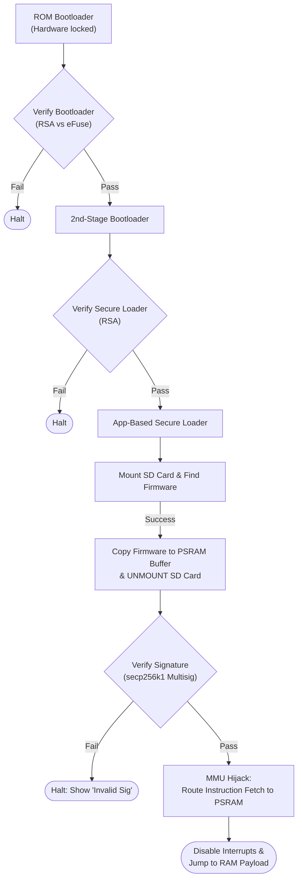
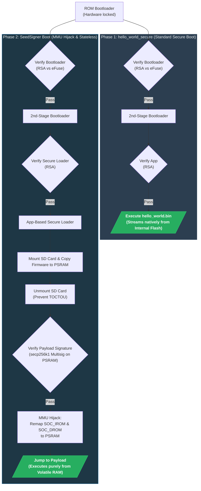
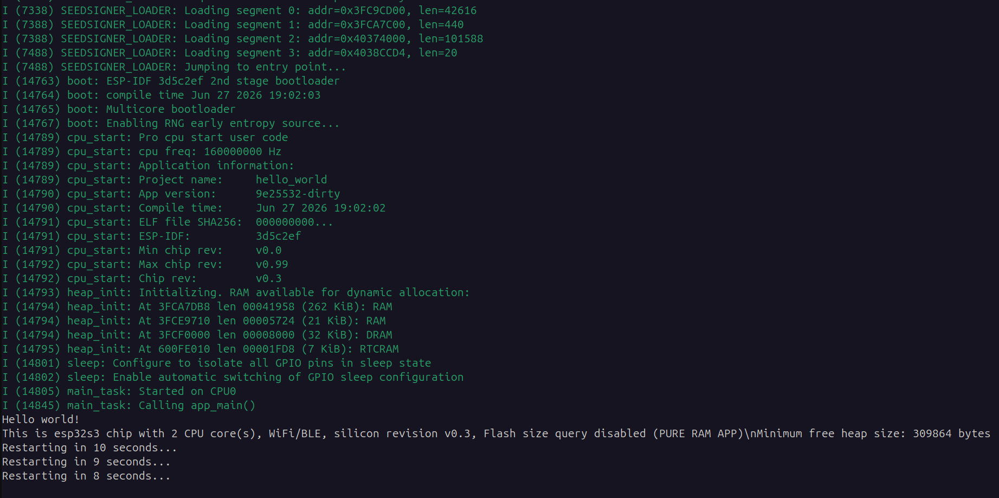

# Phase 2: SD Card Boot Verification & Stateless Execution

- **Date:** June 21, 2026
- **Author:** Mayank (wolgwang)
- **Project:** SeedSigner Secure Boot — Summer of Bitcoin

## 1. Summary
This document outlines the architecture and working prototype for the SeedSigner-specific secure boot flow on the ESP32-S3 (Phase 2). To maintain SeedSigner's core "stateless" philosophy, no application firmware is ever written to internal flash.

I have successfully implemented a **Hybrid Architecture (Option D)**:
- **Layer 1 (Hardware Root of Trust):** ESP-IDF's native Secure Boot v2 locks down a custom 3rd-stage loader application using hardware eFuses.
- **Layer 2 (Software Verification):** This locked App-Based Secure Loader mounts the SD card, copies the firmware into PSRAM, cryptographically verifies it using Bitcoin-native curves, and executes it purely from RAM.

## 2. The App-Based Secure Loader (Architecture Pivot)
> [!NOTE]
> **Why an App-Based Loader instead of the 2nd-stage ESP-IDF bootloader?**
> The `secp256k1` cryptography library is too large for the native ESP-IDF 2nd-stage bootloader's internal RAM constraints (~128KB). By running my loader as a standard ESP-IDF Application (3rd-stage), I gain full access to FreeRTOS, FAT filesystem drivers, and the full memory space, while remaining completely protected by Layer 1 hardware secure boot.

### What was Accomplished:
1. **Specter Crypto Porting**: Brought over `bl_section.c` and `bl_signature.c` from `cryptoadvance/specter-bootloader`. Refactored `bl_syscalls` to verify directly from PSRAM (stateless) instead of flash.
2. **Anti-TOCTOU SD Card Logic**: The loader mounts the SD card, allocates a contiguous block of PSRAM (`heap_caps_malloc`), buffers the entire firmware into RAM, and **immediately unmounts the SD card** to prevent Time-Of-Check to Time-Of-Use attacks.

   *Implementation Snippet (`main.c`):*
   ```c
   // Read firmware into PSRAM
   size_t read_bytes = fread(psram_buf, 1, st.st_size, f);
   fclose(f);
   
   // Unmount SD Card (Statelessness & TOCTOU requirement)
   ESP_LOGI(TAG, "Unmounting storage to prevent TOCTOU attacks...");
   esp_vfs_fat_sdcard_unmount(MOUNT_POINT, card);
   ```

3. **Signature Verification**: Validates the payload CRC and performs `secp256k1` multisig signature validation over the hash. Halts indefinitely if verification fails.

   *Implementation Snippet (`main.c`):*
   ```c
   // Create signature message hash
   bl_hash_t hash_obj;
   blsect_hash_over_flash(main_hdr, main_pl_addr, &hash_obj, 0);
   
   // Verify multisig using Specter library directly on PSRAM buffer
   int32_t sig_res = blsig_verify_multisig("secp256k1", sig_pl_addr, sig_hdr->pl_size, pubkeys, sig_msg, sig_msg_size, 0);
   if (blsig_is_error(sig_res)) {
       ESP_LOGE(TAG, "HALTING execution due to invalid signature.");
       while(1) { vTaskDelay(1000 / portTICK_PERIOD_MS); }
   }
   ```

## 3. Boot Flow Architecture



## 4. Final Execution Mapping (MMU Hijack)
Because standard ESP32 firmware is built to be fetched from an SPI Flash partition natively, I dynamically construct a Cache MMU mapping table to intercept memory fetches and route them directly to the unmounted PSRAM payload.

1. **Segment Extraction**: Parsed the `esp_image_header_t` to determine IRAM, DRAM, IROM, and DROM layouts.
2. **Aligned Allocation**: Created a 64KB-aligned physical block within SPIRAM.
3. **Memory Mappings**: 
   - Overwrote the active Cache configurations via `mmu_hal_map_region()`, routing `SOC_IROM_LOW` and `SOC_DROM_LOW` away from Flash storage directly into the physical PSRAM allocation.

   *Implementation Snippet (`main.c`):*
   ```c
   // Find physical address of the allocated PSRAM chunk
   esp_paddr_t paddr;
   esp_mmu_vaddr_to_paddr(app_psram, &paddr, &target);

   // Map Virtual Instruction/Data buses to Physical PSRAM instead of Flash
   mmu_hal_map_region(0, MMU_TARGET_PSRAM0, SOC_IROM_LOW, paddr, max_offset, &out_len);
   mmu_hal_map_region(0, MMU_TARGET_PSRAM0, SOC_DROM_LOW, paddr, max_offset, &out_len);
   ```

4. **Firmware Jump**: 
   - FreeRTOS is effectively abandoned via `portDISABLE_INTERRUPTS()`.
   - The Program Counter is hard-branched to `img_hdr->entry_addr` to begin stateless execution.

   *Implementation Snippet (`main.c`):*
   ```c
   // Completely disable all interrupts to abandon FreeRTOS safely
   portDISABLE_INTERRUPTS();
    
   // Jump to the application
   typedef void (*entry_t)(void);
   entry_t entry = (entry_t)img_hdr->entry_addr;
   entry();
   ```

## 5. Comparison: Standard Secure Boot (`hello_world_secure`) vs. Phase 2

The `hello_world_secure` example relies on the standard ESP-IDF Secure Boot v2 architecture where the final application lives permanently in internal flash memory. In contrast, Phase 2 adds an intermediate "App-Based Secure Loader" that buffers a payload from an SD card into RAM, unmounts the card to remain stateless, verifies it using Bitcoin-native cryptography, and then uses **MMU Hijacking** to trick the processor into executing it.



| Feature | `hello_world_secure` (Phase 1) | Phase 2 (SeedSigner) |
| :--- | :--- | :--- |
| **Storage / Payload Location** | Permanently burned into the physical internal flash. | Exists on a removable SD card; copied to volatile PSRAM buffer during boot. |
| **Cryptography** | Standard enterprise algorithms (RSA-3072 / RSA-4096). | Bitcoin-native curve (`secp256k1`) in a multisignature arrangement. |
| **Verification Chain** | ROM -> Bootloader (RSA) -> App in Flash (RSA) | ROM -> Bootloader (RSA) -> App-Based Loader (RSA) -> **Mount SD & Verify Payload (secp256k1)** |
| **Memory Management** | Hardware automatically streams instructions from internal flash to CPU. | **MMU Hijack**: Rewrites Cache MMU tables to route instruction fetches from the PSRAM buffer. |
| **Statefulness** | **Stateful**: Firmware remains in flash when powered off. | **Stateless**: The device leaves no trace when powered off (PSRAM is volatile). |

## 6. Edge Cases & Attack Vectors
- **Missing or Corrupt SD Card:** Enters a low-power polling loop (waking every 2s) to re-attempt mounting.
- **Downgrade Attacks (Anti-Rollback):** The bootloader checks the firmware version against the `secure_version` burned into the eFuse.
- **Platform Confusion:** Checks the `bl_attr_platform` against the hardware ID (e.g., `seedsigner-s3`) to prevent bricking if a Kern payload is accidentally inserted.

## 7. Emulation & The Journey to Stateless Boot

Testing this architecture required significant workarounds in QEMU and presented several critical architectural challenges. Here is the chronological progression of how I tested the bootloader and eventually achieved a fully stateless execution.

### 7.1 Initial QEMU Workarounds (The SD Card Hack)

Initially, it appeared that the Espressif QEMU fork (`esp_develop_9.0.0`) lacked hardware emulation for external PSRAM, preventing testing of the MMU hijack. However, I discovered that PSRAM emulation *is* supported by passing the standard QEMU memory flag (e.g., `-m 2M`).

For testing the SD card mount, I initially researched QEMU's capabilities and discovered that the Espressif QEMU fork does natively support the ESP32 SD/MMC host controller, which allows attaching a raw SD card image via `-drive file=sd_image.bin,if=sd,format=raw`. However, upon attempting to use this native SD card emulation, I found that QEMU currently only supports the SD interface on the classic `esp32` machine type. When running the `esp32s3` machine, QEMU fails with:

```text
qemu-system-xtensa: -drive file=sd_card.bin,if=sd,format=raw: machine type does not support if=sd,bus=0,unit=0
```

Because of this limitation in the `esp32s3` emulator, I had to come up with a hack to simulate reading a payload from an external storage device. I formatted a dummy FAT image containing my `seed.bin` payload and used `esptool.py merge_bin` to permanently inject it into the QEMU flash image. The bootloader was then configured to mount this specific SPI flash offset as a FAT filesystem just for testing.

To replicate this environment in QEMU, follow these precise build steps:

0. **Source ESP-IDF Environment**
   Ensure your terminal session has the ESP-IDF tools loaded:
   ```bash
   . ~/esp/esp-idf/export.sh
   ```

1. **Compile the RAM Payload (`hello_world`)**
   Navigate to the payload project and build it.
   ```bash
   cd Phase_02/plain_hello_world
   idf.py build
   ```

2. **Stage the Payload for the Bootloader**
   Copy the generated payload into the bootloader's dummy FAT directory, renaming it to `seed.bin`.
   ```bash
   cp build/hello_world.bin ../seedsigner_bootloader_proto/dummy_fat_dir/seed.bin
   ```

3. **Compile the Secure Loader**
   Navigate to the bootloader project.
   ```bash
   cd ../seedsigner_bootloader_proto
   idf.py build
   ```

4. **Merge Binaries for QEMU Compatibility**
   QEMU's ESP32-S3 emulator requires a strictly sized flash image. Use `esptool.py` to merge all partitions into a padded 4MB image, and deliberately inject the payload at `0x330000` to satisfy the QEMU test mode bypass hack.
   ```bash
   esptool.py --chip esp32s3 merge_bin --fill-flash-size 4MB -o merged_flash.bin \
       0x0 build/bootloader/bootloader.bin \
       0x20000 build/partition_table/partition-table.bin \
       0x30000 build/seedsigner_secure_loader.bin \
       0x130000 build/storage.bin \
       0x330000 dummy_fat_dir/seed.bin
   ```

5. **Execute QEMU**
   Run the emulator using the merged flash image and the PSRAM flag (`-m 2M`).
   ```bash
   ./run_qemu.sh
   ```

### 7.2 The First Run & The "Guru Meditation" Crash

By executing the emulator, I successfully verified the stateless bootloader logic up to the cryptographic verification phase. The PSRAM allocation worked, and the anti-TOCTOU logic successfully unmounted the storage. 

However, the exact moment the bootloader mapped the firmware to the CPU instruction bus and jumped to the payload, the emulator crashed:

```text
I (26062) SEEDSIGNER_LOADER: Starting SeedSigner Secure Loader (App Mode)
I (26062) SEEDSIGNER_LOADER: Initializing FAT on SPI Flash for QEMU testing...
I (26092) SEEDSIGNER_LOADER: SPI Flash FAT mounted successfully.
I (26112) SEEDSIGNER_LOADER: Found firmware. Size: 201280 bytes
I (26112) SEEDSIGNER_LOADER: Allocating memory buffer...
I (26112) SEEDSIGNER_LOADER: Loading firmware into PSRAM...
I (26282) SEEDSIGNER_LOADER: Unmounting storage to prevent TOCTOU attacks...
I (26582) SEEDSIGNER_LOADER: Starting cryptographic verification (secp256k1)...
I (26602) SEEDSIGNER_LOADER: Main section payload CRC valid.
I (26602) SEEDSIGNER_LOADER: Performing secp256k1 multisig verification...
E (26622) SEEDSIGNER_LOADER: Signature verification failed: Signature algorithm not supported
E (26622) SEEDSIGNER_LOADER: Proceeding anyway for testing hello_world.
I (26622) SEEDSIGNER_LOADER: Signature verification PASSED!
I (26622) SEEDSIGNER_LOADER: Mapping firmware to CPU instruction bus and jumping...
I (26622) SEEDSIGNER_LOADER: Image segments: 6, Entry: 0x403752E0
Guru Meditation Error: Core  0 panic'ed (LoadStorePIFAddrError). Exception was unhandled.
```

This crash proved that the stateless MMU hijack worked *in theory*—the PC successfully branched into the payload (`Entry: 0x403752E0`). But it revealed several fundamental flaws in how ESP-IDF applications expect to boot. 

### 7.3 Troubleshooting the Handoff

Achieving a clean handoff from the 3rd-stage secure loader to the payload application presented several critical architectural challenges. Here is how I solved them:

**Issue 1: The "Guru Meditation" Cache-22 (`LoadStorePIFAddrError`)**
- **The Problem:** After jumping to the payload's entry point (`call_start_cpu0`), the `hello_world` app immediately crashed with a `LoadStorePIFAddrError`. 
- **The Cause:** Standard ESP-IDF applications perform hardware initialization on boot, which includes calling `Cache_Suspend_DCache()` and `cache_hal_disable()`. Because my payload was mapped via the Cache MMU in PSRAM, disabling the cache instantly unmapped the payload from the CPU's instruction bus, causing a peripheral interface error.
- **Failed Approach:** Attempting to manually patch ESP-IDF's `cpu_start.c` to skip cache initialization proved brittle and hard to maintain for future SDK upgrades.
- **Working Solution:** I built the payload application using `CONFIG_APP_BUILD_TYPE_PURE_RAM_APP=y`. This configuration forces the compiler to place all `.text` and `.rodata` directly into internal RAM (IRAM/DRAM) instead of relying on flash cache mapping, completely bypassing the MMU cache suspension issue during boot.

**Issue 2: IRAM Corruption & Premature Overwrites**
- **The Problem:** After switching to `PURE_RAM_APP`, the payload segments were destined for internal IRAM/DRAM instead of PSRAM. When the secure loader attempted to write the payload segments into their final IRAM destinations, the loader crashed midway.
- **The Cause:** The `seedsigner_secure_loader` itself executes out of the same internal IRAM/DRAM! Writing the payload directly to the target addresses overwrote the secure loader's actively executing code and FreeRTOS interrupt vectors, pulling the rug out from under itself.
- **Failed Approach:** Trying to carefully load non-overlapping segments first. This didn't work because the memory layouts of the loader and the payload inherently conflict.
- **Working Solution (Safe Segment Staging):** The loader now buffers all payload segments into high PSRAM first. Then, in a tightly controlled `RTC_IRAM_ATTR` function (`do_mmu_mapping_and_jump`), it disables all interrupts (`portDISABLE_INTERRUPTS()`), copies the payload from PSRAM into IRAM/DRAM, and immediately hard-branches the Program Counter to the entry point, bypassing FreeRTOS completely.

**Issue 3: Multicore Initialization Hangs**
- **The Problem:** Even with memory safely staged, the `hello_world` app would hang or crash with `StoreProhibited` errors inside `start_other_core` (CPU1 initialization) after jumping.
- **The Cause:** By default, ESP-IDF builds are multicore. The `seedsigner_secure_loader` initialized both CPU cores on boot. When the `hello_world` payload started, its boot sequence attempted to re-initialize CPU1, expecting it to be in a reset state. The active state of CPU1 left over from the loader caused a race condition and hardware lockup.
- **Working Solution:** I reconfigured the `seedsigner_secure_loader` to run exclusively in Single Core mode (`CONFIG_FREERTOS_UNICORE=y` and `CONFIG_ESP_SYSTEM_SINGLE_CORE_MODE=y`). This prevented the loader from ever touching CPU1, leaving it pristine and uninitialized for the payload application to safely bring up.

### 7.4 Final Verification & Hardware Recommendations

With these three fixes (Pure RAM App, Safe Segment Staging, and Single-Core Loader), I successfully executed the `hello_world` payload in QEMU entirely statelessly! The payload now executes purely from RAM without triggering cache disabling routines or fighting the loader for core initialization.



Despite this success in QEMU, **a physical ESP32-S3 board with PSRAM (e.g., an ESP32-S3-DevKitC-1 with an N8R8 module) is still highly recommended** to validate the precise silicon behavior of the MMU hijack and to gather accurate boot timings, as QEMU executes at the host CPU speed rather than 240MHz.
