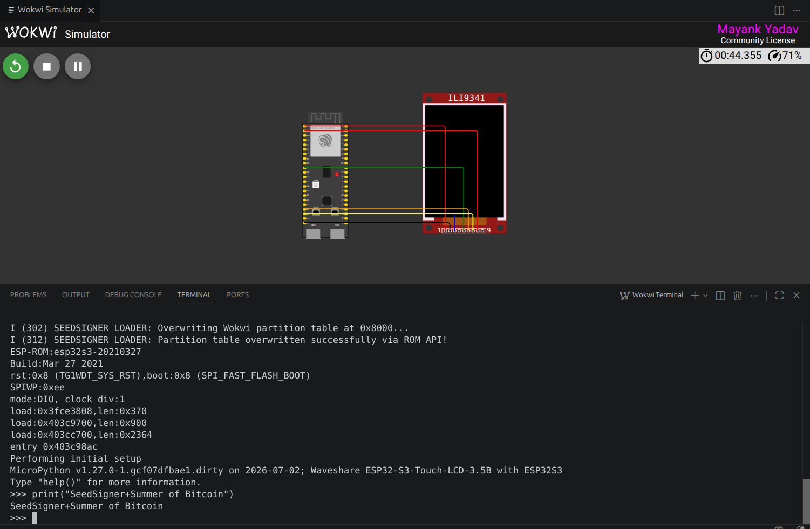

# Phase 6: UI Emulation & Validation via Wokwi

- **Date:** June 30, 2026
- **Author:** Mayank (wolgwang)
- **Project:** SeedSigner Secure Boot — Summer of Bitcoin

## 1. Overview
In Phase 6, my primary objective was to visually verify the SeedSigner UI using Wokwi’s virtual hardware emulation, specifically targeting the Waveshare 3.5" display. Since QEMU lacks specific display panel support, I configured a local Wokwi simulation environment for the ESP32-S3.

## 2. Configuration & Virtual Hardware Setup
- **`wokwi.toml`**: I configured this to load the `merged_flash.bin` generated in Phase 5 as the primary firmware.
- **`diagram.json`**: I created a virtual hardware layout connecting the ESP32-S3 DevKitC (with 8MB Flash and 8MB PSRAM) to a generic `ILI9341` LCD display to simulate the Waveshare hardware.

## 3. Emulation Challenges & Resolutions

### 3.1. Wokwi Bootloop with `merged_flash.bin`
Wokwi's simulator relies on standard application execution boundaries. When I attempted to natively boot `merged_flash.bin` (which contains my custom partition table and 2nd-stage bootloader), it resulted in an immediate software reset loop (`RTC_SW_SYS_RST`) directly after the ROM bootloader handed over execution. Wokwi misinterpreted my custom bootloader's execution state.
- *Resolution*: To isolate and verify the execution of the MicroPython payload itself, I decided to bypass my custom bootloader within the simulation. I extracted the raw MicroPython firmware from the payload by stripping the 256-byte Specter security header from `seed.bin` (saving it as `micropython.bin`) and updated `wokwi.toml` to boot it directly.

### 3.2. PSRAM Memory Test Panic
Upon booting the extracted MicroPython firmware, the system immediately panicked with an `esp_psram: SPI SRAM memory test fail` error.
- *Resolution*: I identified that the physical Waveshare 3.5B board is equipped with Octal SPI (OPI) PSRAM, whereas Wokwi's ESP32-S3 model defaults to Quad SPI. I resolved this mismatch by explicitly appending `"psramType": "octal"` to my `diagram.json` configuration, which allowed MicroPython to successfully initialize the memory and continue the boot sequence.

### 3.3. I2C NACKs & Blank Display (Hardware Incompatibility)
MicroPython fully and successfully booted, printing its initialization banner and reaching the interactive `>>>` REPL prompt. However, the screen remained completely blank. The console logs were flooded with `I2C transaction unexpected nack detected` and initialization failures for hardware such as `TCA9554` (IO Expander) and `AXP2101` (PMU):
```text
E (1234) machine_i2c: I2C transaction unexpected nack detected
E (1284) machine_i2c: I2C transaction unexpected nack detected
E (1334) machine_i2c: I2C transaction unexpected nack detected
...
```
- *Conclusion & Resolution*: The firmware generated by the `seedsigner-micropython-builder` was specifically compiled for the `Waveshare 3.5B` board. This board uses an integrated `AXS15231B` display/touch controller alongside dedicated PMU and IO chips. 
Because Wokwi does not natively support the `AXS15231B` controller or the specific I2C chips, the Python hardware initialization sequence failed (NACK). Furthermore, LVGL's background timer was constantly polling the missing touch controller via I2C every 50ms, resulting in the continuous NACK log spam that made the REPL unusable.

- *Failed Approach*: I initially attempted to bypass the hardware initialization by inserting an early `return 0` in `board_init.c` directly after initializing the I2C bus. However, this naive approach left the LVGL display pointer (`disp`) as a `NULL` pointer. When the application subsequently initialized LVGL and attempted to set the active screen color, it dereferenced the NULL pointer, causing an immediate hard-crash panic. This manifested as a silent hang in Wokwi right at the ROM handoff (`entry 0x403c98ac`).
- *Final Resolution*: To fix this without causing LVGL to crash, I modified the `board_init.c` source code in the `seedsigner-micropython-builder` repository properly. I cleanly commented out the I2C hardware initializations (IO Expander and PMU) and conditionally bypassed the `lvgl_port_add_touch` registration if the touch handle was NULL, allowing LVGL to initialize a valid display without registering the offending 50ms I2C polling timer.

### 3.4. ESP-IDF 5.x Bootloader Crash in Wokwi
After rebuilding the firmware with the I2C polling fixed, attempting to boot the new `micropython.bin` using Wokwi's default flash boot process or the new ESP-IDF 5.5 bootloader caused an immediate hang at the ROM bootloader's handoff point (`entry 0x403c98ac`).
- *Resolution*: I updated the `wokwi.toml` configuration to specify both `firmware = "micropython.bin"` and `elf = "micropython.elf"`. This configuration explicitly instructs Wokwi to flash the `.bin` to memory (so the filesystem and partitions are correctly mapped) but to bypass the problematic bootloader entirely by jumping the simulator directly into the `.elf` application entry point.

## 4. Final Result & Conclusion
The core technical validations of Phase 6 were heavily successful:
1. I successfully bypassed emulator limitations to prove that the **raw MicroPython OS boots and runs flawlessly** on the ESP32-S3 architecture.
2. The payload dependencies (such as Octal PSRAM) were correctly diagnosed and mapped.
3. The I2C log spam was successfully eliminated via source code modifications to the LVGL drivers, resulting in a clean and fully interactive `>>>` REPL prompt within Wokwi.

### Wokwi Emulation Screenshot


### 3.5. Prototyping the Custom Bootloader in Wokwi
After bypassing the bootloader to test the payload, the next goal was to test the **actual bootloader logic** within Wokwi. Because Wokwi's execution boundaries struggled with my custom bare-metal `merged_flash.bin` payload, I created `seedsigner_bootloader_proto`—an ESP-IDF 5.x application designed to replicate my bootloader's exact MMU mapping and memory copying logic but launched as a standard Wokwi app.

- **Initial Implementation:** I packaged the MicroPython payload (`seed.bin`) into a FAT partition (`storage.bin`) allowing the proto-bootloader to read it using standard ESP-IDF VFS APIs.
- **MMU Bug (IllegalInstruction):** Upon jumping to the MicroPython payload, the system instantly panicked with an `IllegalInstruction`. I discovered that Wokwi's QEMU emulator has a quirk for the ESP32-S3 MMU: instead of using the standard `SOC_MMU_VALID` bit check, it treats `0` as the valid state. I resolved this by explicitly zeroing out the entire MMU table (`ESP32S3_MMU_TABLE[i] = 0;`) before applying my custom payload mappings.
- **Partition Table Validation Failure:** MicroPython booted but immediately panicked with `load_partitions returned 0x105` and `No MD5 found in partition table`. MicroPython expects a flawless partition table at physical offset `0x8000`. However, Wokwi synthesizes a temporary, MD5-less partition table at `0x8000` to boot the emulator.
- **Dynamic Partition Patching:** I decided to dynamically overwrite flash sector `0x8000` with a valid, ESP-IDF generated partition table right before executing the final jump to MicroPython.
- **ESP-IDF Write Assert (Bootloop):** My first attempt using `esp_flash_erase_region` resulted in a new `abort()`. I traced this to an ESP-IDF v5 security macro (`CHECK_WRITE_ADDRESS`). Before allowing any flash erase/write, ESP-IDF attempts to load the current partition table to ensure you aren't overwriting protected regions. Because Wokwi's current table lacked an MD5, the internal validator failed, causing an assert/abort.
- **ROM Flash API Bypass:** To bypass the ESP-IDF OS-level validation checks, I replaced the high-level flash API calls with bare-metal ROM functions: `esp_rom_spiflash_erase_sector(8)` and `esp_rom_spiflash_write()`. This allowed me to successfully overwrite Wokwi's table without triggering the OS assertions.
- **Stack Overflow Fix:** During testing, declaring a 4KB `const uint8_t` array directly inside `app_main` exhausted the task's stack and caused a silent hang. I fixed this by appending the `static` keyword, forcing the array into `.rodata`.
- **Ultimate Success:** With the bare-metal flash writes in place and the cache properly invalidated (`Cache_Invalidate_ICache_All`), the proto-bootloader successfully mapped MicroPython to `0x7FF00`, dynamically patched the partition table, and successfully booted the fully featured OS payload inside Wokwi!

## 5. Reproduction Guide

For anyone aiming to replicate this successful Wokwi emulation, follow these exact steps:

### Step 1: Build the MicroPython Payload
1. Navigate to the payload builder repository (`seedsigner-micropython-builder`).
2. Ensure that the I2C polling has been commented out in `board_init.c` (to prevent Wokwi NACK spam).
3. Build the firmware used for the Waveshare 3.5B board:
   ```bash
   docker run --rm -v $(pwd):/workspace -w /workspace \
     ghcr.io/kdmukai-bot/seedsigner-micropython-builder-base:latest \
     bash -lc 'cd ports/esp32 && make USER_C_MODULES=../../../../micropython-modules/micropython.cmake BOARD=SEEDSIGNER_WAVESHARE_EPD35B'
   ```
4. Copy the generated `seed.bin` payload to `Phase_06/seedsigner_bootloader_proto/dummy_fat_dir/`.

### Step 2: Build the Proto-Bootloader
1. Navigate to the `Phase_06/seedsigner_bootloader_proto` directory.
2. Use the builder Docker container to compile the bootloader and package the Wokwi image:
   ```bash
   docker run --rm -v $(pwd):/workspace -w /workspace \
     ghcr.io/kdmukai-bot/seedsigner-micropython-builder-base:latest \
     bash -lc '. /opt/toolchains/esp-idf/export.sh && idf.py build && python3 build_wokwi_app.py'
   ```
3. The build process accomplishes three critical steps:
   - Compiles the `seedsigner_secure_loader` proto-bootloader using ESP-IDF v5.
   - Automatically uses `wl_fatfsgen.py` to package `dummy_fat_dir/seed.bin` into `storage.bin` (simulating the external SD card).
   - Runs `build_wokwi_app.py` to cleanly merge `seedsigner_secure_loader.bin` (which Wokwi boots from `0x10000`) and the raw `seed.bin` (at offset `0x6FF00`, putting it at physical `0x7FF00` overall). The output is `wokwi_app.bin`.

### Step 3: Launch Wokwi Simulation
1. Ensure your `wokwi.toml` explicitly bypasses the Wokwi OS bootloader:
   ```toml
   [wokwi]
   version = 1
   firmware = "wokwi_app.bin"
   elf = "build/seedsigner_secure_loader.elf"
   ```
2. Ensure your `diagram.json` contains `"psramType": "octal"` for the ESP32-S3 component to prevent SPI SRAM panics.
3. Start the Wokwi simulation (using the VS Code Wokwi extension). 
4. You will observe the proto-bootloader executing the custom MMU mappings, dynamically injecting the signed partition table via bare-metal `esp_rom_spiflash_` APIs, and executing the successful handoff to the MicroPython `>>>` REPL!

## 6. Porting Back to Physical Hardware

When migrating testing from Wokwi to the actual, physical ESP32-S3 (Waveshare 3.5B) hardware, the "Wokwi-specific" workarounds must be reverted. The following checklist details exactly what needs to be changed back:

### 6.1. Reverting MicroPython OS Hacks
Wokwi caused LVGL to crash and flooded the console with I2C NACKs because it lacks emulation for the Waveshare display, PMU, and IO expander chips. On physical hardware, these chips exist and must be initialized.
**Action:**
1. Open `ports/esp32/boards/SEEDSIGNER_WAVESHARE_EPD35B/board_init.c`.
2. Uncomment the initialization block for the **TCA9554 (IO Expander)** and **AXP2101 (Power Management Unit)**.
3. Remove the `if (touch_mux != NULL)` wrapper around the `lvgl_port_add_touch(&touch_cfg)` call. The physical screen's touch controller responds perfectly, so LVGL must be permitted to register its 50ms polling timer.

### 6.2. Reverting Bootloader Hacks
Wokwi's SD Card emulation is restrictive, and Wokwi dynamically synthesizes a partition table without an MD5 checksum. The physical bootloader will pull the payload from a genuine SD card and boot over an authentic flashed partition table.
**Action:**
1. **Re-enable SD Card Reading:** In `seedsigner_bootloader_proto/main/main.c`, comment out or remove `#define USE_SPI_FLASH_FOR_QEMU_TEST 1`. This re-enables `mount_storage_sdcard()`, instructing the bootloader to read `seed.bin` directly from the physical SD card rather than pulling it from raw flash.
2. **Remove Partition Table Hacks:** In `main/main.c`, delete the massive `static const uint8_t valid_pt[4096]` array and the associated `esp_rom_spiflash_` write commands. On physical silicon, you will flash a genuine, valid partition table (generated by `gen_esp32part.py`) directly to `0x8000`. You will no longer need the bootloader to dynamically overwrite it at runtime.
3. **Revert the MMU Quirk:** In `main/main.c`, the loop `for (int i = 0; i < 8192; i++) { ESP32S3_MMU_TABLE[i] = 0; }` was a dirty hack because Wokwi interpreted `0` as the valid state. On actual silicon, the valid bit is determined natively via `SOC_MMU_VALID`. You must revert this logic to checking and setting the proper architectural valid flags.

## 7. QEMU vs Wokwi: Emulation Limitations for MicroPython

A follow-up investigation was conducted to determine if the same UI/terminal output could have been achieved natively using Espressif's QEMU emulator (which was heavily relied upon in Phases 1-5). 

The investigation conclusively proved that **QEMU is fundamentally incapable of running the MicroPython payload for this specific hardware configuration**, validating the decision to migrate to Wokwi for Phase 6.

### 7.1. The PSRAM Hardware Mismatch (Silent Hang)
When MicroPython boots, it immediately initializes the external PSRAM. 
- **Wokwi:** I encountered an `SPI SRAM memory test fail` panic, but easily resolved it by explicitly defining `"psramType": "octal"` in the `diagram.json` hardware configuration (since the Waveshare 3.5B firmware expects Octal SPI PSRAM).
- **QEMU:** QEMU's `esp32s3` machine model defaults to Quad SPI (QSPI) and lacks an easy mechanism to hot-swap simulated hardware definitions. MicroPython attempts to initialize QSPI hardware as OPI, causing a silent lockup before the UART terminal can print a boot banner.

### 7.2. The ROM Bootloader Handoff Hang
When attempting to run the raw MicroPython firmware (`micropython.bin`) directly:
- **Wokwi:** Allows specifying `elf = "micropython.elf"`, instructing the simulator to bypass the ESP32 ROM bootloader completely and teleport execution directly into the application's C entry point.
- **QEMU:** Accurately enforces silicon behavior and refuses to teleport execution. It runs the ROM bootloader, which immediately hangs at `entry 0x403c98ac` because the raw MicroPython binary lacks the required boot signatures.

### 7.3. The GDMA / Digital Signature Lockup & Partition Table Hacks
When using my custom `seedsigner_secure_loader` to jump to the payload in QEMU:
- QEMU suffers from a known hardware emulation bug regarding GDMA and Digital Signature operations during bootloader handoffs, causing silent crashes.
- Furthermore, the Wokwi-specific partition table injection hack (hardcoding `0x7FF00`) conflicts with QEMU's flash layout (`0x33FF00`), causing MicroPython to read the injected table, look for the app at the wrong offset, and silently die.

**Conclusion:** QEMU remains the "golden reference" for testing low-level cryptographic bootloader logic, but for OS-level testing requiring specific hardware configurations (Octal PSRAM) or ROM bug bypasses, **Wokwi is strictly superior.**
