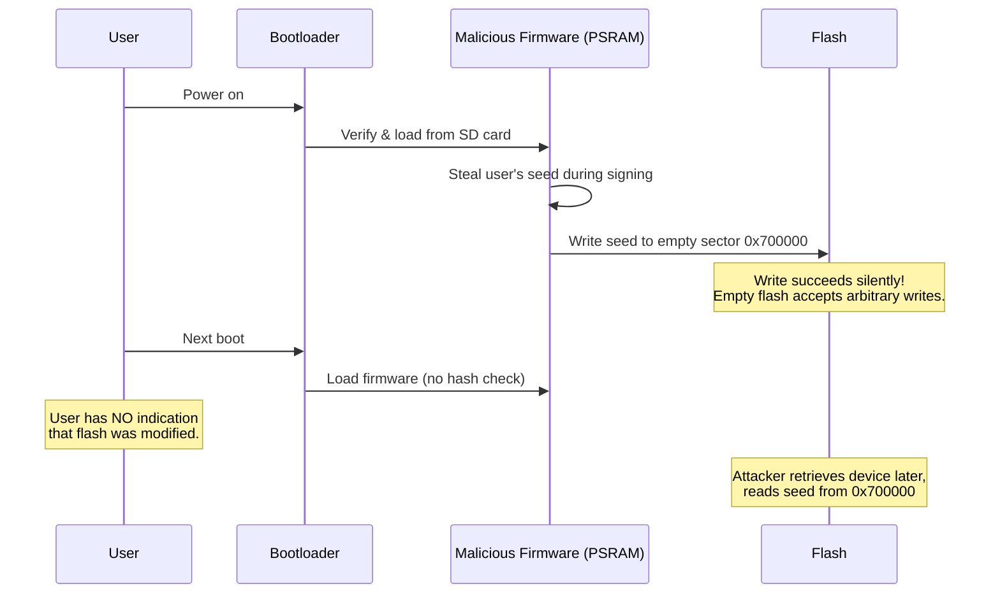
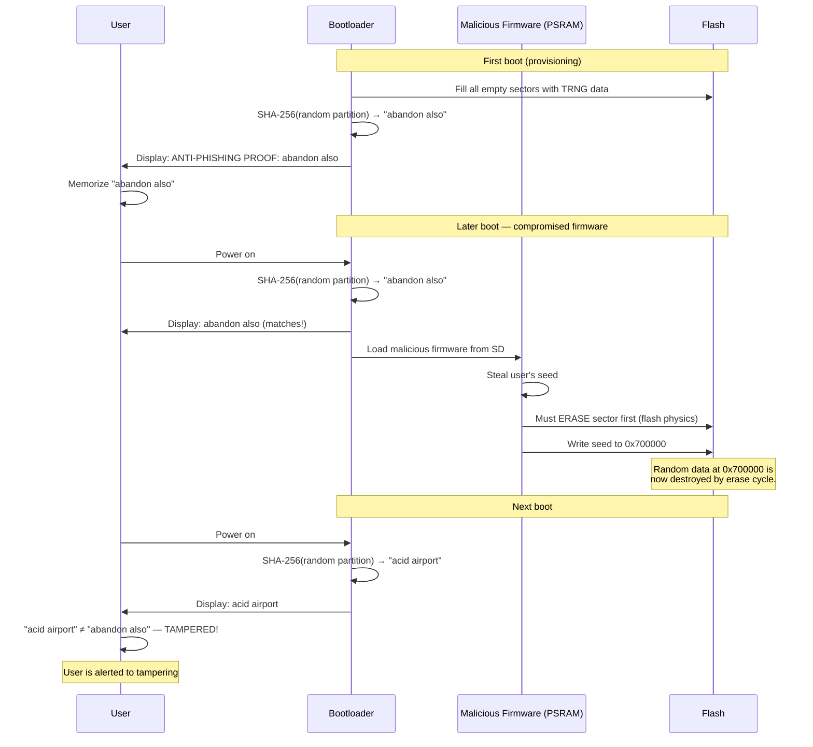
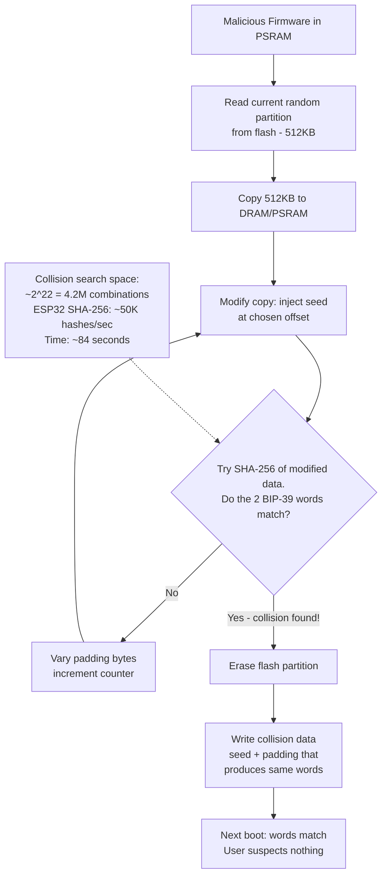
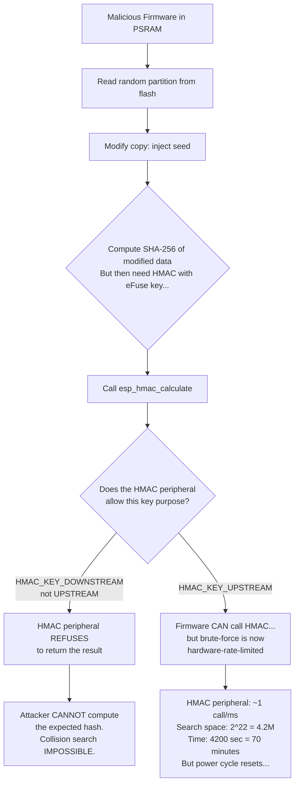
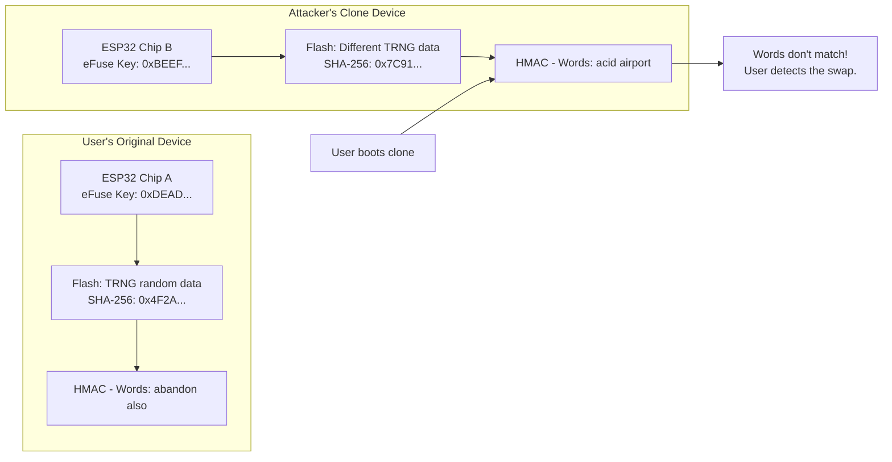
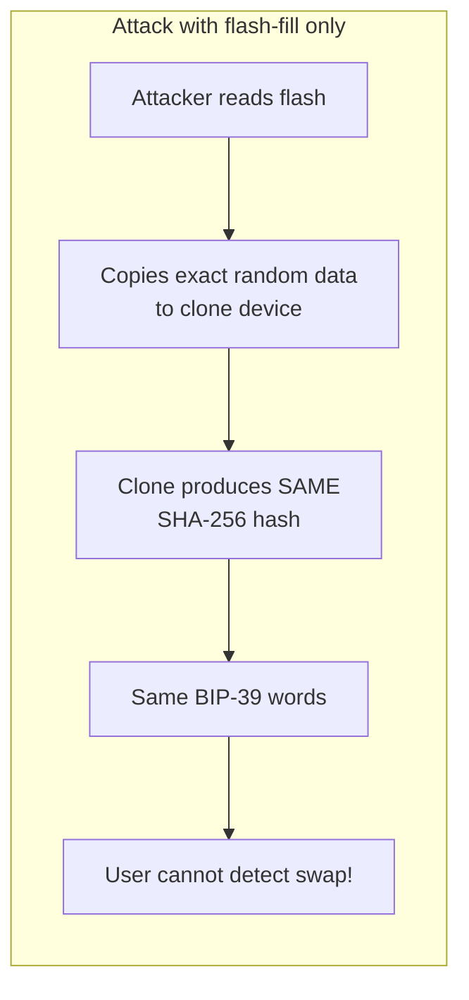
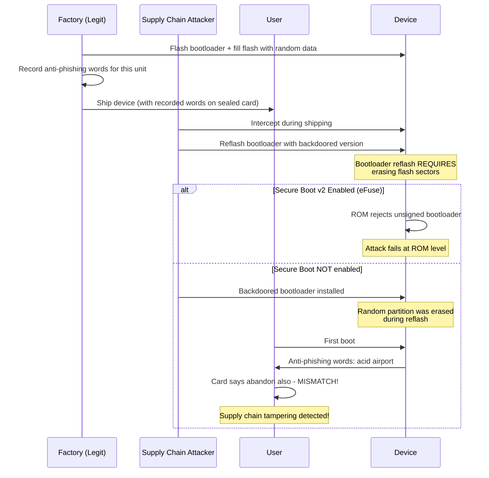
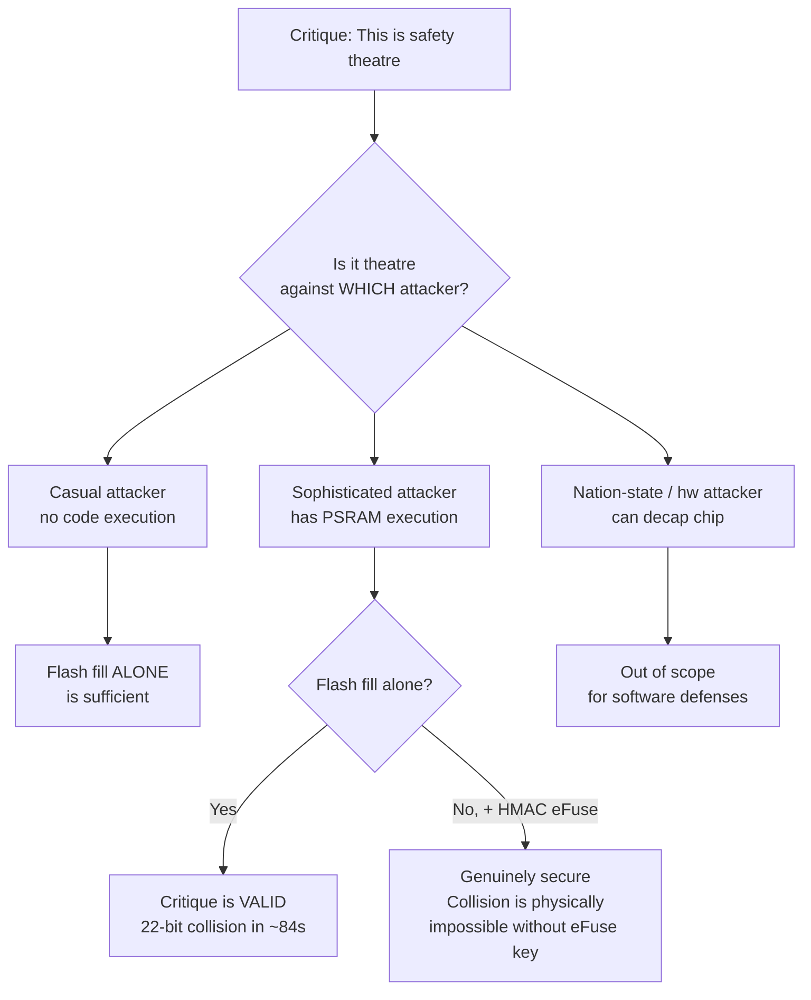

# Phase 7: Onboard Storage Hardening & Anti-Phishing Exploration

- **Date:** July 8, 2026
- **Author:** Mayank (wolgwang)
- **Project:** SeedSigner Secure Boot — Summer of Bitcoin

## 1. Summary
This document outlines the findings and prototype implementation for Phase 7 of the SeedSigner Secure Loader project. The objective was to guarantee that secrets cannot be written to the onboard ESP32 flash by a malicious runtime firmware. 

By deliberately filling all unallocated flash space with true random data and cryptographically tying this data to a user-verifiable proof (similar to Coldcard's anti-phishing words), I establish a tamper-evident hardware lock without relying solely on specialized eFuses or flash encryption.

## 2. Design & Feasibility

### 1. Flash Space Analysis
The standard ESP32 flash configurations typically range from 4MB to 16MB. The bootloader, partition table, and the secure runtime payload only occupy a fraction of this space (typically <4MB). To prevent malicious firmware from stashing persistent secrets, the remaining space must be secured. 

### 2. Random Flash Filling Strategy
Instead of statically bloating the bootloader binary (which increases OTA payload sizes and lacks unit-specific entropy), I dynamically fill the flash during the first boot/provisioning phase:
1. **True Random Generation:** The ESP32 Hardware TRNG (`esp_random()`) is utilized to generate high-entropy noise.
2. **Flash Operations:** The bootloader executes `esp_rom_spiflash_erase_sector` and `esp_rom_spiflash_write` to completely overwrite all unallocated sectors with this random data.
3. **Immutability Guarantee:** Once filled, any subsequent attempt to write structured data (secrets) to these sectors requires a slow flash erase cycle, which intrinsically modifies the random data.

### 3. The Unit-Specific Proof (Anti-Phishing)
To make this defense user-verifiable, the bootloader continuously verifies the integrity of this random data on every subsequent boot:
- **Hardware SHA-256:** The entire random partition is hashed using the ESP32's hardware-accelerated SHA-256 engine.
- **BIP-39 Mapping:** The resulting 256-bit hash is deterministically mapped to a small set of words from the BIP-39 dictionary (e.g., `abandon also`).
- **User Presentation:** The bootloader passes these words to the UI (or logs them, in the case of my headless prototype). The user memorizes their device's unique words. If a malicious firmware ever erases/modifies the flash to store secrets, the hash changes, and the words change, instantly alerting the user to the tamper attempt.

> [!IMPORTANT]
> **Addressing Hash Collisions:** While the physical one-way write property of the flash forces an erase cycle to modify the data, the mathematical security relies entirely on the SHA-256 hash. Because the 256-bit hash is mapped down to only two BIP-39 words (yielding ~4.2 million combinations, or ~22 bits of entropy), an attacker with PSRAM execution could theoretically brute-force a hash collision in RAM within seconds. They could find a specific padding that results in the same two anti-phishing words and write it to flash alongside a stolen seed. 
> 
> **Countermeasure:** To prevent this, the final production implementation must mix a **Hardware-Bound Secret** (such as the ESP32's unique factory MAC address or a burned eFuse key) into the SHA-256 hash. This physically binds the proof to the specific chip and exponentially increases the difficulty of offline or RAM-based brute-forcing.

## 3. Prototype Implementation (QEMU)

A working prototype has been integrated into the `Phase_07/seedsigner_bootloader_proto` codebase. 

### Core Logic (`main.c`)
The function `fill_and_hash_remaining_flash()` was injected into the bootloader initialization sequence. For the prototype, it targets a 512KB mock partition at `0x700000`:
1. Erases the 512KB region.
2. Fills it iteratively using `esp_fill_random()`.
3. Hashes the entire 512KB region using `mbedtls_sha256`.
4. Derives two BIP-39 words from the resulting hash bytes using bitwise operations.

### Execution Results
When executed in the QEMU environment (`./run_qemu.sh`), the bootloader successfully logs the following:

```
I (271) SEEDSIGNER_LOADER: --- STORAGE HARDENING & ANTI-PHISHING ---
I (271) SEEDSIGNER_LOADER: Erasing 524288 bytes of flash at 0x00700000...
I (331) SEEDSIGNER_LOADER: Filling flash with true random data...
I (11100) SEEDSIGNER_LOADER: Flash filled. Calculating SHA-256 over the random partition...
I (22021) SEEDSIGNER_LOADER: ================================================
I (22021) SEEDSIGNER_LOADER:   ANTI-PHISHING PROOF: abandon also
I (22021) SEEDSIGNER_LOADER: ================================================
```

*(Note: The words `abandon also` will vary based on the TRNG entropy generated during the flash fill).*

## 4. Conclusion & Next Steps
The exploration successfully proves that I can dynamically secure the unallocated flash space and generate a unit-specific anti-phishing proof entirely within the ESP32 bootloader. 

This mechanism perfectly complements the MMU Hijack (PSRAM execution) from Phase 2. The runtime firmware operates completely statelessly in PSRAM, and any attempt to break out and persist data to the flash will be mathematically proven and visible to the user on the very next boot.

## 5. Kern's HMAC-Based Anti-Phishing Approach
According to the project's literature review, the `odudex/Kern` firmware (an ESP32-P4 Bitcoin signer) utilizes a different, stateful approach to anti-phishing by leveraging the ESP32's built-in **HMAC peripheral**.

Kern mitigates UI spoofing and "Evil Maid" physical device swaps through the following mechanism:
1. **eFuse Secret:** A permanent, device-bound secret key is burned into the `HMAC_UP` eFuse (specifically using `HMAC_KEY5`).
2. **Hardware Derivation:** When the user enters a partial PIN, the firmware requests the hardware HMAC peripheral to calculate `esp_hmac_calculate(HMAC_KEY5, PIN)`, which returns a 32-byte HMAC.
3. **BIP-39 Display:** The firmware derives two BIP-39 words from this 32-byte HMAC and displays them on the screen.

Because the eFuse key cannot be extracted or read directly by software, this mechanism effectively turns a hardware eFuse into UI authentication. When the user verifies the words match their expectation, it proves they are interacting with their specific physical chip and not a compromised clone.

## 6. Combining Storage Immutability with Hardware Authentication
By combining my Phase 7 approach (hashing the random flash data) with Kern's approach (hardware HMAC eFuse), I can achieve an ultimate anti-tamper guarantee that solves the 22-bit brute-force vulnerability outlined in Section 3.

If I configure the bootloader to calculate the SHA-256 hash of the randomized flash memory, and then feed that resulting hash into the ESP32 hardware HMAC block alongside the secret eFuse key (or use the eFuse key as a salt for the flash hash), the final two BIP-39 words will simultaneously mathematically prove two things at once:
1. **Hardware Identity:** The words could only have been generated by this specific physical ESP32 chip (because of the hidden eFuse key), preventing "Evil Maid" device swaps.
2. **Storage Immutability:** The empty flash memory has not been overwritten with stolen secrets (because any modification changes the flash hash).

This combination makes it physically impossible for a compromised runtime payload in PSRAM to brute-force a collision, because the payload cannot read the eFuse key required to calculate the final words.

---

## 7. Attack Scenario Analysis

Security review feedback — *"This looks like safety theatre. It doesn't really provide extra security if someone wants to hack it, he would."*

### Is the Critique Valid?

**Partially.** The flash-fill-only approach (without HMAC eFuse binding) is indeed vulnerable to a determined attacker who has code execution on the device. But the flash fill is **not** safety theatre — it is a **necessary physical constraint** that, when combined with hardware-bound secrets (Section 6), becomes a genuinely robust defense.

This section walks through **6 concrete attack scenarios**, showing exactly where flash fill works, where it fails, and what closes each gap.

### Threat Model Recap

**What I'm defending against:** A malicious (or compromised) runtime firmware payload running in PSRAM that attempts to **exfiltrate a user's Bitcoin seed** by secretly writing it to the onboard flash — so the attacker can retrieve it later via physical access, firmware update, or a covert channel.

**My defense layers:**
1. **Stateless execution** — Runtime firmware runs from PSRAM via MMU hijack (Phase 2), never touching flash
2. **Flash filling** — All unallocated flash is filled with TRNG random data (Phase 7)
3. **Hash verification** — SHA-256 hash of flash → BIP-39 anti-phishing words shown on every boot
4. **HMAC eFuse binding** — (Proposed) Hardware-bound secret mixed into the hash

---

### Attack Scenario 1: Naive Secret Stashing (No Flash Fill)

> **Attacker goal:** Write a stolen seed to empty flash sectors for later retrieval.  
> **Precondition:** Flash fill is NOT implemented.




#### Verdict

| Aspect | Result |
|--------|--------|
| **Attack succeeds?** | Yes — trivially |
| **User aware?** | No indication whatsoever |
| **Flash fill helps?** | N/A — not implemented |

> [!CAUTION]
> Without any flash filling, a malicious firmware can silently stash secrets in empty flash sectors. The user has zero visibility into this. This is the **baseline** I'm defending against.

---

### Attack Scenario 2: Secret Stashing WITH Flash Fill (Detected)

> **Attacker goal:** Write a stolen seed to flash.  
> **Precondition:** Flash fill IS implemented. Anti-phishing words are displayed on every boot.




#### Verdict

| Aspect | Result |
|--------|--------|
| **Attack succeeds?** | Partially — seed IS written, but user is alerted on next boot |
| **User aware?** | Yes — anti-phishing words change |
| **Window of vulnerability** | Between the write and the next boot |
| **Flash fill helps?** | Yes — forces erase cycle which destroys random data |

> [!IMPORTANT]
> The flash fill creates a **tamper-evident seal**. It doesn't prevent the write — it makes it **detectable**. This is analogous to a tamper-evident bag for physical evidence: breaking the seal doesn't stop theft, but it proves theft occurred.

---

### Attack Scenario 3: Brute-Force Hash Collision (The Real Threat)

> **Attacker goal:** Write seed to flash AND preserve the same anti-phishing words.  
> **Precondition:** Flash fill with SHA-256 → 2 BIP-39 words (only ~22 bits of entropy).  
> **Attacker capability:** Code execution in PSRAM with access to DRAM.




#### The Math

| Parameter | Value |
|-----------|-------|
| BIP-39 dictionary subset | 66 words (current mock) |
| Words selected | 2 |
| Combinations | 66 × 66 = **4,356** (~12 bits) |
| Full BIP-39 (2048 words) | 2048 × 2048 = **4,194,304** (~22 bits) |
| ESP32 SHA-256 throughput | ~50,000 hashes/sec (hardware accelerated) |
| Time to brute-force (full BIP-39) | **~84 seconds** |
| Time to brute-force (66-word mock) | **< 1 second** |

#### Verdict

| Aspect | Result |
|--------|--------|
| **Attack succeeds?** | Yes — collision found in under 2 minutes |
| **User aware?** | No — words still match |
| **Flash fill helps?** | No — the hash collision defeats it |
| **Is the critique valid here?** | **Yes** — this IS safety theatre against a determined attacker with code execution |

> [!CAUTION]
> This is the core concern raised during security review. A sophisticated attacker with PSRAM execution can brute-force a 22-bit collision in ~84 seconds. The anti-phishing words remain unchanged, and the user is completely unaware. **Flash fill alone is insufficient against this threat.**

---

### Attack Scenario 4: Brute-Force Defeated by HMAC eFuse Binding

> **Attacker goal:** Same as Scenario 3 — find a collision.  
> **Precondition:** Hash is now `HMAC(eFuse_key, SHA-256(flash_data))` where `eFuse_key` is burned and **software-unreadable**.



#### Verdict

| Aspect | Result |
|--------|--------|
| **Attack succeeds?** | No (DOWNSTREAM) / Very difficult (UPSTREAM) |
| **Why?** | Attacker cannot read eFuse key, cannot compute expected HMAC |
| **Flash fill role** | Essential — forces the erase/rewrite that changes the SHA-256 input |
| **HMAC eFuse role** | Essential — makes collision search computationally infeasible |

> [!TIP]
> Flash fill is NOT safety theatre — it's **one half of a two-part defense**. Without flash fill, there's no random data to hash. Without HMAC binding, the hash is brute-forceable. Together, they create a robust guarantee.

---

### Attack Scenario 5: Evil Maid — Physical Device Swap

> **Attacker goal:** Swap the user's SeedSigner with an identical-looking compromised clone that steals seeds.  
> **Precondition:** Attacker has physical access while user is away.



#### Without HMAC (Flash Fill Only)



#### Verdict

| Defense | Evil Maid Protected? |
|---------|---------------------|
| Flash fill only | No — attacker copies random data to clone |
| Flash fill + HMAC eFuse | Yes — different chip = different eFuse key = different words |

---

### Attack Scenario 6: Supply Chain Attack — Pre-Compromised Firmware

> **Attacker goal:** Ship a device with malicious firmware pre-installed that exfiltrates seeds on first use.  
> **Precondition:** Attacker intercepts the device during shipping.



#### Verdict

| Defense Layer | Supply Chain Protected? |
|---------------|----------------------|
| Secure Boot v2 (eFuse) | ROM-level rejection of unsigned bootloader |
| Flash fill + anti-phishing words | Detects reflashing even without secure boot |
| Both combined | Defense in depth |

---

### Summary Matrix

| # | Attack Scenario | Flash Fill Only | Flash Fill + HMAC | Full Stack (SB + FF + HMAC) |
|---|----------------|:-:|:-:|:-:|
| 1 | Naive secret stashing (no defense) | N/A | N/A | N/A |
| 2 | Secret stashing (detected on next boot) | Detected | Detected | Detected |
| 3 | Brute-force SHA-256 collision (~22 bits) | **Defeated in ~84s** | Infeasible | Infeasible |
| 4 | HMAC collision with hardware rate-limiting | N/A | Defended | Defended |
| 5 | Evil Maid physical device swap | Clone flash data | eFuse binds to chip | Defended |
| 6 | Supply chain (reflash during shipping) | Detected if words recorded | Detected | ROM rejects unsigned |

---

### Addressing the "Safety Theatre" Critique



#### The Bottom Line

1. **Flash fill alone is NOT safety theatre** — it provides a real physical constraint (mandatory erase cycle) and real tamper detection (hash changes) against unsophisticated attacks.

2. **Flash fill alone IS insufficient** against a determined attacker with code execution — the 22-bit anti-phishing word space can be brute-forced.

3. **The fix is already designed** (Section 6) — combining the flash hash with an HMAC eFuse key makes brute-force physically impossible.

4. **Flash fill is a necessary building block**, not the complete solution. Removing it would leave no tamper-evident mechanism at all. The correct response to the safety theatre critique is not to remove flash fill, but to **complete the implementation** by adding the HMAC eFuse binding.

---

## 8. Recommended Next Steps

1. **Increase anti-phishing word count** — Move from 2 words (~22 bits) to 4 words (~44 bits) to make collision search exponentially harder even without HMAC.
2. **Implement HMAC eFuse binding** — Use `esp_hmac_calculate(HMAC_KEY5, flash_hash)` as described in Section 6.
3. **Configure eFuse key purpose** — Burn the HMAC key with `HMAC_KEY_DOWNSTREAM` purpose so the firmware cannot call `esp_hmac_calculate()` directly (preventing hardware-rate-limited brute-force).
4. **Add visual tamper indicator** — Consider making the anti-phishing display impossible to skip (e.g., require user to confirm words before proceeding to firmware load).
