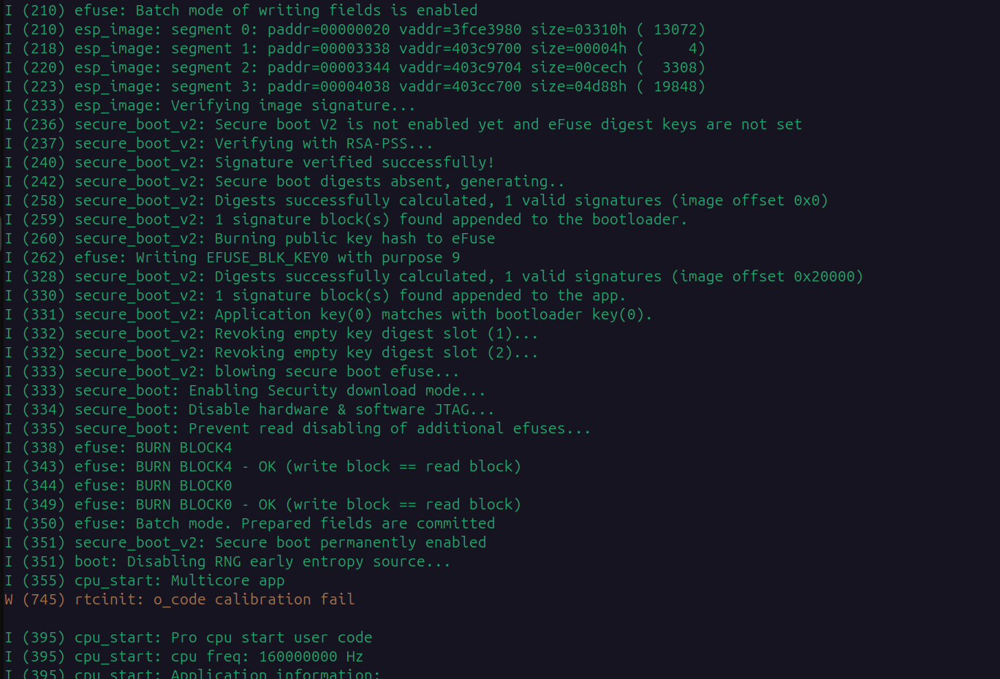
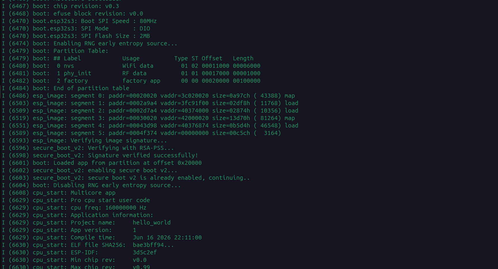

# Secure Boot Quickstart (QEMU Emulation)

**Date:** June 15, 2026
**Author:** Mayank (wolgwang)
**Phase:** 1 (Prototype: Minimal Secure Boot on ESP32)

## Overview
As discussed with Keith, I will eventually need to perform lots of hands-on testing across various physical ESP32 dev boards. However, since I currently do not have physical boards on hand and am waiting to resolve logistics (e.g., sourcing/budget) while Keith is away, this guide documents the process of setting up ESP-IDF and enabling **Secure Boot v2** using the official ESP32 QEMU emulator.

Using an emulator is highly recommended for initial secure boot testing because burning eFuses on real hardware is an irreversible action. A mistake on a real dev board would permanently brick it.

> **Important Discovery for QEMU:** The default `esp32` QEMU machine emulates chip revision 0. Secure Boot v2 on the classic ESP32 physically requires chip revision 3 (ECO3). Instead of trying to force QEMU to emulate an ECO3 ESP32, **I target `esp32s3`** which natively supports Secure Boot v2 from its base revision.

## 1. Development Environment Setup

### 1.1. Installing ESP-IDF

I maintain two versions of the ESP-IDF toolchain for specific testing purposes:
1. **v5.2 (Default):** Used for standard CLI/UART-based Secure Boot tests. This is my stable baseline.
2. **v5.3 (Graphical Simulation):** Required strictly if you want to use the `espressif/esp_lcd_qemu_rgb` component to simulate a graphical LCD screen in QEMU (e.g., for testing LVGL user interfaces).

**To install v5.2 (Default):**
```bash
mkdir -p ~/esp
cd ~/esp
git clone -b release/v5.2 --depth 1 https://github.com/espressif/esp-idf.git
cd esp-idf
git submodule update --init --recursive
./install.sh
```

To use ESP-IDF tools in any terminal session, you must load the environment variables:
```bash
. ~/esp/esp-idf/export.sh
```

### 1.2. QEMU Emulator Setup
Espressif provides a customized QEMU that supports ESP32-S3, including eFuse and Secure Boot v2 emulation.

With the ESP-IDF environment exported, install the QEMU binaries:
```bash
~/esp/esp-idf/tools/idf_tools.py install qemu-xtensa qemu-riscv32
```

## 2. Generating Signing Keys
To use Secure Boot v2, I need to generate an RSA-3072 keypair.

Use the `espsecure.py` tool (included in ESP-IDF) to generate the private signing key:
```bash
espsecure.py generate_signing_key --version 2 secure_boot_signing_key.pem
```

*Note: This key signs the bootloader and the application firmware. The public key digest is extracted and burned into the ESP32's eFuse during the first boot. Keep the private key safe.*

## 3. Creating a Minimal App & Enabling Secure Boot
I'll create a basic "Hello World" application and configure `sdkconfig` to enable Secure Boot.

1. **Create the Project:**
   ```bash
   cp -r ~/esp/esp-idf/examples/get-started/hello_world ~/esp/hello_world_secure
   cd ~/esp/hello_world_secure
   ```
2. **Set the Target to ESP32-S3:**
   ```bash
   idf.py set-target esp32s3
   ```
3. **Configure Secure Boot:** 
   I must adjust the partition table offset to make room for the larger signed bootloader, and point to my key. Create a file named `sdkconfig.defaults` in the project root:
   ```ini
   CONFIG_SECURE_BOOT=y
   CONFIG_SECURE_BOOT_V2_ENABLED=y
   CONFIG_SECURE_BOOT_SUPPORTS_RSA=y
   CONFIG_SECURE_SIGNED_ON_BOOT=y
   CONFIG_SECURE_SIGNED_APPS_NO_RSA_SIGN=n
   CONFIG_SECURE_BOOT_SIGNING_KEY="/home/wolgwang/esp/secure_boot_signing_key.pem"
   CONFIG_PARTITION_TABLE_OFFSET=0x10000
   ```
   Apply the configuration:
   ```bash
   rm sdkconfig
   idf.py reconfigure
   ```

4. **Build the Firmware:**
   ```bash
   idf.py build
   ```
   *The build process will automatically sign `bootloader.bin` and `hello_world.bin` using your generated key.*

## 4. Merging Binaries and Running in QEMU

> **Warning:** Do NOT use `esptool.py merge_bin` if you want to test Secure Boot v2 on QEMU. `esptool.py` recalculates simple digests and rewrites the flash headers of the bootloader, which inadvertently invalidates the RSA signature. Instead, I use `dd` to stitch the files bit-for-bit exactly as they were signed.

```bash
cd build
# Create a 4MB empty file
dd if=/dev/zero bs=1M count=4 of=merged_flash.bin

# Stitch the binaries at their precise offsets
dd if=bootloader/bootloader.bin of=merged_flash.bin bs=1 seek=0 conv=notrunc
dd if=partition_table/partition-table.bin of=merged_flash.bin bs=1 seek=65536 conv=notrunc
dd if=hello_world.bin of=merged_flash.bin bs=1 seek=131072 conv=notrunc

# Run in QEMU
qemu-system-xtensa -nographic -machine esp32s3 -drive file=merged_flash.bin,if=mtd,format=raw
```

## 5. Expected Output (Success Case)

On the **first boot**, you will see the 2nd stage bootloader generating the digest and burning the eFuse:



```
I (287) secure_boot_v2: Signature verified successfully!
I (289) secure_boot_v2: Secure boot digests absent, generating..
I (306) secure_boot_v2: Burning public key hash to eFuse
I (307) efuse: Writing EFUSE_BLK_KEY0 with purpose 9
...
I (417) secure_boot_v2: Secure boot permanently enabled
```

The emulator will automatically restart. On the **second boot**, you will see successful verification against the hardware eFuse:



```
Valid secure boot key blocks: 0
secure boot verification succeeded
```

This confirms that the hardware Root of Trust has been established and the boot chain is protected.

## 6. Testing Failure Modes

During testing in QEMU, I simulated several failure modes to verify the bootloader's behavior when confronted with untrusted or modified binaries:

### 6.1. Flashing Unsigned Firmware
If an attacker attempts to overwrite the application partition with an unsigned binary:
- The 2nd-stage bootloader detects the missing signature magic byte (`0xe7`).
- Boot is aborted before execution.
**Output:**
```
I (245) secure_boot_v2: Secure boot V2 is not enabled yet and eFuse digest keys are not set
I (246) secure_boot_v2: Verifying with RSA-PSS...
No signature block magic byte found at signature sector (found 0x0 not 0xe7). Image not V2 signed?
E (247) secure_boot_v2: Secure Boot V2 verification failed.
E (250) esp_image: Secure boot signature verification failed
I (251) esp_image: Calculating simple hash to check for corruption...
W (311) esp_image: image valid, signature bad
E (311) boot: Factory app partition is not bootable
E (312) boot: No bootable app partitions in the partition table
```

### 6.2. Flashing Firmware Signed with the Wrong Key
If firmware is signed with a valid signature, but the key's public digest does not match what is burned into the eFuse:
- The bootloader parses the signature block, extracts the public key, hashes it, and compares it against the trusted eFuse slots.
- The comparison fails and execution is blocked.
**Output:**
```
I (430) secure_boot_v2: Digests successfully calculated, 1 valid signatures (image offset 0x20000)
I (432) secure_boot_v2: 1 signature block(s) found appended to the app.
E (432) secure_boot_v2: No application key digest matches the bootloader key digest.
I (434) efuse: Batch mode of writing fields is cancelled
E (435) boot: Secure Boot v2 failed (-1)
E (435) boot: Factory app partition is not bootable
E (436) boot: No bootable app partitions in the partition table
```

### 6.3. Revoking eFuse Slots (`SECURE_BOOT_KEY_REVOKE0`/`1`)
The ESP32 platform allows for key rotation by burning the `SECURE_BOOT_KEY_REVOKE` eFuses. 
- When `SECURE_BOOT_KEY_REVOKE0` is burned, the hardware permanently ignores the key digest stored in `BLOCK_KEY0`.
- If an attacker compromises the original key, revoking the slot ensures any firmware signed with the compromised key will instantly fail verification, behaving exactly as if the wrong key was used.
- If all valid key slots are revoked, the device becomes unbootable (fails safe).

To permanently revoke a compromised key from an ESP32-S3 via the terminal, use the `espefuse.py` tool (Note: If Secure Boot is already locked into Production/Release mode, this can only be done programmatically via a signed firmware update rather than via USB). 

To test this safely without a physical board, you can append the `--virt` flag to run the hardware emulation virtually:

```bash
espefuse.py --chip esp32s3 --virt burn_efuse SECURE_BOOT_KEY_REVOKE0
```

**This is the actual output captured from running the command in our virtual environment:**
```
espefuse.py v4.11.0

=== Run "burn_efuse" command ===
The efuses to burn:
  from BLOCK0
     - SECURE_BOOT_KEY_REVOKE0

Burning efuses:

    - 'SECURE_BOOT_KEY_REVOKE0' (Revoke 1st secure boot key) 0b0 -> 0b1


Check all blocks for burn...
idx, BLOCK_NAME,          Conclusion
[00] BLOCK0               is empty, will burn the new value
. 
This is an irreversible operation!
BURN BLOCK0  - OK (write block == read block)
Reading updated efuses...
Checking efuses...
Successful
```
