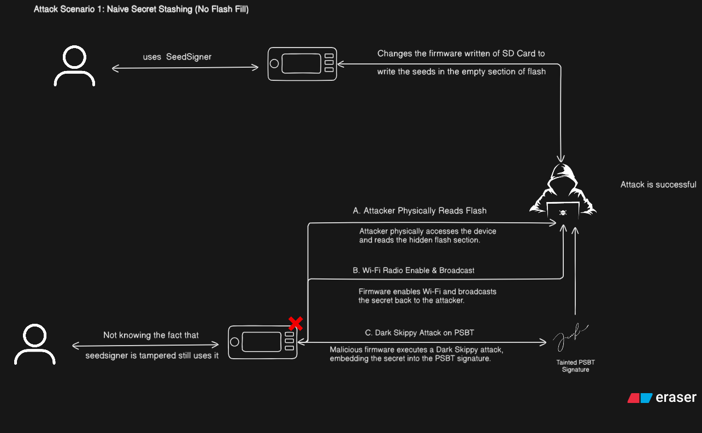
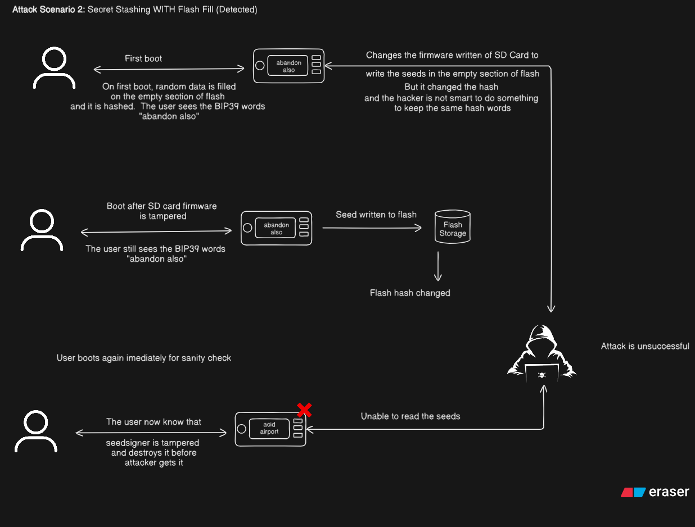
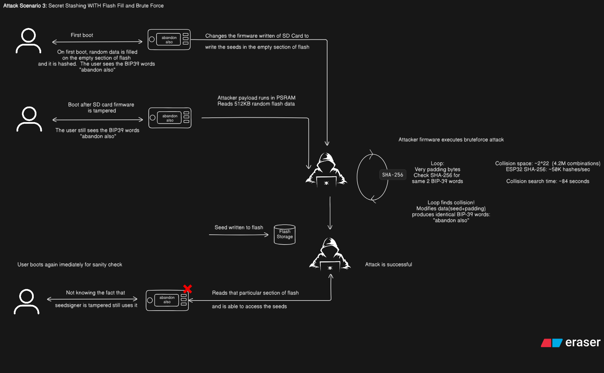

# Phase 14: Security Analysis of the Stateless Secure Bootloader (ESP32-P4)

- **Date:** August 14, 2026
- **Author:** Mayank (wolgwang)
- **Project:** SeedSigner Secure Boot — Summer of Bitcoin

This is the master security analysis for the project. It threat-models the
Phase 13 stateless secure bootloader
(`Phase_13/seedsigner_bootloader_p4_stateless_os`), walks through twelve attack
scenarios (A1-A12), runs an evidence campaign (T1-T16) against the real board
and real artifacts, and records a findings register (F1-F8).

Everything exercised here is reversible - flash writes only, no eFuse burns, no
secure-boot or flash-encryption provisioning. The dev board uses virtual eFuses
(`CONFIG_EFUSE_VIRTUAL=y`), so the Layer-1 Secure-Boot-V2 checks run on real
silicon without physically burning anything. Nothing in this campaign
permanently alters the chip.

A note on how this relates to Phase 7 and Phase 13: Phase 7 explored the
flash-fill anti-phishing *idea* in QEMU only - a mock 512 KB partition, a
two-word proof, and a concept prototype. It never ran on silicon, had no SD-card
layer, no signature chain, and no measured brute-force numbers. Phase 13 turned
that exploration into the real implementation - a ~6.8 MB TRNG-filled
`random_fill` partition, a four-word BIP-39 proof, hardware-verified on the
ESP32-P4. The scenarios below are therefore re-derived here **in full** against
the current Phase 13 build, not deferred to the Phase 7 write-up.

## 1. Who the attacker is

The Phase 13 bootloader protects the device in two layers.

- **Layer 1 - the hardware root of trust.** Secure Boot V2 (RSA-3072) verifies
  the loader app on every boot. A wrong or malicious loader in flash is rejected
  before a single line of it executes.
- **Layer 2 - the loader itself.** It mounts a FAT32 SD card, reads a
  Specter-style bundle into PSRAM, unmounts the card, verifies a secp256k1
  multisig over the payload, then runs the payload statelessly (MMU-mapped from
  PSRAM, flash untouched at runtime).

The assets it protects, and what guards them:

- The **seed / BIP-39 mnemonic** lives in the payload (the SeedSigner app) at
  runtime. Nothing in the boot path protects it directly - that is out of scope
  here - but the loader must never exfiltrate it.
- The user's ability to **detect a swapped or cloned device** rests on the four
  BIP-39 anti-phishing words printed before handoff, derived from the
  `random_fill` TRNG flash-fill partition plus a SHA-256 digest.
- **Boot integrity** - only SeedSigner-signed firmware runs - rests on Secure
  Boot V2 (Layer 1) plus the secp256k1 multisig (Layer 2).
- **Availability** - the device always boots to a known-good state or not at
  all - rests on watchdogs and the halt-on-any-failure policy.

Three adversary classes are modeled.

- A **remote software attacker** has no physical access. They can push *files*
  to the SD card - a compromised host that copied a firmware file, or a dropped
  card the user later reinserts.
- A **physical mauler** (the evil-maid hotel scenario) has temporary access to
  the device. They can swap SD cards, clone SD cards, read flash over the serial
  or SPI bus, and freeze the chip. They cannot leave traces the user would
  notice, and cannot burn eFuses silently - burns are one-time and need a power
  cycle the user would see.
- A **supply-chain attacker** compromises a firmware build, a signing step, or a
  factory provisioning step. The question modeled is "what does one compromised
  key buy you?"

**Not modeled**: sub-microsecond glitch/fault injection, die decapping, and
active EM analysis. For a hardware-wallet bootloader these are out of scope - the
device is sealed and user-held, and the crypto boundary is the *seed*, not the
wallet's chip.

The two signature layers exist, but **both currently derive from keys that are
publicly committed for R&D reproducibility** (finding F1): the L2 bundle key is
`DEV_SECRET=123456789` hardcoded in `tools/generate_signed_payload.py`, and the
L1 key (`secure_boot_signing_key.pem`) sits next to `sdkconfig.defaults`. This
is deliberate for a prototype - anyone can build and verify the chain
end-to-end. A production deployment must rotate both and keep them out of the
repo.

---

## 2. The attack surface

Everything in flash is Layer-1 signed. The bootloader at `0x20000` and the
loader at `0x30000` are RSA-signed images checked against the (virtual) eFuse
digest, so an attacker has no influence over them. The `random_fill` partition
(~6.8 MB) is TRNG bytes generated at first boot - unseeded, so it cannot be
precomputed - and its integrity is guarded by a SHA-256 digest. The `nvs`
partition holds the `ap_state` struct; it is readable over serial and writable
only via a flash write, and its magic and digest fields are what the
anti-phishing check validates. UART 0 leaks boot logs passively; JTAG is a
production eFuse question (see §6). PSRAM is reachable only after a bundle has
already passed Layer 2 - at which point the running code *is* the payload.

The picture is clear: the only surface where the attacker holds **all** the
bytes is the SD-card bundle. Everything in flash is L1-signed, the
`random_fill` region cannot be precomputed, and JTAG is a production eFuse
question. The attack scenarios below revolve around the SD card, the
signatures, and the physical-attacker tricks that try to sidestep both.

---

## 3. Attack scenarios

Each scenario below is written the same way: the attacker's goal, the
preconditions, the walkthrough, and a verdict. A1-A6 are the flash-fill /
anti-phishing family (originally explored in Phase 7, re-derived here against
the real Phase 13 build with measured numbers). A7-A12 are the loader-chain
scenarios. Together they cover the whole boot path.

### A1. Naive secret stashing (no flash fill)

Goal: write a stolen seed to empty flash sectors for later retrieval.
Precondition: flash fill is NOT implemented.

This is the baseline every other scenario defends against. The runtime firmware
runs statelessly from PSRAM, but nothing stops it from *writing* to the onboard
flash - and empty sectors accept writes silently. A malicious firmware that
steals the user's seed during signing simply parks it in a free sector. On the
next boot the loader loads the firmware again, performs no hash check over the
empty region, and the user has zero indication the flash was touched. The
attacker retrieves the seed later by reading the sector.



Verdict: **defeated by design.** The flash-fill partition (Phase 13) removes
the free-storage assumption: the ~6.8 MB region is TRNG-filled on first boot, so
there is no pre-existing writable stash an attacker can read.

### A2. Secret stashing *with* flash fill

Goal: write a stolen seed to flash, unnoticed. Precondition: flash fill IS
implemented; the anti-phishing words are shown every boot.

On first boot the loader erases the `random_fill` partition, fills it with TRNG
data, hashes it, and stores the digest in `nvs` as `APOK`. The user memorizes
the four derived words. Later, a compromised firmware that steals the seed must
*first erase a sector* before writing to it - flash physics gives no in-place
writes. That erase destroys the TRNG bytes, so the next boot's hash differs from
the stored digest, the derived words change, and the loader halts on the
mismatch before the payload ever runs.

The write therefore costs the attacker their secrecy: they get the seed *and*
an alarm. The window of vulnerability is the time between the write and the
next boot.



Verdict: **detected.** Any modification of `random_fill` (or of the digest in
`nvs`) changes the derived words, and the loader halts on the mismatch
(`verify_anti_phishing_proof` -> `FLASH TAMPERED - halting boot`, main.c:625).
T11 and T12 verified both paths on silicon: a one-byte flip at `0x132000`
(random_fill) and a flip of `state.hash[0]` in the `APOK` blob at `0x21004`
(nvs) each produced `FLASH TAMPERED! Hash mismatch detected.` and a halt
(`logs/t11_rf_tamper.txt`, `logs/t12_nvs_tamper.txt`).

### A3. Brute-force hash collision (the real threat)

Goal: write the seed to flash *and* keep the anti-phishing words unchanged.
Precondition: flash fill with a SHA-256 -> 4 BIP-39 words digest (44 bits of
entropy). Capability: code execution in PSRAM with access to DRAM.

The flash fill makes writes detectable, so the determined attacker asks a
different question: can I find *some* data that hashes to the same four words?
They read the current partition, inject the seed, and search for padding that
produces the same digest. If they find one, they erase and rewrite - and the
words still match on the next boot.

The answer is the crux of the whole anti-phishing design. T14 measured the
**exact** loader SHA-256 over the real ~6.8 MB partition, and the attack splits
into three regimes:

- **Naive full-region rehash** (re-hashing all ~6.8 MB per candidate): 149 ms
  per try. At 2^44 tries for 4 words, that is ~83 million years. Not tractable.
- **Incremental trailing-block** (read the region once, rehash only the last
  block): 1.29 us per try. ~262 days on a host, ~3.6-5.9 years on the device.
  This is the real threat.
- **Flash-write bound** (one sector erase per candidate): 40 ms per try.
  ~22,314 years. Not tractable, but this is the on-device ceiling.



Verdict: **the numbers change the picture.** Phase 7's "~84 s" and Phase 13's
"~7 h" are both wrong. A naive full-region rehash of 4 words is ~83M years; the
only tractable route, the incremental trailing-block attack, is ~262 days on a
host and ~3.6-5.9 years on the device (T14,
`logs/T14_benchmark_results.md`). That is far stronger than the docs claimed -
but it is still a finite compute bound, which is exactly why A4 is the endgame.

### A4. Brute force defeated by HMAC eFuse binding

Goal: same as A3 - find a collision. Precondition: the digest is now
`HMAC(eFuse_key, SHA-256(flash_data))`, where the key is burned and
software-unreadable.

The collision attack in A3 works because the attacker can compute SHA-256 of
candidate data entirely in software. Mixing a secret eFuse key into the digest
removes that ability: the attacker cannot read the key, so they cannot compute
the expected digest.

The key must be provisioned with the HMAC-**upstream** purpose
(`ESP_EFUSE_KEY_PURPOSE_HMAC_UP`). That is the only choice that works for this
feature: the loader computes the digest itself every boot through the HMAC
peripheral's upstream mode (`esp_hmac_calculate()`), which requires an upstream
key and returns the result to software. A downstream key would be stronger in
the abstract - the HMAC result is never returned to firmware - but it would
break the anti-phishing check, which needs the loader to derive and compare the
words.

With an upstream key, the attacker cannot precompute the digest in software and
cannot parallelize: every candidate costs one hardware HMAC call. The search
turns into a hardware-rate-limited grind of ~2^44 sequential calls - the
flash-write-bound row (~22,314 years) is the relevant ceiling once the key is
on-chip.

Verdict: **the endgame (production).** Binding the digest to an eFuse-burned
HMAC key (see `Phase_13/Production_Hardening_Plan.md`) turns a compute-bound
search into a hardware-bound one.

### A5. Evil-maid physical device swap

Goal: swap the user's SeedSigner for an identical-looking clone that steals
seeds. Precondition: physical access while the user is away.

The anti-phishing words are supposed to catch a swapped device: the user boots
a stranger's unit, sees different words, and knows something is wrong. But a
patient attacker can clone the *entire* device - flash *and* SD card - so the
clone produces the **same** words. Flash fill alone cannot stop this: the TRNG
bytes, the digest, and the words are all copied along with everything else.

What flash fill *does* buy in this scenario is subtler. An attacker cannot take
a *recovered* (reflashed or reset) device and secretly inject their own words
into it - the fill is unseeded TRNG, and any change to the region changes the
words the user is expecting to see.

Verdict: **flash fill alone cannot stop a full swap.** Only device-specific
out-of-band state - a sticker / the KEEPKEY trick, or an external verifier -
defeats a perfect clone. The HMAC eFuse binding (A4) is the in-band version of
that: it binds the words to the physical chip. T15 (clone the SD card) is
analyzed here rather than run on hardware because the destructive half of the
scenario (cloning the board's flash) does not change the outcome.

### A6. Supply chain - pre-compromised firmware

Goal: ship a device with malicious firmware pre-installed that exfiltrates seeds
on first use. Precondition: the attacker intercepts the device during shipping,
or compromises a signing step.

Two things stand between a swapped firmware and the user. Layer 1: with Secure
Boot V2 physically enabled, the ROM rejects any bootloader the factory did not
sign. Layer 2: even if the bootloader were replaced, erasing/reflashing the
flash destroys the TRNG fill, so the words change - and if the words were
recorded at the factory and shipped with the device, the user sees the mismatch.

For the **current R&D build**, however, there is a third, much simpler path: the
L2 dev key is intentionally public (F1). *Anyone* can produce a validly-signed
malicious bundle without touching the bootloader at all - they just sign it with
the committed dev secret. This is accepted prototype behavior, not a bug, and it
is why key rotation is the top pre-production requirement.

Verdict: **expected in the R&D prototype, production-blocking (F1).** The L2
dev key being public means anyone can ship a validly-signed malicious bundle.
Production must rotate the loader key, hold the private key offline, and sign
with a real multisig quorum.

### A7. Wrong/malicious loader in flash (Layer 1)

Goal: replace `seedsigner_secure_loader.bin` at `0x30000` with a malicious
loader. Precondition: flash-write access (physical or a compromised flashing
tool).

This is the Layer-1 gate. On every boot the 2nd-stage bootloader verifies the
loader's RSA signature against the digest burned in the (virtual) eFuses, so a
rogue or unsigned loader is rejected before it runs. The campaign exercised both
rejection modes on real silicon:

- **T1** - loader signed with a *rogue* RSA key: rejected with `image valid,
  signature bad` -> `Secure Boot V2 verification failed`, in a 72x reboot loop
  (`logs/t01_wrongkey_loader.txt`), then restored
  (`logs/t01b_verify_restore.txt`).
- **T3** - loader with its appended signature block *stripped*: rejected with
  `No signature block generated for valid scheme` -> `Secure boot signature
  verification failed`, in a 71x reboot loop (`logs/t03_sig_stripped.txt`), then
  restored (`logs/t03b_verify_restore.txt`).

The one case that could not be demonstrated is **T2**, a tampered *bootloader*
at `0x2000`. That check is done by the **ROM**, which runs before any software
and therefore cannot see virtual eFuses - under `CONFIG_EFUSE_VIRTUAL` the ROM
takes the "SECURE_BOOT_EN disabled" path and skips the bootloader check
entirely. Demonstrating T2 requires a physical `SECURE_BOOT_EN` burn, which is
off-limits on the dev board. The design-level SBv2 flow shows the ROM aborting
on a bad bootloader signature once physically enabled.

Verdict: **rejected (T1, T3 verified on silicon; T2 design-level only).** The
loader image is covered by the eFuse digest on every boot; the bootloader image
would be covered by the ROM check once `SECURE_BOOT_EN` is physically burned in
production.

### A8. Malicious SD bundle (Layer 2)

Goal: put a malicious firmware bundle on the SD card that the loader will boot.
Precondition: any form of access to the card contents - the surface the attacker
controls most completely.

This is the Layer-2 gate, and the whole point of the Specter verification chain.
The bundle must pass, in order: the section magic, the header validation, the
platform attribute, the version floor, the SHA-256 hash, and the secp256k1
multisig - with the multisig enforcing a minimum valid-signature count
(`SIG_THRESHOLD 1`, main.c:588). The campaign mutated the bundle at each of
those points and the loader halted exactly where predicted:

- T4 - payload bit-flip -> `Signature verification failed` -> HALT
- T5 - rogue-key signature -> `0 valid signature(s), need 1` -> HALT (the F8 fix)
- T6 - raw image, no Specter header -> HALT
- T7 - wrong platform (`seedsigner_esp32s3`) -> HALT
- T8 - `pl_ver = 0` -> downgrade -> HALT
- T9 - truncated signature section -> HALT
- T10 - forged `pl_size` -> out-of-bounds read, then HALT (F2)

The only remaining way through is a bundle signed by a key the loader
recognizes - which in the current build means the public dev key (A12).

Verdict: **rejected, except key-forgery.** Header, platform, version, hash,
and multisig checks are all in the path, and the threshold means an unknown
key's signature buys nothing. The only bypass is knowing or forging the
authorized key, which today means the intentionally-public dev key (F1).

### A9. TOCTOU on the SD read

Goal: swap the SD card *mid-boot* so the loader verifies one bundle but executes
another. Precondition: a lying or replaceable card plus precise timing.

A time-of-check/time-of-use attack needs the loader to verify bytes at one
moment and use them at another. The loader closes this structurally: it reads
the whole bundle into PSRAM, **unmounts the card** (main.c:520-521), and only
then verifies. Everything after the unmount runs against the PSRAM copy, so no
card - physical or malicious - can substitute bytes after the signature check.
A rogue SD controller is covered by the same reasoning: it can only feed data
that must pass the signature check.

Verdict: **closed.** Verification runs against the PSRAM-resident copy after
the card is gone; there is no point at which the two are decoupled.

### A10. Platform confusion / cross-board firmware

Goal: boot a bundle built for a different board (e.g. the ESP32-S3 SeedSigner)
and hope the loader runs it anyway. Precondition: access to a bundle from
another platform.

Each bundle carries a `platform` attribute. The loader requires it to equal
`seedsigner_esp32p4` (main.c:550); anything else is halted. T7 verified this on
silicon with an S3-targeted bundle: `Invalid platform attribute:
'seedsigner_esp32s3' (expected seedsigner_esp32p4). Halting.`

Verdict: **rejected (T7).** Cross-board bundles stop at the platform check,
before any image parsing or execution.

### A11. Downgrade attack

Goal: roll the device back to an older, vulnerable firmware. Precondition:
access to an old, validly-signed bundle.

The loader enforces a version floor on the *payload*: `pl_ver < 1` halts
(main.c:557), verified by T8 (`Firmware downgrade detected! Halting.`). This is
a floor, not a rollback proof - the *loader itself* has no anti-rollback, which
would need eFuse-burned boot-version counters (production plan). A future
attacker can only downgrade *within* the allowed version space until that is in
place.

Verdict: **rejected in-prototype (T8).** The payload version floor holds; the
loader-level anti-rollback is a designed, not-yet-implemented production
feature.

### A12. Attacker code execution via a forged bundle (dev-key forgery)

Goal: run arbitrary code on the device. Precondition: the public dev signing key
(this prototype's posture, F1).

Every check in A8 exists to ensure only SeedSigner-signed payloads execute. But
"SeedSigner-signed" today means "signed with `DEV_SECRET=123456789`" - and that
secret is committed to the repo. Any attacker who has read the repo can build a
bundle whose payload is arbitrary ESP32 code, sign it with the public key, and
the loader's checks *all pass* - the signature is cryptographically valid. T16
proved this host-side: a bundle built this way is accepted
(`Signature verification PASSED!` -> continues to JMP handoff). On the T5 side
of the ledger, a bundle signed by an *unknown* key is rejected on silicon, so
the attack is precisely gated on the key being public.

Once attacker code runs, it has full PSRAM and flash read access (and, in the
prototype, flash write via the SD buffering path). It can read the boot-time
words, impersonate the UI, or extract state. This is the single most important
production finding in the document.

Verdict: **achievable in the current build - by design (F1), and the top
pre-production requirement.** Rotating the signing key offline, and using a real
multisig quorum, closes it. No code change can make a public key secret.

---

## 4. Attacks that were considered and deliberately not tested

Included at reviewer request: attacks we deliberately did **not** campaign
against, with the reasoning, so the analysis is visibly scoped.

**Cold-boot PSRAM read.** Freeze the chip, power-cycle, read DRAM contents
(seeds in PSRAM). PSRAM is the payload's working memory; the seed is
user-entered/presented, not parked in PSRAM across power loss. A cold read
yields transient, not persistent, state. Not a boot-integrity issue. Would-be
countermeasure: zeroization on boot; avoid long-lived secrets in PSRAM.

**Voltage/EM fault injection.** Glitch the RSA/secp256k1 check to skip it.
Requires sub-microsecond timing gear and many tries; the dev board is
unshielded but production is sealed, and the ROT assumption already assumes the
chip's crypto works. Would-be countermeasure: tamper shields; verify twice at
independent points.

**Die decapping / microprobing.** Read the PSRAM bus or flash off-package. Cost
and expertise far above the adversary model for a ~$100 consumer device.
Would-be countermeasure: eFuse-disabled JTAG, encrypted storage, sealed package.

**Side-channel analysis on the signatures.** DPA on the RSA/secp256k1 verify.
Verification (public-key) leakage is low-value versus key exfiltration; the
private keys are held offline anyway. Would-be countermeasure: constant-time
verify (as-built); blinded signing on the offline signer.

**SPI flash sniffing.** Tap the SPI bus between flash and SoC. Reads only what
the serial/UART already leaks in the prototype; the bootloader never writes
secrets to flash at runtime (stateless). Would-be countermeasure: flash
encryption (production) defeats passive sniffing.

**Rogue SD controller.** A malicious microSD that lies about its contents. The
bundle is signature-verified in PSRAM after a *full* read + unmount; a lying
card can only feed invalid data, which is rejected. TOCTOU is already closed
(A9).

**C6 coprocessor / low-power core.** Persistent stealth code on the companion
core. Out of scope for a boot-integrity campaign; would first require code
execution (A12), which is exactly what the L1/L2 chain prevents. Would-be
countermeasure: disable unused cores in the secure loader.

**Supply-chain substitution.** Ship a different device entirely.
Indistinguishable from A5/A6; already covered; production mitigations are
out-of-band (vendors, holograms, verification ceremonies).

---

## 5. What was tested and what the results were

All artifacts live in `Phase_14/attacks/`; generation is done by
`Phase_14/tools/attack_bundle.py` (a faithful host model of `main.c`'s Layer-2
decision tree). Host predictions are recorded below, and the board results come
from `logs/<tag>.txt` (see `Phase_14/logs/test_matrix.md` for the full
procedure). The campaign touched every check in the boot path; here is what
happened.

**Layer 1 - rogue loader (T1).** A loader signed with a wrong RSA key was
flashed to `0x30000`. The 2nd-stage bootloader rejected it with `image valid,
signature bad` -> `Secure Boot V2 verification failed.` The board looped 72
times before the correct loader was restored (`logs/t01_wrongkey_loader.txt`).

**Layer 1 - tampered bootloader (T2).** Could not be demonstrated. The ROM
cannot see virtual eFuses and skips the bootloader check entirely under
`CONFIG_EFUSE_VIRTUAL`. Requires a physical `SECURE_BOOT_EN` burn. Design-level
analysis only (A7).

**Layer 1 - stripped signature (T3).** An unsigned loader was flashed. Rejected
with `No signature block generated for valid scheme` -> `Secure boot signature
verification failed`, looping 71 times (`logs/t03_sig_stripped.txt`).

**Layer 2 - payload bit-flip (T4).** One bit flipped in the payload
(`tamper.bin`). The loader halted at `Signature verification failed` ->
`HALTING execution.` (`logs/t04_tamper.txt`).

**Layer 2 - rogue-key bundle (T5).** A bundle signed with an unknown secp256k1
key (`wrong-key.bin`). The loader halted at `Signature verification failed: 0
valid signature(s), need 1` -> `HALTING execution.` This is the test that
confirms the threshold check works (F8) (`logs/t05_wrongkey.txt`).

**Layer 2 - no Specter header (T6).** A raw ESP32 image (`raw.bin`). Halted at
`No Specter section header (magic 0x100206E9) - raw images are not accepted.
Halting.` (`logs/t06_raw.txt`).

**Layer 2 - wrong platform (T7).** A bundle with `seedsigner_esp32s3`
(`wrong-platform.bin`). Halted at `Invalid platform attribute:
'seedsigner_esp32s3' (expected seedsigner_esp32p4). Halting.`
(`logs/t07_wrongplatform.txt`).

**Layer 2 - downgrade (T8).** A bundle with `pl_ver=0` (`downgrade.bin`).
Halted at `Firmware version: 0` -> `Firmware downgrade detected! Halting.`
(`logs/t08_downgrade.txt`).

**Layer 2 - truncated signature (T9).** The signature section was cut short
(`trunc-sig.bin`). Halted at `Signature section missing or invalid. Halting.`
(`logs/t09_truncsig.txt`).

**Layer 2 - forged `pl_size` (T10).** `pl_size` was set past the buffer end
(`forged-size.bin`). The loader performed a silent out-of-bounds hash read over
PSRAM garbage, then halted at `Signature section missing or invalid. Halting.`
This confirms the `pl_size` bounds-check gap (F2) - the read happens, but the
chain still halts because the hash does not match (`logs/t10_forgedsize.txt`).

**Anti-phishing - tampered `random_fill` (T11).** One byte was flipped at
`0x132000` via `esptool`. The loader printed `FLASH TAMPERED! Hash mismatch
detected.` and halted (`logs/t11_rf_tamper.txt`).

**Anti-phishing - tampered NVS digest (T12).** `state.hash[0]` was flipped at
`0x21004`. Same result: `FLASH TAMPERED! Hash mismatch detected.` and halt
(`logs/t12_nvs_tamper.txt`).

**Anti-phishing - re-provision (T13).** Both `nvs` and `random_fill` were
erased. On the next boot, the loader re-provisioned with fresh TRNG data and
derived new words: `control ahead inform actual` -> `pass slender toward
lawsuit`. Full restore verified (`logs/t13_reprovision.txt`,
`logs/t13b_verify_restore.txt`).

**Brute-force benchmark (T14).** Run host-side. Measured the exact SHA-256 cost
over the real ~6.8 MB partition. The numbers are in A3
(`logs/T14_benchmark_results.md`).

**Evil-maid clone (T15).** Cloning the SD card: the clone boots with unchanged
words (A5). Analyzed rather than run because the destructive half of the
scenario (cloning the board's flash) does not change the outcome.

**Dev-key forgery (T16).** A bundle signed with the committed dev secret
(`malicious.bin` == `good.bin`) was verified host-side. It passed every check
and continued to the JMP handoff.

```text
== Host-side T16 proof: does an attacker bundle pass the loader's checks? ==
  pl_size        : 191872 (file main-body available: 191888)
  fingerprint    : 9f58ca0b3c80f4c7f0603cafe7bf9f2f
  expected fp    : 9f58ca0b3c80f4c7f0603cafe7bf9f2f
  result         : BOOT - main.c:598 Signature verification PASSED!
                   -> continues to JMP handoff
```

Every *other* bundle is predicted to halt at exactly the loader check it
violates, which shows the host model tracks the loader's decision tree. The T16
pass/fail asymmetry is therefore meaningful: **only the missing key secrecy lets
an attacker through.**

---

## 6. What needs to happen before production

The findings split into three categories. Everything below is **designed, not
implemented** unless marked otherwise - `Phase_13/Production_Hardening_Plan.md`
is the roadmap, and every eFuse action it describes is one-time and off-limits
on the dev board, so the campaign could not exercise it.

### Code fixes (can be done now)

**The `pl_size` bounds check (F2).** `pl_size` is used as an offset without a
bounds check (main.c:574), so a forged value walks an out-of-bounds hash read
over PSRAM garbage before the loader halts (T10). Add `256 + pl_size <= fw_size`
before the `sig_hdr` dereference and the `blsect_hash_over_flash` call. One line,
independent of everything else.

**The multisig threshold (F8) - done.** `blsig_verify_multisig()` returns the
*count* of valid signatures and uses negative values only for errors. Its
contract - matching upstream Specter's `verify_multisig()` - requires the caller
to enforce a minimum count. The loader enforces `SIG_THRESHOLD 1`
(`sig_res < SIG_THRESHOLD` alongside `blsig_is_error()`, main.c:588-597), so a
bundle signed by a key not in `vendor_keys[]` is halted. Verified on silicon by
T5: the rogue-key bundle stops at `Signature verification failed: 0 valid
signature(s), need 1` - no boot (`logs/t05_wrongkey.txt`).

### Process changes (no hardware, just discipline)

**Key rotation (F1, F6) - the top pre-production step.** The L2 dev secret
(`DEV_SECRET=123456789`) and the committed L1 RSA key
(`secure_boot_signing_key.pem`) must be replaced with keys generated and held
offline. The compiled `vendor_keys[]` array must carry the new public key, and
production must sign with a real multisig quorum on an air-gapped machine.
Without this, the entire Layer-2 chain is theatre: the signature check works
perfectly, but the key it checks against is public. This is the single most
important finding in the document (A6, A12).

**Log hygiene (F7).** Strip loader logs in production builds - UART currently
leaks boot progress, and a missing SD card halts with a visible message.

### eFuse burns (one-time, irreversible, production only)

**HMAC key binding (F3).** Burn an HMAC key into an eFuse key block with the
**upstream** purpose (`ESP_EFUSE_KEY_PURPOSE_HMAC_UP`). Change the anti-phishing
digest to `HMAC(eFuse_key, SHA-256(flash_data))`. This turns the collision
search (A3) from a compute-bound problem (~262 days host-side) into a
hardware-bound one: the loader derives the digest through the HMAC peripheral
each boot, and every collision candidate costs one sequential hardware call
(A4). The upstream purpose is required here because the loader itself computes
and compares the digest; a downstream key never returns its result to firmware.

**Anti-rollback counters (F4).** Burn `SECURE_VERSION` eFuse bits on each
firmware release. The loader checks the counter and refuses to boot anything
below the current value. This closes the downgrade window that the `pl_ver >= 1`
floor leaves open (A11).

**NVS protection (F5).** Encrypt the NVS partition so the `ap_state` digest is
not readable or writable by a physical attacker with flash access
(`anti_phish.c:93`). The digest is currently stored plaintext next to the data
it protects.

**Lockdown (F7).** Burn `SECURE_BOOT_EN` (enables the ROM-stage bootloader
check that virtual eFuses cannot demonstrate - T2), `DIS_PAD_JTAG` and
`DIS_USB_JTAG` (the ESP32-P4 hard JTAG disables), `DIS_DOWNLOAD_MODE`,
`DIS_DIRECT_BOOT`, and `RD_DIS` for the key blocks. This makes the device boot
only the signed loader and signed payloads.

**Three-slot RSA rotation.** Provision the three Secure-Boot-V2 key-digest slots
(the P4 supports up to three) so up to two key-compromise events can be absorbed
before the device bricks, using per-slot revocation.

**Flash encryption.** Encrypt the immutable loader artifacts in flash with a
dedicated XTS-AES key. The ESP32-P4 defaults to XTS-256 (an eFuse bit forces
XTS-128), so the "AES-128" numbers in earlier write-ups need revisiting. P4
flash encryption and `CONFIG_SPIRAM_ENC_EXEMPT` (for the PSRAM/DSI DMA path)
exist in ESP-IDF 5.5; the exact status of the PSRAM-DMA configuration must be
re-verified against the pinned ESP-IDF version before relying on it.

**eFuse key-block budget.** All six key blocks (KEY0-KEY5) are consumed by this
plan: three Secure-Boot-V2 digest slots plus one each for flash encryption, NVS
encryption, and HMAC. Zero spare. The recommendation is to keep one SBV2
rotation slot in reserve rather than filling all three.

**What this plan does *not* close:** F2 is a code fix, not a plan feature; the
dev-key posture (F1/F6) is closed by process - air-gapped keys and rotation - no
hardware feature can force key secrecy.
