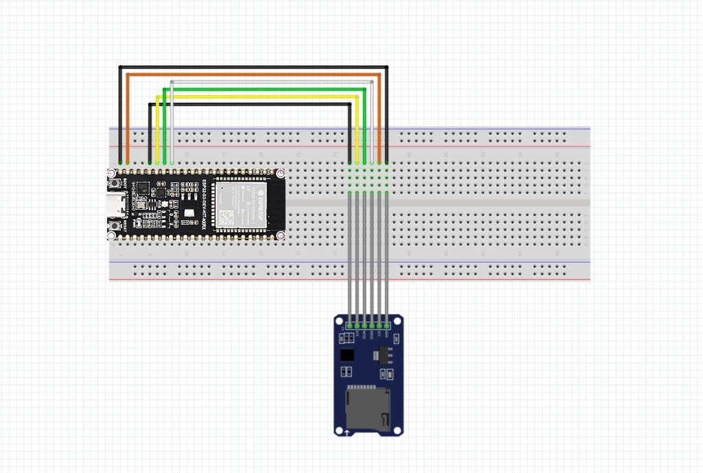

# Phase 17: ESP32-S3 Stateless Secure Bootloader — Pure SD Card Boot & Flash Hardening

- **Date:** August 16, 2026
- **Author:** Mayank (wolgwang)
- **Project:** SeedSigner Secure Boot — Summer of Bitcoin

## 1. Overview

In **Phases 15 and 16**, the core ESP32-S3 stateless secure loader architecture and the SeedSigner MicroPython runtime were ported, debugged, and proven on physical silicon. During initial bring-up, a development fallback mechanism allowed loading unsigned raw `0xE9` binaries directly from an onboard flash `payload` data partition (`@ 0x220000`). While critical for early bring-up, this temporary path presented two fundamental deviations from the SeedSigner stateless security model:
1. **Residual Flash Attack Surface:** Having an unhardened flash partition capable of staging executable code creates an evil-maid flash-tamper vector.
2. **Reduced Anti-Phishing Coverage:** The anti-phishing `random_fill` partition was constrained to 2.875 MB (`0x520000` to `0x800000`) because 3 MB of flash was occupied by the dev payload partition.

**Phase 17 completes the transition of the ESP32-S3 to a Pure Stateless, Cryptographically Enforced SD-Card Boot & Maximally Hardened Flash Architecture, verified end-to-end on physical ESP32-S3 hardware:**

- **Complete Elimination of the Flash Payload Partition:** Firmware payloads are never written to, staged in, or executed from internal flash memory.
- **Maximal Flash Hardening (Anti-Phishing TRNG Fill):** The `random_fill` partition expands to span **5.875 MB (6,016 KB)** across all unallocated flash (`0x220000` to `0x800000`). On first boot, it is flooded with true-random data (hardware TRNG). On every subsequent boot, a full SHA-256 digest derives **4 BIP-39 words** displayed to the user prior to payload execution.
- **Pure SD Stateless Execution & Anti-TOCTOU:** The loader mounts the FAT32 SD card, loads `/sdcard/seedsigner_esp32s3.bin` into 64KB-aligned external PSRAM, and **unmounts the SD card immediately** before cryptographic verification, completely eliminating Time-of-Check to Time-of-Use (TOCTOU) physical swap attacks.
- **Dual SDSPI / SDMMC Host Resilience:** Seamlessly supports both native SDMMC Slot 1 and buffered Arduino SPI SD card adapters (such as the ubiquitous HW-125 with 74LVC125A level shifters) via `SPI2_HOST` with automated fallback and internal GPIO pull-ups.
- **Mandatory Specter Multisig Signature Enforcement:** Raw unsigned images on the SD card are strictly rejected and wiped from RAM. All bootable images must pass Specter header validation, platform binding (`"seedsigner_esp32s3"`), anti-downgrade verification (`pl_ver >= 1`), and `secp256k1-sha256` ECDSA multisig verification against authorized `vendor_keys[]`.

## 2. End-to-End Boot Architecture & Verification Chain

The full Phase 17 boot chain establishes a continuous, unbroken cryptographic path from the hardware Root of Trust through to the SeedSigner MicroPython OS:

```
┌─────────────────────────────────────────────────────────────────────────┐
│                      ESP32-S3 Hardware / ROM Boot                       │
└────────────────────────────────────┬────────────────────────────────────┘
                                     │
                                     ▼
┌─────────────────────────────────────────────────────────────────────────┐
│           ESP-IDF 2nd-Stage Bootloader (@ 0x0, Secure Boot V2)           │
│   - Hardware / virtual eFuse verification of RSA-3072 signature         │
│   - Verified OK → loads factory loader app from @ 0x20000                │
└────────────────────────────────────┬────────────────────────────────────┘
                                     │
                                     ▼
┌─────────────────────────────────────────────────────────────────────────┐
│           Stateless Secure Loader (factory app @ 0x20000)                │
│                                                                         │
│   1. Mounts FAT32 SD Card (SDSPI on SPI2: MOSI=10, MISO=9, SCK=11, CS=12│
│      or SDMMC Slot 1: CLK=11, CMD=10, D0=9)                             │
│   2. Reads /sdcard/seedsigner_esp32s3.bin into 64KB-aligned PSRAM buffer│
│   3. UNMOUNTS SD CARD IMMEDIATELY (Anti-TOCTOU protection)               │
│   4. Flushes PSRAM D-cache (Cache_WriteBack_Addr)                       │
│   5. Specter secp256k1 multisig check (BL_SECT_MAGIC, platform, sig)    │
│   6. Anti-Phishing: Hashes 5.875 MB random_fill -> Displays 4 BIP-39 words│
│   7. Stages IROM/DROM into PSRAM fake_flash; maps MMU @ 0x600C5000      │
│   8. Prepares direct copies; jumps to IRAM JMP Zone (@ 0x403A0000)      │
└────────────────────────────────────┬────────────────────────────────────┘
                                     │
                                     ▼
┌─────────────────────────────────────────────────────────────────────────┐
│                 IRAM JMP Zone (@ 0x403A0000, loader_high.ld)            │
│   - Masks all interrupts (rsil a2, 15), switches SP to jump_stack       │
│   - Disables RWDT / MWDT0 / MWDT1 / SYSTIMER                            │
│   - Copies direct SRAM/RTC segments (32-bit word stores to IRAM)        │
│   - Programs shared I/D MMU table (512 x 64KB entries @ 0x600C5000)     │
│   - Flushes & invalidates I/D caches; executes jump to entry point      │
└────────────────────────────────────┬────────────────────────────────────┘
                                     │
                                     ▼
┌─────────────────────────────────────────────────────────────────────────┐
│          Payload Stateless Shim (entry.S / stateless_shim.c)            │
│   - entry.S: WINDOWBASE=0, WINDOWSTART=1, stack pivot                   │
│   - stateless_shim.c: BSS clear, vector table setup, clock/MMU init     │
│   - Injects 5 MB PSRAM heap (0x3C300000-0x3C800000)                     │
│   - __wrap_uart_stdout_init: Allocates UART0 RX ISR                     │
│   - Jumps to esp_startup_start_app()                                    │
└────────────────────────────────────┬────────────────────────────────────┘
                                     │
                                     ▼
┌─────────────────────────────────────────────────────────────────────────┐
│             SeedSigner MicroPython Runtime / Interactive REPL           │
└─────────────────────────────────────────────────────────────────────────┘
```

## 3. Flash Memory Layout & Flash Hardening

In Phase 17, the partition layout strictly enforces the stateless contract. The temporary `payload` partition is removed, allowing `random_fill` to cover the entire remaining 5.875 MB of flash memory:

### 3.1 Partition Table (`partitions.csv`)

| Offset | Size | Name | Type | SubType | Purpose |
|---|---|---|---|---|---|
| `0x000000` | 64 KB | `bootloader` | — | — | ESP-IDF 2nd-stage bootloader (Secure Boot V2 RSA-3072 signed) |
| `0x010000` | 4 KB | `ptable` | — | — | Partition table (`CONFIG_PARTITION_TABLE_OFFSET=0x10000`) |
| `0x011000` | 24 KB | `nvs` | `data` | `0x99` | Non-volatile storage (holds anti-phishing provisioning state) |
| `0x017000` | 4 KB | `phy_init` | `data` | `phy` | PHY initialization data |
| `0x018000` | 8 KB | `efuse` | `data` | `0x05` | Virtual eFuse emulation partition (`CONFIG_EFUSE_VIRTUAL=y`) |
| `0x020000` | 2.0 MB | `factory` | `app` | `factory` | Stateless Secure Loader (`seedsigner_secure_loader.bin`) |
| `0x220000` | **5.875 MB** | `random_fill` | `data` | `0x06` | Hardware TRNG fill region for tamper-evident anti-phishing proof |

### 3.2 Anti-Phishing Flash-Fill Mechanism

The anti-phishing module (`anti_phish.c`) provides tamper evidence for all unallocated onboard flash:
1. **Provisioning (First Boot):**
   - Checks the `nvs` partition for the state record magic `AP_MAGIC` (`0x41504F4B` = `"APOK"`).
   - If not found, it erases the entire 5.875 MB `random_fill` partition and writes hardware TRNG entropy generated via `esp_fill_random()`.
   - It hashes the entire 5.875 MB region with SHA-256 and records the 32-byte digest in `nvs`.
2. **Verification (Every Boot):**
   - Reads the `random_fill` partition in 4 KB sectors and computes a fresh SHA-256 digest.
   - Compares the calculated hash against the stored digest in `nvs`.
   - If the hash matches, it extracts four 11-bit chunks from the digest and maps them to **4 BIP-39 words** via `bip39_wordlist.c` (2048 words).
   - If any byte in flash has been modified, erased, or re-written, the digest mismatches and the bootloader **halts immediately**:
     ```
     E (xxxx) anti_phish: ⚠️  FLASH TAMPERED! Hash mismatch detected.
     E (xxxx) SEEDSIGNER_LOADER: FLASH TAMPERED — halting boot
     ```

## 4. Hardware SD Card Interface & Dual-Host Architecture

### 4.1 Octal PSRAM Pin Conflict Avoidance
On ESP32-S3 modules equipped with **Octal PSRAM / Octal Flash (OPI)** (such as the `ESP32-S3-WROOM-1-N8R8` and Waveshare 3.5B):
- **GPIOs 33 to 37 (and 38)** are connected internally to the high-speed MSPI interface (D4–D7 data lines and DQS clock).
- Attaching SDMMC signals to GPIOs 33–37 causes bus contention on the MSPI interface, leading to immediate instruction cache corruptions and memory faults.

### 4.2 Hardware Pin Mapping (ESP32-S3-DEV-KIT-N8R8)
Phase 17 uses a contiguous row of pins on the bottom strip of the ESP32-S3 DevKit:

| ESP32-S3 Pin | Signal (SDSPI) | Signal (SDMMC) | HW-125 SD Module Header |
|---|---|---|---|
| **`GND`** (Pin 1) | `GND` | `GND` | **Pin 1 (`GND`)** |
| **`5V`** (Pin 2) | `VCC` (5V to LDO) | `VCC` | **Pin 2 (`VCC`)** |
| **`GPIO 12`** (Pin 5) | `CS` (Chip Select) | `D2` | **Pin 6 (`CS`)** |
| **`GPIO 11`** (Pin 6) | `SCK` (Clock) | `CLK` | **Pin 5 (`SCK`)** |
| **`GPIO 10`** (Pin 7) | `MOSI` (Host → Card) | `CMD` | **Pin 4 (`MOSI`)** |
| **`GPIO 9`** (Pin 8) | `MISO` (Card → Host) | `D0` | **Pin 3 (`MISO`)** |



### 4.3 Dual SDSPI / SDMMC Host Engine & Linker Memory Expansion
- **HW-125 Buffered Adapter Support:** Many off-the-shelf microSD modules (like HW-125) feature an onboard 74LVC125A quad level shifter that buffers `MOSI` unidirectionally into the card's `CMD` pin. In native SDMMC 1-bit mode, the bidirectional `CMD` line response is blocked. Phase 17 implements an automated **SDSPI Host (`SPI2_HOST`)** probe first with internal pull-ups (`gpio_set_pull_mode`) and 4MHz calibrated clock, falling back seamlessly to native SDMMC.
- **Linker IRAM Expansion (`loader_high.ld`):** To accommodate both the full SDSPI host driver, SPI DMA drivers, and crypto libraries without overflowing `iram0_0_seg`, the loader linker memory script expands `iram0_0_seg` from `0xD400` to `0x20000` (128 KB), maintaining safe headroom before the JMP zone at `0x403A0000`.

## 5. Pure SD Card Stateless Execution & Anti-TOCTOU

To protect against physical Time-of-Check to Time-of-Use (TOCTOU) attacks where an attacker swaps the microSD card between signature verification and memory execution:

1. **Atomic Ingestion:**
   ```c
   sdmmc_card_t *card = mount_storage_sdcard();
   // ... stat and allocate 64KB-aligned PSRAM buffer ...
   FILE *f = fopen("/sdcard/seedsigner_esp32s3.bin", "rb");
   fread(psram_buf, 1, fw_size, f);
   fclose(f);
   ```
2. **Immediate Unmount:**
   ```c
   ESP_LOGI(TAG, "Unmounting SD card before verification (TOCTOU-safe)...");
   esp_vfs_fat_sdcard_unmount(MOUNT_POINT, card);
   ```
3. **Coherency Writeback:**
   ```c
   extern int Cache_WriteBack_Addr(uint32_t vaddr, uint32_t size);
   Cache_WriteBack_Addr((uint32_t)psram_buf, fw_size);
   ```
4. **Verification & Execution entirely from RAM:**
   Cryptographic signature verification, anti-phishing hashing, and Cache MMU remapping operate strictly on the PSRAM-resident buffer. The SD card is physically disconnected from the OS before any code is validated or executed.

## 6. Specter Multisig Signature Verification

The bundle format matches the Specter-DIY bootloader standard (`components/specter_crypto`):

```
┌────────────────────────────────────────────────────────────────────────┐
│  bl_section_t "main"  (256 bytes)                                      │
│  - magic:       0x424C5343 ("BLSC")                                    │
│  - pl_ver:      Firmware version integer (downgrade check: pl_ver >= 1)│
│  - pl_size:     Length of payload binary                               │
│  - pl_crc:      CRC32 of payload binary                                │
│  - attributes:  "platform=seedsigner_esp32s3", "alg=secp256k1-sha256" │
├────────────────────────────────────────────────────────────────────────┤
│  Raw ESP32-S3 Application Binary (esp_image_header_t + segments)       │
├────────────────────────────────────────────────────────────────────────┤
│  bl_section_t "sign"  (256 bytes)                                      │
│  - magic:       0x424C5343 ("BLSC")                                    │
│  - pl_type:     BL_SECT_TYPE_SIGN                                      │
│  - payload:     bech32-encoded secp256k1 ECDSA signature              │
└────────────────────────────────────────────────────────────────────────┘
```

The verification flow enforces:
1. `main_hdr->magic == BL_SECT_MAGIC`
2. `blsect_validate_header(main_hdr) == true`
3. `blsect_get_attr_str(main_hdr, bl_attr_platform) == "seedsigner_esp32s3"`
4. `main_hdr->pl_ver >= 1` (anti-downgrade)
5. `blsect_hash_over_flash()` over the main section
6. `blsig_verify_multisig("secp256k1-sha256", ...)` against `vendor_keys[]` $\ge$ `SIG_THRESHOLD` (1)

## 7. Xtensa Memory Model & JMP Zone Trampoline

```
ESP32-S3 Address Space:
  0x3C000000 - 0x3E000000 : DROM (Shared MMU table @ 0x600C5000 -> PSRAM)
  0x3FC88000 - 0x3FCB0000 : DRAM (Static RAM, heap capped at 0x3FCB0000)
  0x3FCB0000 - 0x3FCC8000 : DRAM alias of JMP zone (Protected from heap)
  0x40370000 - 0x403A0000 : IRAM (Payload segment copy target)
  0x403A0000 - 0x403B8000 : JMP zone (IRAM: jump_stack + do_mmu_mapping_and_jump)
  0x42000000 - 0x44000000 : IROM (Shared MMU table @ 0x600C5000 -> PSRAM)
  0x50000000 - 0x50020000 : RTC Fast Memory (Direct copy)
```

Key features of the S3 handoff trampoline:
- **JMP Zone Relocation (`loader_high.ld`):** Relocates the JMP zone to `0x403A0000`, above any payload IRAM target.
- **Fixed Static RAM Limit:** `CONFIG_ESP32S3_USE_FIXED_STATIC_RAM_SIZE=y` (0x40000) guarantees the loader heap terminates at `0x3FCB0000` and never corrupts the JMP zone's DRAM alias.
- **Shared MMU Programming:** Programs the 512 entries at `DR_REG_MMU_TABLE` (`0x600C5000`) with `(paddr_page) | SOC_MMU_ACCESS_SPIRAM`.
- **Atomic Cache Flush:** ROM calls `Cache_Invalidate_ICache_All()` and `Cache_Invalidate_DCache_All()` flush instruction and data pipelines before jumping to the payload entry point.

## 8. Build & Package Workflow

### Step 1: Build the MicroPython Payload (External Builder)
```bash
cd ~/Desktop/seedsigner-micropython-builder
git checkout esp32s3-stateless-boot
make docker-build-all BOARD=WAVESHARE_ESP32_S3_TOUCH_LCD_35B
```

### Step 2: Sign the Payload into a Specter Bundle
```bash
cd ~/Desktop/SoB/Phase_17
./build_micropython.sh
# Output: Phase_17/build/seedsigner_esp32s3.bin (2,635,792 bytes)
```
*(Alternatively, for stock hello-world test payload: `./build_payload.sh`)*

### Step 3: Copy to FAT32 SD Card Root
```bash
cp build/seedsigner_esp32s3.bin /media/$USER/<SDCARD>/seedsigner_esp32s3.bin
```

### Step 4: Build and Flash the Bootloader
```bash
cd seedsigner_bootloader_esp32s3_stateless_os
./run.sh
```
The script builds the 2nd-stage bootloader, partition table, and loader app, performs the virtual-eFuse safety check, and flashes:
- Bootloader @ `0x0`
- Partition table @ `0x10000`
- Loader app @ `0x20000`

## 9. Physical Hardware Verification & Execution Logs

The pure SD card stateless secure boot chain was executed and verified on physical **ESP32-S3-DEV-KIT-N8R8** hardware (ESP32-S3 revision v0.2, 8 MB AP Octal PSRAM) with an external FAT32 MicroSD card module:

```text
I (294) secure_boot_v2: Verifying with RSA-PSS...
I (301) secure_boot_v2: Signature verified successfully!
I (310) boot: Loaded app from partition at offset 0x20000
I (310) secure_boot_v2: enabling secure boot v2...
I (313) secure_boot_v2: secure boot v2 is already enabled, continuing..
I (374) esp_psram: Found 8MB PSRAM device
I (378) esp_psram: Speed: 40MHz
I (1117) esp_psram: SPI SRAM memory test OK
I (1132) app_init: Project name:     seedsigner_secure_loader
I (1164) efuse_init: Chip rev:         v0.2
I (1195) esp_psram: Adding pool of 8192K of PSRAM memory to heap allocator
W (1229) efuse: [Virtual] Loading virtual efuse blocks from flash
I (1330) main_task: Calling app_main()
I (1460) SEEDSIGNER_LOADER: SeedSigner Loader — ESP32-S3 PSRAM payload
I (1480) SEEDSIGNER_LOADER: Initializing SDSPI host on SPI2 (MOSI=10, MISO=9, SCK=11, CS=12)...
I (1620) SEEDSIGNER_LOADER: SD card mounted via SDSPI at /sdcard
I (9910) SEEDSIGNER_LOADER: Unmounting SD card before verification (TOCTOU-safe)...
I (9910) SEEDSIGNER_LOADER: [SD CARD] Loaded 2635792 bytes from /sdcard/seedsigner_esp32s3.bin
I (9920) SEEDSIGNER_LOADER: Specter bootloader section detected
I (9920) SEEDSIGNER_LOADER: Firmware version: 1
I (11590) SEEDSIGNER_LOADER: Performing secp256k1 multisig verification...
I (11630) SEEDSIGNER_LOADER: Signature verification PASSED!
I (11630) anti_phish: Verifying hash 0 / 6160384 bytes...
...
I (16050) anti_phish: Verifying hash 6029312 / 6160384 bytes...
I (16150) anti_phish: ================================================
I (16150) anti_phish:   ANTI-PHISHING PROOF: timber filter matrix crystal
I (16150) anti_phish: ================================================
I (16160) SEEDSIGNER_LOADER: Remapping MMU and jumping to PSRAM payload...
I (16170) SEEDSIGNER_LOADER: Entering JMP zone @ 0x403A0000
[SHIM] SeedSigner Stateless Shim (ESP32-S3)
[SHIM] Setting up vector tables and clocks...
[SHIM] Injecting 5 MB PSRAM heap @ 0x3C300000...
MicroPython v1.27.0-dirty on 2026-08-16; WAVESHARE_ESP32_S3_TOUCH_LCD_35B with ESP32-S3
Type "help()" for more information.
>>> 
```

## 10. Artifacts

- `Phase_17/Phase_17_ESP32S3_SDCard_Stateless_Boot.md` — this phase write-up
- `Phase_17/circuit_diagram_esp32s3.jpg` — ESP32-S3 to MicroSD module breadboard circuit wiring diagram
- `Phase_17/seedsigner_bootloader_esp32s3_stateless_os/` — complete ESP32-S3 pure SD card stateless secure bootloader project (partitions, main orchestrator, anti-phishing flash fill, JMP trampoline linker script, virtual-eFuse run script, pytest suite)
- `Phase_17/build_micropython.sh` — S3 MicroPython Specter bundle signing script
- `Phase_17/build_payload.sh` — S3 hello-world shim payload build and Specter signing script
- `Phase_17/hello_world_esp32s3_stock_shim/` — baseline stock ESP-IDF test payload with Xtensa windowed stateless shim

